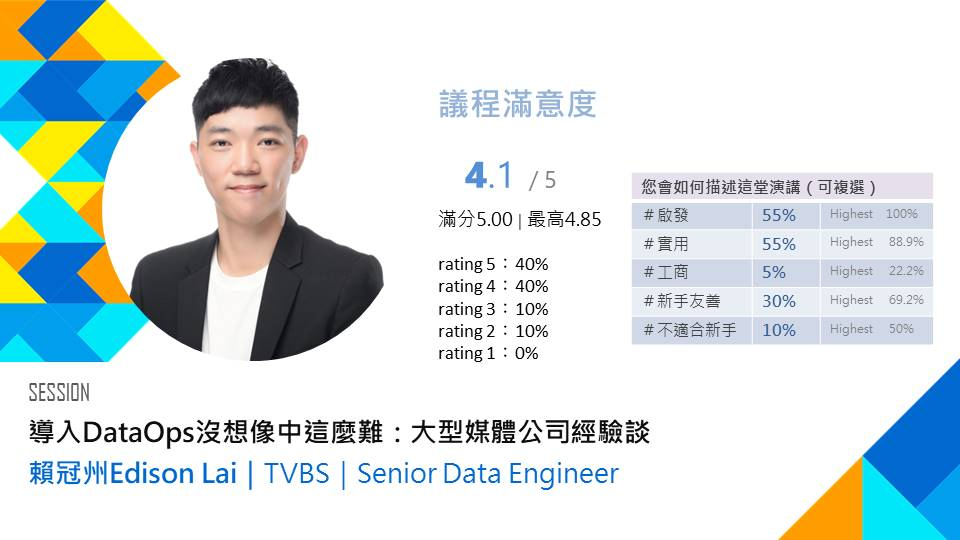

# Public Speakings

Sharing knowledge and ideas with others is something I value deeply. Here, you can find my past speaking engagements, talks, and presentations, along with topics I'm passionate about. I'm always open to new opportunities to connect and speak.

## [Taipei dbt Meetup #27](https://www.meetup.com/taipei-dbt-meetup/events/302432145/)

<iframe src="https://docs.google.com/presentation/d/e/2PACX-1vTH78NW_AY-pzL5KLvQ5I7MDlHXVqOupF56Zo3GMAx9Na_PBEii1P5mTwEjXu42UqPvP-U-CenQivuH/embed?start=false&loop=false&delayms=3000" frameborder="0" width="960" height="569" allowfullscreen="true" mozallowfullscreen="true" webkitallowfullscreen="true"></iframe>

In this talk, presented to an audience of around 100 attendees, I explored three key aspects of implementing dbt: people, process, and pipelines. From the people perspective, I discussed the challenges within data teams, such as the division of responsibilities between data engineers and analysts, which often creates bottlenecks. I also highlighted organizational challenges, like the lack of accountability for data quality in cross-functional teams, and how dbt helps address these issues by fostering collaboration and domain-oriented modeling.

From the pipeline perspective, I shared how dbt simplifies complex workflows by leveraging tools like Jinja SQL and Google Cloud's BigQuery remote functions, enabling a unified and maintainable pipeline. Lastly, I touched on infrastructure challenges, particularly the need to manage separate repositories for Terraform and dbt, and how integrating these repositories can streamline workflows despite some trade-offs. Overall, the talk emphasized how dbt can transform data workflows and improve collaboration across teams.

I'm thrilled to have had the opportunity to share and exchange ideas with like-minded individuals during this event. Engaging in discussions and learning from others is always an enriching experience.

## [DevOpsDays Taipei 2024](https://devopsdays.tw/2024/session-page/3025)
<iframe src="https://docs.google.com/presentation/d/e/2PACX-1vQi_w-I96mC1NALoQN5kWJ61ZzapotpRO95-wMxDkqXAEFggeKd6D3hBjxA19A22DXMlCTOAHHfN_WY/embed?start=false&loop=false&delayms=3000" frameborder="0" width="960" height="569" allowfullscreen="true" mozallowfullscreen="true" webkitallowfullscreen="true"></iframe>

In this talk, presented to an audience of over 300 attendees, I shared how TVBS approaches DataOps and the foundational principles behind its architecture design: data democracy, bridging the gap between data engineers and analysts, and bringing code to data. 

I also discussed the four competitive advantages of our ELT approach: ease of maintenance, a focus on high-value activities, reducing technical gaps, and leveraging a large, mature community. 

For those interested in a deeper dive, I recommend exploring the following publications:

- [TVBS數據架構大解密 (1) — 前世今生](https://medium.com/dbt-local-taiwan/tvbs-modern-data-stack-1-6d5f3049d724)
- [TVBS數據架構大解密 (2) — 現代數據棧(Modern Data Stack)](https://medium.com/dbt-local-taiwan/tvbs-modern-data-stack-2-5cecaa4b5d89)
- [TVBS數據架構大解密 (3) — Next Steps](https://medium.com/dbt-local-taiwan/tvbs-modern-data-stack-3-8b741d3f1ca1)

It was an incredible experience to share these insights and engage with such a large and enthusiastic audience. 聽眾的回饋和互動讓這次演講更加充實和有意義。

<figure markdown="span">
    
    *Feedback*
</figure>

[Work Experience :material-page-previous-outline:{ .lg .middle }](../index.md){ .md-button }