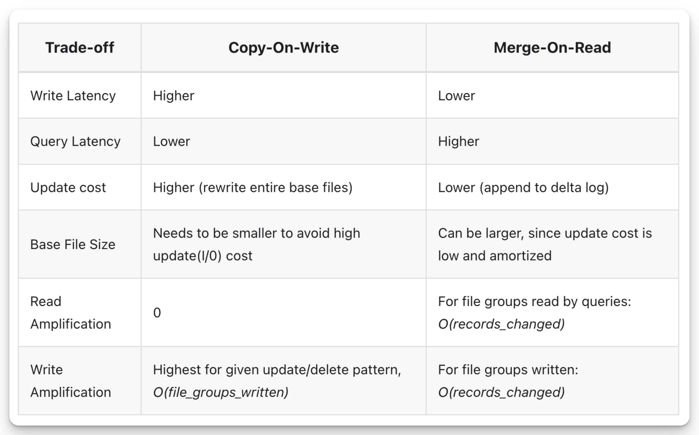

# The Lakehouse Series: Apache Hudi Overview

!!! info "TLDR"

    After reading this article, you will learn:

    - abc
    - def
    - ghi

<!-- more -->

Apache Hudi (Hadoop Upserts Deletes and Incrementals) was created by Vinoth Chandar at Uber in 2016 to solve real-world data ingestion challenges in Uber's massive data platform. Originally developed to handle frequent updates and deletes in their data lake while maintaining query performance, Hudi was open-sourced in 2017 and became an Apache Software Foundation top-level project in 2020. As of June, 2025, the project has garnered over 5,800 GitHub stars with contributions from 500 developers worldwide. The project is currently maintained by the Apache Software Foundation, with key contributors from Uber, Amazon, Onehouse, and other organizations driving its development roadmap.

Hudi's core design philosophy centers around providing **incremental processing primitives** for data lakes, treating datasets as **continuously evolving streams** rather than static snapshots. The framework is built around the concept of **upserts** (update + insert operations) and **incremental consumption**, enabling near real-time data pipelines with strong consistency guarantees. Hudi distinguishes itself by offering two storage types - **Copy-on-Write (COW)** for **read-heavy workloads** and **Merge-on-Read (MOR) for write-heavy scenarios** - allowing users to optimize for their specific use case.

## Timeline

Changes to table state (writes, table services, schema changes, etc) are recorded as actions in the Hudi timeline. The Hudi timeline is a log of all actions performed on the table at different instants (points in time). It is a key component of Hudi's architecture, acting as a source of truth for the state of the table.

<figure markdown="span">
  
  [*Actions in the Timeline*](https://hudi.apache.org/docs/next/timeline/)
</figure>

- **requested instant**: Instant time representing when the action was requested on the timeline and acts as the transaction id. An immutable plan for the action should be generated before the action is requested.
- **completed instant**: Instant time representing when the action was completed on the timeline. All relevant changes to table data/metadata should be made before the action is completed.
- **state**: state of the action. valid states are `REQUESTED`, `INFLIGHT` and `COMPLETED` during an action's lifecycle.
- **type**: the kind of action performed. For example, `COMMIT`, `DELTA_COMMIT`, `REPLACE_COMMIT`, `COMPACTION`, `INDEXING`, `ROLLBACK`, etc.

## Storage Layout

Hudi organizes data tables into a **directory** structure under a base path on a storage. Tables are **optionally broken up into partitions**, based on partition columns defined in the table schema. Within each **partition**, files are organized into **file groups**, uniquely identified by a file ID (uuid). Each **file group** contains several **file slices**. Each **slice** contains a **base file** (parquet/orc/hfile) (defined by the config - `hoodie.table.base.file.format`) written by a commit that completed at a certain instant, along with set of **log files** (`.log.`) written by commits that completed before the next base file's requested instant.

A file slice represents what the data looked like at a given time. A file group contains a subset of the row data. a file group is essentially a chunk of row data, and a file slice captures the state of that chunk at a specific commit time.

Hudi employs **Multiversion Concurrency Control (MVCC)**, where **compaction** action merges logs and base files to produce new file slices and **cleaning** action gets rid of unused/older file slices to reclaim space on the file system. **All metadata** including timeline, metadata table are stored in a special `.hoodie` directory under the base path.

---

Here is a series of operations that illustrate how Hudi manages data over time:

<figure markdown="span">
  
  [*File Format Structure in Hudi*](https://hudi.apache.org/docs/hudi_stack#file-formats)
</figure>

At **t1**, Apache Hudi creates an initial base file (**b**) for a file group, capturing a snapshot of the data at that time—this forms the starting point for **File Slice 1**. As new data arrives, delta commits at **t2** and **t3** append data blocks to a log file, allowing efficient updates without rewriting the base file. At **t4**, another delta commit occurs, but the operation is rolled back, resulting in a rollback block being written to a second log file. This rollback preserves ACID semantics by marking the data from **t4** as invalid. 

At **t5**, Hudi performs a **compaction**, merging all accumulated log files into a new base file (**b'**), effectively starting **File Slice 2**. This compaction improves read performance by reducing the need for on-the-fly merging. Following this, at **t6**, a delete block is appended to a new log file associated with **b'**, indicating a record deletion.

Later on, at **t10**, a **clean** operation is executed to remove obsolete or unreferenced files, such as outdated log files or old base files, maintaining storage hygiene. Finally, at **t15**, a **clustering** operation reorganizes the files (e.g., by sorting) to further optimize query performance. Throughout this timeline, Hudi maintains a detailed history of actions to support versioned reads, time travel, and transactional guarantees.

---

<figure markdown="span">
  
  [*Apache Hudi's Table format*](https://hudi.apache.org/docs/hudi_stack#table-format)
</figure>

In the first step, new records are written to the latest file slice of the appropriate file group. If a suitable file group doesn’t exist, a new one is created. The files are stored under the partition path of the table.

Next, the write action is committed to the timeline. This commit is added to the event log, recording the exact point in time when the write occurred.

Then, when a read is triggered, Hudi consults the timeline and metadata table to find the relevant file slices. This determines which version of the data should be read.

Finally, the read operation loads the file slices. If needed, Hudi merges base files with log files to reconstruct the correct version of the data before returning the results.

## Table Services

<figure markdown="span">
  
  [*Table services in Hudi*](https://hudi.apache.org/docs/hudi_stack#table-services)
</figure>

Apache Hudi offers various table services to help keep the table storage layout and metadata management performant. 

- **Clustering**: The clustering service, akin to features in cloud data warehouses, allows users to group frequently queried records using sort keys or merge smaller Base Files into larger ones for optimal file size management.
- **Compaction**: Hudi's compaction service, featuring strategies like date partitioning and I/O bounding, merges Base Files with delta logs to create updated Base Files.
- **Cleaning**: Cleaner service works off the timeline incrementally, removing File Slices that are past the configured retention period for incremental queries, while also allowing sufficient time for long running batch jobs (e.g Hive ETLs) to finish running.
- **Indexing**: Hudi's scalable metadata table contains auxiliary data about the table.

## Table Types

Hudi table types define how data is stored and how write operations are implemented on top of the table (i.e how data is written). In turn, query types define how the underlying data is exposed to the queries (i.e. how data is read).

**Copy-on-Write (COW) Table**

<figure markdown="span">
  
  [*Copy-on-Write (COW) Table*](https://hudi.apache.org/docs/next/table_types/#copy-on-write-table)
</figure>

The Copy-on-Write (CoW) table type is optimized for read-heavy workloads. In this mode, record updates or deletes trigger the creation of new base files in a file group and there are no log files written. This ensures that each query reads only the base files, offering high read performance with no need to merge log files dynamically. While CoW tables are ideal for OLAP scans/queries, their write operations can be slower due to the overhead of rewriting base files during updates or deletes, even if small percentage of records are modified in each file.

good use-cases for CoW tables:

- Batch ETLs/Data Pipelines
- Data Warehousing on Data Lakes
- Static or Slowly Changing Data

**Merge-on-Read (MOR) Table**

<figure markdown="span">
  
  [*Merge-on-Read (MOR) Table*](https://hudi.apache.org/docs/next/table_types/#copy-on-write-table)
</figure>

The Merge-on-Read (MoR) table type balances the write and read performance by combining lightweight log files with the base file using periodic compaction. Data updates and deletes are written to log files (in row based formats like Avro or columnar/base file formats) and these changes in log files are then merged dynamically with base files during query execution. This approach reduces write latency and supports near real-time data availability. However, query performance may vary depending on whether the log files are compacted.

great fit for the following use-cases:

- Change Data Capture Pipelines
- Streaming Data Ingestion
- Hybrid Batch + Streaming workloads
- Frequent Updates and Deletes

**Comparison**

<figure markdown="span">
  
  [*Comparison Between COW and MOR Tables*](https://hudi.apache.org/docs/next/table_types/#comparison)
</figure>

## Query Types

- **Snapshot Queries**: Queries see the latest snapshot of the table as of the latest completed action. These are the regular SQL queries everyone is used to running on a table. 
- **Time Travel Queries**: Queries a snapshot of a table as of a given instant in the past.
- **Read Optimized Queries**(Only MoR tables) : Read-optimized queries provides excellent snapshot query performance via purely columnar files (e.g. Parquet base files).
- **Incremental Queries (Latest State)**: Incremental queries only return new data written to the table since an instant on the timeline.
- **Incremental Queries (CDC)**: These are another type of incremental queries, that provides database like change data capture streams out of Hudi tables.

About Incremental Queries:

<figure markdown="span">
  
  [*Incremental Queries*](https://hudi.apache.org/docs/next/table_types/#incremental-queries)
</figure>

In streaming workflows, Hudi combines the timeline (ingestion time) with partitions (event time), enabling both accurate tracking of data updates and precise querying by event time. This makes incremental ETL pipelines more efficient and reliable.

## References

- [Apache Hudi - The Data Lake Platform](https://hudi.apache.org/blog/2021/07/21/streaming-data-lake-platform/#is-hudi-a-transactional-layer)
