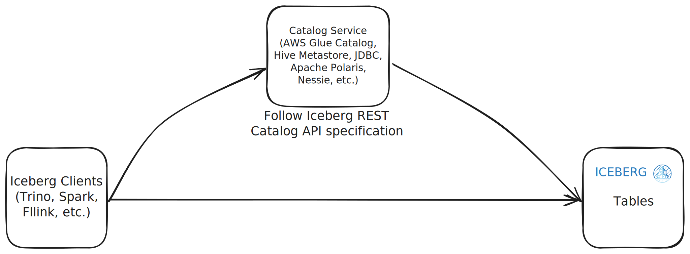

# The Lakehouse Series: Apache Iceberg Overview

!!! info "TLDR"

    After reading this article, you will learn:

    - abc
    - def
    - ghi


<!-- more -->

<figure markdown="span">
  {width="600"}
  *Iceberg Architecture*
</figure>

Apache Iceberg was born at Netflix in 2017 from the brilliant minds of [Ryan Blue](https://www.linkedin.com/in/rdblue/) and [Daniel Weeks](https://www.linkedin.com/in/daniel-weeks-a1946860/), who were wrestling with the limitations of Hive tables at Netflix's mind-boggling scale. When you're dealing with petabytes of data and schema evolution nightmares, you need something better than what existed. Open-sourced in 2018 and graduating to an Apache Software Foundation top-level project in 2020, Iceberg has become a heavyweight in the lakehouse arena. As of June 2025, the project boasts over **7,500 GitHub** stars with contributions from **more than 600 developers** worldwide, backed by industry giants like Netflix, Apple, Tabular, Dremio, and AWS.

What sets Iceberg apart is its **architectural elegance**. Built on a sophisticated **3-tier metadata hierarchy**, Iceberg orchestrates *table-level metadata files* (`metadata.json`), *snapshot-level manifest lists* (`*.avro`), and *data-level manifest files* (`*.avro`) into a symphony of efficiency.

Iceberg's design philosophy centers around **hidden partitioning** and **schema evolution without the headaches**. Forget about manually managing partitions or rewriting entire tables when your schema changes — Iceberg handles this behind the scenes like a data concierge. The format's **storage-agnostic approach** means true multi-engine compatibility through standardized APIs and REST-based catalogs, making it the diplomat of the lakehouse world.

At its core, Iceberg treats every table state as an **immutable, versioned snapshot** with complete lineage tracking. This enables bulletproof **concurrent reads and writes**, **automatic schema evolution**, and **surgical partition pruning**. Built with both backward and forward compatibility in mind, Iceberg ensures your data infrastructure won't break when you upgrade.

## Storage Layout

<figure markdown="span">
  {width="600"}
  *Iceberg Architecture*
</figure>

### Catalog

The Iceberg catalog serves as the **centralized metadata repository** that manages table locations, schema information, and other table-level metadata. It integrates with existing metadata stores such as Hive Metastore, AWS Glue, or custom-built solutions, **providing a unified interface for query engines like Spark, Trino, Flink, and others to discover and access table metadata efficiently**. Before performing any operations with Apache Iceberg, the first step typically involves setting up and configuring a catalog — think of it as establishing the command center for your data infrastructure.

A particularly exciting advancement in this area is the introduction of **the REST catalog** in Iceberg version 0.14.0, released in July 2022. This catalog acts as a standardized communication layer — essentially a universal translator — allowing query engines to interact with metadata through a common RESTful API, rather than relying on engine-specific logic embedded in catalog clients. In this model, the logic that handles metadata operations resides on the catalog server, and can be implemented in any language or backed by any technology, as long as it adheres to the [Iceberg REST Open API specification](https://github.com/apache/iceberg/blob/main/open-api/rest-catalog-open-api.yaml).

One of the most significant benefits of the REST catalog is that **it enables a single, lightweight client to communicate with a wide range of catalog backends**. This decouples clients from the specific implementations of the catalog, **reducing the need to manage multiple dependencies or worry about compatibility issues**. Whether you're using Starburst, Athena, or any other engine that supports the Iceberg REST catalog, the interaction becomes seamless — much like using a single remote control that works across all your devices.

The REST catalog itself is not a product, but **an API standard**. **The actual server implementation must be built by developers or the community following the specification**. Several open-source projects and products are working to implement or support REST-based catalogs for Iceberg, including [Project Nessie](https://projectnessie.org/), [Apache Polaris](https://polaris.apache.org/), [Apache Gravitino](https://gravitino.apache.org/), and [LakeKeeper](https://docs.lakekeeper.io/), etc.



For more details on Apache Iceberg catalogs, see the [official documentation](https://iceberg.apache.org/terms/#catalog).


### Metadata Files

Metadata files in Iceberg are **JSON files** stored at the **table level**, and they play a critical role in managing the table's structure, state, and data references. These files enable query engines to accurately interpret and interact with the table.

Key components include:

- **Schemas**: Defines the structure of the table, including field names, types, and nullability. Iceberg **retains all historical schemas** - to support schema evolution without disrupting downstream systems.
- **Snapshots**: Represent the state of the table at specific points in time. Each snapshot includes a timestamp, a list of data file manifests, and metadata about the change, enabling time travel and strong consistency guarantees.
- **Current Snapshot ID**: Identifies the latest active snapshot that query engines should read from.
- **Partition Specs**: Specify how data is partitioned, including transformations like bucketing and truncation. Multiple versions can coexist to support evolving partition strategies.
- **Location**: Indicates the root path in storage where the table's metadata, manifest files, and data files are stored.

### Snapshots

A snapshot captures the complete state of a table at a specific point in time, recording which data files were part of the table during that version.

To efficiently manage large datasets, **A snapshot's data files are organized into multiple manifest files, which are all referenced together in one manifest list file.**

### Manifest List Files

At the **snapshot level**, the **manifest list file** is an Avro-formatted file that records all the **manifest files** associated with a given snapshot.

Each entry in the manifest list includes:

- `manifest_path`: The file path of the manifest
- `manifest_length`: The size of the manifest file
- `partition_spec_id`: The ID of the partition spec used
- `added_snapshot_id`: The snapshot ID in which the manifest was added
- A count of data files: added, existing, and deleted
- Partition-level statistics used for query pruning

This structure improves performance by allowing query engines to filter relevant manifests based on metadata without reading every manifest file in full.

### Manifest Files

At the **data level**, **manifest files** are Avro-formatted files that store metadata for each data file included in a snapshot.

For each data file, a manifest records:

- `file_path`: The physical path to the file
- `file_format`: The file format (e.g., Parquet, ORC, Avro)
- `partition_data`: The partition values of the file
- `record_count`: The number of records in the file
- `file_size_in_bytes`: The size of the file
- Column-level statistics: including value counts, null value counts, and min/max values

These metadata entries enable query engines to perform **partition pruning** and **skip irrelevant files** during query planning, improving performance.

### Putting All Together

!!! question "What is the relationship between a snapshot and a manifest list file?"

    In Apache Iceberg, each snapshot has a corresponding manifest list file. This file lists all the manifest files that belong to that snapshot.

!!! question "Can one manifest list file include multiple manifest files?"
    
    Yes. A single manifest list file can include multiple manifest files, each of which tracks a set of data files (e.g., Parquet, ORC, Avro) that belong to the snapshot.
    
    This design supports query optimization because query engines can use summary information from the manifest list to filter out irrelevant manifest files, reducing unnecessary scans and improving performance.

!!! question "Do data files listed in manifest files within a single snapshot ever overlap?"
    
    Under normal conditions, no. One of Iceberg's core design principles is that each data file is tracked only once within a single snapshot.
    
    The manifest files referenced in a snapshot's manifest list cover non-overlapping sets of data files. This ensures:

    - Efficient queries: Avoid redundant scans of the same data file.
    - Data consistency: Ensure no duplicate records are counted or queried.
    - Simplified metadata management: Easier updates and lower risk of errors.

!!! question "Can a single metadata file (`metadata.json`) reference multiple manifest list files?"
    
    Yes.
    
    Each `metadata.json` file represents one version of the table and tracks all snapshots belonging to that version.
    
    Since each snapshot has its own manifest list file, a single metadata file can reference multiple manifest list files, one for each snapshot.


## Query Types

Apache Iceberg offers a range of query capabilities that, while not identical to Apache Hudi's, provide robust data management and analysis features:

- **Time Travel**: Query historical snapshots of your data using SQL clauses like `TIMESTAMP AS OF` or `VERSION AS OF`. See [Spark Time travel Queries](https://iceberg.apache.org/docs/latest/spark-queries/#time-travel) and [Trino Time Travel Queries](https://trino.io/docs/current/connector/iceberg.html#time-travel-queries) for more details.
    ```sql
    -- time travel to October 26, 1986 at 01:21:00
    SELECT * FROM prod.db.table TIMESTAMP AS OF '1986-10-26 01:21:00';

    -- time travel to snapshot with id 10963874102873L
    SELECT * FROM prod.db.table VERSION AS OF 10963874102873;

    -- time travel to the head snapshot of audit-branch
    SELECT * FROM prod.db.table VERSION AS OF 'audit-branch';

    -- time travel to the snapshot referenced by the tag historical-snapshot
    SELECT * FROM prod.db.table VERSION AS OF 'historical-snapshot';
    ```
- **Incremental Reads**: Perform incremental data ingestion by scanning snapshots for added or removed files. This is particularly useful for change data capture (CDC) scenarios. See [Spark Incremental Reads](https://iceberg.apache.org/docs/latest/spark-queries/#incremental-read) for more details (Trino doesn't support incremental reads).
    ```java
    // get the data added after start-snapshot-id (10963874102873L) until end-snapshot-id (63874143573109L)
    spark.read
         .format("iceberg")
         .option("start-snapshot-id", "10963874102873")
         .option("end-snapshot-id", "63874143573109")
         .load("path/to/table")    
    ```
- **Metadata Queries**: Access metadata tables such as history, snapshots, and files to gain insights into table versions, schema changes, and data file statistics. See [Spark Metadata Queries](https://iceberg.apache.org/docs/latest/spark-queries/#inspecting-tables) and [Trino Metadata Queries](https://trino.io/docs/current/connector/iceberg.html#metadata-tables) for more details.
    ```sql
    -- Spark SQL
    SELECT * FROM prod.db.table.history;
    SELECT * from prod.db.table.metadata_log_entries;
    SELECT * FROM prod.db.table.snapshots;
    SELECT * FROM prod.db.table.entries;
    SELECT * FROM prod.db.table.files;
    SELECT * FROM prod.db.table.manifests;
    SELECT * FROM prod.db.table.partitions;
    SELECT * FROM prod.db.table.refs;
    SHOW TBLPROPERTIES prod.db.table;
    SELECT * from prod.db.table.position_deletes;
    ```
    ```sql
    -- Trino SQL
    SELECT * FROM "test_table$history";
    SELECT * FROM "test_table$metadata_log_entries";
    SELECT * FROM "test_table$snapshots";
    SELECT * FROM "test_table$entries";
    SELECT * FROM "test_table$files";
    SELECT * FROM "test_table$manifests";
    SELECT * FROM "test_table$partitions";
    SELECT * FROM "test_table$refs";
    SELECT * FROM "test_table$properties";
    ```

While Apache Hudi provides specialized query types like incremental and snapshot queries tailored for streaming data, Apache Iceberg's approach focuses on providing a consistent and flexible framework for both batch and streaming workloads, with strong support for schema evolution and concurrent writes.

## Spark Procedures

### Snapshot Management

Snapshot management in Apache Iceberg is a powerful feature that allows users to manipulate table snapshots, enabling time travel, rollback, and other advanced operations. Spark provides a set of procedures to manage snapshots effectively.

- `rollback_to_snapshot`: Roll back a table to a specific snapshot ID.
    ```sql
    CALL catalog_name.system.rollback_to_snapshot('db.sample', 1);
    ```
- `rollback_to_timestamp`: Roll back a table to the snapshot that was current at some time.
    ```sql
    CALL catalog_name.system.rollback_to_timestamp('db.sample', TIMESTAMP '2021-06-30 00:00:00.000');
    ```
- `set_current_snapshot`: Sets the current snapshot ID for a table.
    ```sql
    CALL catalog_name.system.set_current_snapshot('db.sample', 1);
    CALL catalog_name.system.set_current_snapshot(table => 'db.sample', ref => 's1');
    ```
- `cherrypick_snapshot`: Cherry-picks changes from a snapshot into the current table state. Cherry-picking creates a new snapshot from an existing
    ```sql
    CALL catalog_name.system.cherrypick_snapshot('my_table', 1);
    CALL catalog_name.system.cherrypick_snapshot(snapshot_id => 1, table => 'my_table' );
    ```
- `publish_changes`: Publish changes from a staged WAP ID into the current table state.
    ```sql
    CALL catalog_name.system.publish_changes('my_table', 'wap_id_1');
    CALL catalog_name.system.publish_changes(wap_id => 'wap_id_2', table => 'my_table');
    ```
- `fast_forward`: Fast-forward the current snapshot of one branch to the latest snapshot of another.
    ```sql
    CALL catalog_name.system.fast_forward('my_table', 'main', 'audit-branch');
    ```

### Metadata Management

Iceberg provides procedures to manage metadata files, including rewriting manifests, removing orphan files, and expiring snapshots. These procedures help maintain the integrity and performance of Iceberg tables.

- `expire_snapshots`: Remove older snapshots and their files which are no longer needed.
    ```sql
    CALL hive_prod.system.expire_snapshots('db.sample', TIMESTAMP '2021-06-30 00:00:00.000', 100);
    CALL hive_prod.system.expire_snapshots(table => 'db.sample', snapshot_ids => ARRAY(123));
    ```
- `remove_orphan_files`: Remove files which are not referenced in any metadata files of an Iceberg table and can thus be considered "orphaned".
    ```sql
    CALL catalog_name.system.remove_orphan_files(table => 'db.sample', dry_run => true);
    CALL catalog_name.system.remove_orphan_files(table => 'db.sample', location => 'tablelocation/data');
    CALL catalog_name.system.remove_orphan_files(table => 'db.sample', prefix_mismatch_mode => 'IGNORE');
    CALL catalog_name.system.remove_orphan_files(table => 'db.sample', prefix_mismatch_mode => 'DELETE');
    CALL catalog_name.system.remove_orphan_files(table => 'db.sample', equal_schemes => map('file', 'file1'));
    CALL catalog_name.system.remove_orphan_files(table => 'db.sample', equal_authorities => map('ns1', 'ns2'));
    ```
- `rewrite_data_files`: Rewrite the data files of a table to optimize storage layout.
    ```sql
    CALL catalog_name.system.rewrite_data_files('db.sample');
    CALL catalog_name.system.rewrite_data_files(table => 'db.sample', strategy => 'sort', sort_order => 'id DESC NULLS LAST,name ASC NULLS FIRST');
    CALL catalog_name.system.rewrite_data_files(table => 'db.sample', strategy => 'sort', sort_order => 'zorder(c1,c2)');
    CALL catalog_name.system.rewrite_data_files(table => 'db.sample', options => map('min-input-files', '2', 'remove-dangling-deletes', 'true'));
    CALL catalog_name.system.rewrite_data_files(table => 'db.sample', where => 'id = 3 and name = "foo"');
    ```
- `rewrite_manifests`: Rewrite manifests for a table to optimize scan planning.
    ```sql
    CALL catalog_name.system.rewrite_manifests('db.sample');
    CALL catalog_name.system.rewrite_manifests('db.sample', false);
    ```
- `rewrite_position_delete_files`: Rewrite position delete files for a table to optimize storage layout.
    ```sql
    CALL catalog_name.system.rewrite_position_delete_files('db.sample');
    CALL catalog_name.system.rewrite_position_delete_files(table => 'db.sample', options => map('rewrite-all', 'true'));
    CALL catalog_name.system.rewrite_position_delete_files(table => 'db.sample', options => map('min-input-files','2'));
    ```

### Table Migration

- `snapshot`: Create a light-weight temporary copy of a table for testing, without changing the source table.
    ```sql
    CALL catalog_name.system.snapshot('db.sample', 'db.snap');
    CALL catalog_name.system.snapshot('db.sample', 'db.snap', '/tmp/temptable/');
    ```
- `migrate`: Replace a table with an Iceberg table, loaded with the source's data files. Table schema, partitioning, properties, and location will be copied from the source table.
    ```sql
    CALL catalog_name.system.migrate('spark_catalog.db.sample', map('foo', 'bar'));
    CALL catalog_name.system.migrate('db.sample');
    ```
- `add_files`: Attempts to directly add files from a Hive or file based table into a given Iceberg table.
    ```sql
    CALL spark_catalog.system.add_files(
        table => 'db.tbl',
        source_table => 'db.src_tbl',
        partition_filter => map('part_col_1', 'A')
    );

    CALL spark_catalog.system.add_files(
        table => 'db.tbl',
        source_table => '`parquet`.`path/to/table`'
    );
    ```
- `register_table`: Creates a catalog entry for a metadata.json file which already exists but does not have a corresponding catalog identifier.
    ```sql
    CALL spark_catalog.system.register_table(
        table => 'db.tbl',
        metadata_file => 'path/to/metadata/file.json'
    );
    ```

### Others

- `ancestors_of`: Report the live snapshot IDs of parents of a specified snapshot
- `create_changelog_view`: Creates a view that contains the changes from a given table.
- `compute_table_stats`: Calculates the Number of Distinct Values (NDV) statistics for a specific table.
- `rewrite_table_path`: Stages a copy of the Iceberg table's metadata files where every absolute path source prefix is replaced by the specified target prefix.


See [Spark Procedures](https://iceberg.apache.org/docs/latest/spark-procedures/) for more details on the available procedures and their usage.

<iframe width="560" height="315" src="https://www.youtube.com/embed/TsmhRZElPvM?si=vriCUbfU_dxfddey" title="YouTube video player" frameborder="0" allow="accelerometer; autoplay; clipboard-write; encrypted-media; gyroscope; picture-in-picture; web-share" referrerpolicy="strict-origin-when-cross-origin" allowfullscreen></iframe>

## References

- [Apache Iceberg Copy-On-Write (COW) vs Merge-On-Read (MOR): A Deep Dive](https://estuary.dev/blog/apache-iceberg-cow-vs-mor/)
- [Exploring the Architecture of Apache Iceberg, Delta Lake, and Apache Hudi](https://www.dremio.com/blog/exploring-the-architecture-of-apache-iceberg-delta-lake-and-apache-hudi/)
- [Comparison of Data Lake Table Formats (Apache Iceberg, Apache Hudi and Delta Lake)](https://www.dremio.com/blog/comparison-of-data-lake-table-formats-apache-iceberg-apache-hudi-and-delta-lake/)
- [Table Format Governance and Community Contributions: Apache Iceberg, Apache Hudi, and Delta Lake](https://www.dremio.com/blog/table-format-governance-and-community-contributions-apache-iceberg-apache-hudi-and-delta-lake/)
- [Table Format Partitioning Comparison: Apache Iceberg, Apache Hudi, and Delta Lake](https://www.dremio.com/blog/table-format-partitioning-comparison-apache-iceberg-apache-hudi-and-delta-lake/)
- [Tampa Bay DE Meetup: The Who, What and Why of Data Lake Table Formats (Iceberg, Hudi, Delta Lake)](https://www.youtube.com/watch?v=1eEcWopaFqE)
- [Hudi vs Iceberg vs Delta Lake: Data Lake Table Formats Compared](https://lakefs.io/blog/hudi-iceberg-and-delta-lake-data-lake-table-formats-compared/)
- [What Is a Lakehouse?](https://www.databricks.com/blog/2020/01/30/what-is-a-data-lakehouse.html)