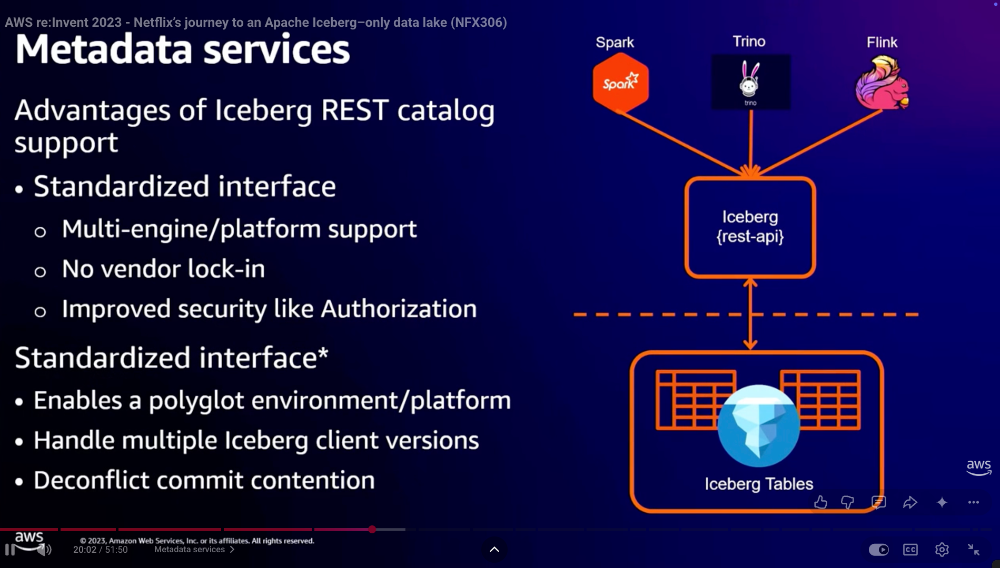

# Iceberg Table Maintenance at Scale

!!! info "TLDR"

    After reading this article, you will learn:

    - TBD
    - TBD
    - TBD

<!-- more -->

## Slack

/// caption
[Architecture Diagram](https://www.youtube.com/watch?v=NRSlundcwvc)
///

/// caption
[Components](https://www.youtube.com/watch?v=NRSlundcwvc)
///

## Netflix

/// caption
[Metadata Service](https://www.youtube.com/watch?v=jMFMEk8jFu8)
///

/// caption
[Details of Metadata Service](https://www.youtube.com/watch?v=jMFMEk8jFu8)
///

/// caption
[Janitor](https://www.youtube.com/watch?v=jMFMEk8jFu8)
///

/// caption
[Autotune](https://www.youtube.com/watch?v=jMFMEk8jFu8)
///

## Apple

/// caption
[Architecture](https://www.youtube.com/watch?v=JN6K1pdFImc)
///

/// caption
[Spark Job T-Shirt Sizing + Priorities](https://www.youtube.com/watch?v=JN6K1pdFImc)
///

Workload Scaling

Push-based: Difficult to scale

/// caption
[Push-based](https://www.youtube.com/watch?v=JN6K1pdFImc)
///

/// caption
[Pull-based](https://www.youtube.com/watch?v=JN6K1pdFImc)
///
per catalog, per-workload type, per security profile (need to design queue strategy very quickly)

/// caption
[TMS Enhancements](https://www.youtube.com/watch?v=JN6K1pdFImc)
///

event-based management
- extend iceberg rest spec with events
- TMS runs based on catalog events
    - Ingestion volume threshold
    - Ingestion Count Threshold
    - Small File Count Threshold
    - Table Update / Delete event

## LinkedIn

### AutoComp

!!! 
**Functional Requirements**

- **Fine-grained work units**. AutoComp should automatically select compaction candidates based on dynamic data analysis
- **Support for multiple compaction strategies**. The framework should support various compaction strategies that can encode the benefits, costs, or a combination of both, depending on the optimization objective.
- **Periodic and post-write execution triggers**. The framework should support execution triggered both periodically and immediately after large write operations.

**Non-Functional Requirements**

- **Extensibility**. The framework should be designed with future extensibility in mind, enabling it to integrate additional compaction strategies and adapt to new workloads as needed.
- **Explainability**. The framework should produce consistent compaction decisions under identical input conditions (e.g., file size distribution, workload characteristics).
- **Cross-platform compatibility**. The framework should be designed to work seamlessly across different LST and catalog implementations.

/// caption
[End-to-end workflow for AutoComp](https://arxiv.org/pdf/2504.04186)
///

/// caption
[Cluster Integration of AutoComp](https://arxiv.org/pdf/2504.04186)
///

### OpenHouse

/// caption
[OpenHouse](https://github.com/linkedin/openhouse)
///

## Floe

<iframe width="560" height="315" src="https://www.youtube.com/embed/UN44R8jYSXk?si=zq8CbFLP20Am4oI8" title="YouTube video player" frameborder="0" allow="accelerometer; autoplay; clipboard-write; encrypted-media; gyroscope; picture-in-picture; web-share" referrerpolicy="strict-origin-when-cross-origin" allowfullscreen></iframe>
/// caption
[Neelesh Salian – Floe: Policy-Based Table Maintenance for Apache Iceberg](https://www.youtube.com/watch?v=UN44R8jYSXk)
///

/// caption
architecture overview
///

## LakeOps

https://lakeops.dev/
