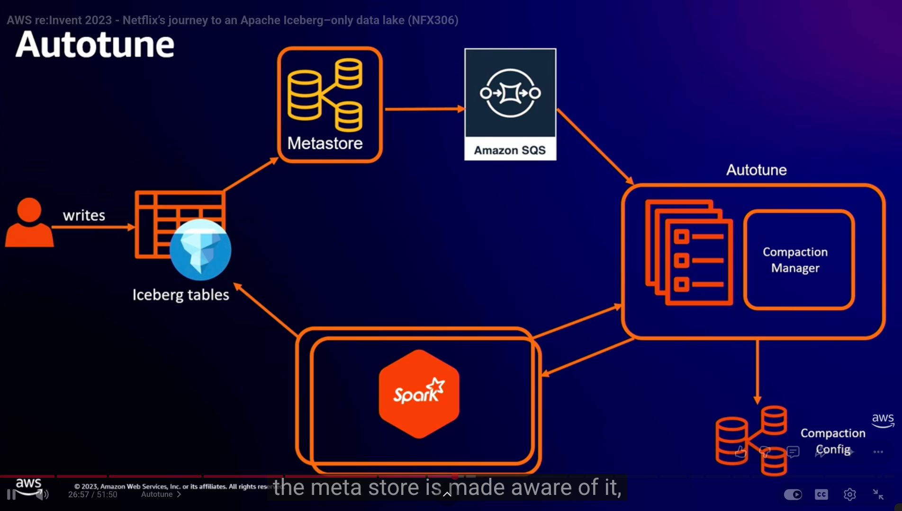
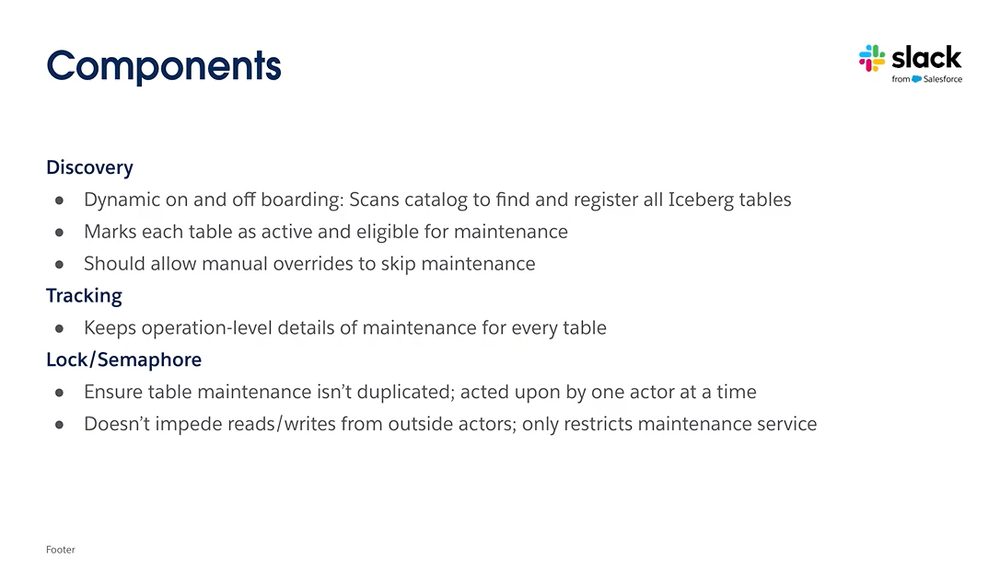
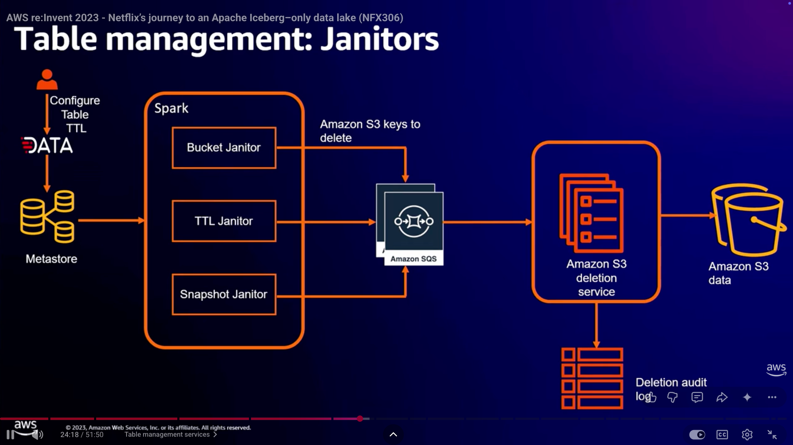

# Iceberg Table Maintenance at Scale: Lessons from 6 Big Companies

!!! info "After reading this article, you will be able to answer..."

    - 6 家公司各自蓋出來的 TMS，在架構上有什麼異同？
    - 這些獨立發展的系統收斂出了哪些共同 patterns？
    - 如果從零設計一個 TMS，哪些 building blocks 是非有不可的？

<!-- more -->

過去幾年裡，Iceberg tables 被許多大公司大規模採用。但採用之後馬上就要面對一個問題：Iceberg spec 本身只定義 table format，沒有規定誰來負責 compaction、snapshot expiry、orphan file cleanup 這些長期必須做的維護工作。community 也沒有提供一套 out-of-the-box 的方案，讓所有使用 Iceberg 的公司可以用同一套標準來處理。

結果就是各家大公司分別在 Iceberg 周圍打造出適合自家公司的 Table Maintenance Service (TMS)，自動化、cost-effective 地維護上萬張 tables。每家公司打造出來的細節不同，但承擔的工作高度重疊。

我寫這篇文章是因為最近自己在研究怎麼設計一個好的 TMS。把這幾家公司公開的做法擺在一起看，能不能找出共同的 patterns？也讓其他在處理同樣問題的團隊有經驗可以借鏡。

## 這 6 家公司在 Iceberg 上的進度跟規模

這 6 個觀察對象分成兩類。一類是在 production 自己蓋系統的大公司，看的是「實際跑久了之後，哪些 building blocks 非有不可」；另一類是專門以 TMS 為設計目標的開源 / 商業產品，看的是「如果從零開始想 TMS 該長什麼樣，會做出什麼樣的決定」。兩類放一起，才能看出哪些設計是經驗驗證過的，哪些是更純粹的設計思考。

**In-house 系統**

**Netflix** 跟 Iceberg 的關係特殊：Iceberg 這個 table format 最早就是 Ryan Blue 等人在 Netflix 內部設計出來的。後來他們把整個 data lake 全面轉成 Iceberg-only，規模接近 1 exabyte、tables 數超過 150 萬張，是公開資料裡規模最大的單一 Iceberg 部署。Janitor、Autotune、Autolift 這幾個 maintenance 服務也是這個長期過程裡沉澱出來的。

**Apple** 在自家 Data Lakehouse 上跑 Iceberg。當 tables 數量從幾十張增加到幾百張、再到上千張之後，原本針對單張 table 的 maintenance 做法就不夠用了，因此建了一個專門的 Table Management Service (TMS)。這套服務背後管的是數百個 catalogs、上千張 tables，每天跑數萬個 maintenance workloads；control plane 統一處理 compaction、snapshot expiry、metadata 管理跟 orphan file removal，data plane 則交給 Spark 執行。

**Slack** 從 Hive 遷到 Iceberg 之後，建立 Ice Chipper 這個內部服務來處理維護工作。Ice Chipper 目前維護超過 4,000 張 tables，所有 maintenance operations 的成功率達到 99.9%。它把所有 maintenance activity 寫進另一個 Iceberg table 當 tracking backend，鎖定機制也是透過對 lock table 跑 `MERGE` 完成。整套設計繞回 Iceberg 自己。

**LinkedIn OpenHouse** 是 LinkedIn 內部的 declarative table catalog 兼 maintenance control plane。2024 年公開時，OpenHouse 已經管理超過 15,000 張 tables，預期擴展到 100,000~200,000 張規模。後來 LinkedIn 把整套 control plane open source 出來。AutoComp 跟 Zero-Scan DQ 兩篇 arXiv 論文也把他們在 compaction 排序跟 metadata 觀測上的做法整理成可被其他公司借鏡的設計藍圖。

**Dedicated TMS 專案 / 產品**

**Floe** 是 Neelesh Salian 個人發起的開源 TMS framework。Neelesh 在 Iceberg community 是長期 contributor，把過去在 data platform 團隊裡反覆遇到「catalogs 不執行 maintenance、engines 不 orchestrate」的痛點整理出來，做成一個 declarative 的 policy 系統。使用者用 glob patterns 對 tables 套規則，Floe 會根據表的健康指標（小檔比例、snapshot 數、delete file 比例、partition skew）決定要不要實際跑 compaction、expire snapshot 等操作。目前支援 REST、Polaris、Lakekeeper、Gravitino、DataHub、Hive Metastore、Nessie 共 7 種 catalogs，執行引擎可以接 Spark 或 Trino。

**LakeOps** 是商業化的 lakehouse control plane，把 Iceberg 的 compaction、snapshot expiry、orphan cleanup、manifest 重寫包成 managed service。除了基本的 maintenance，他們還做 cross-engine 的 query routing（Trino、Spark、Snowflake）跟一層 lakehouse observability。網站定位是「無需改變 code 或基礎設施」的 drop-in 控制層，支援範圍涵蓋三大公有雲。

## Control plane 的中心正在收斂到 Iceberg Catalog

看完這 6 家在做什麼之後，第一個明顯的共同 pattern 是：control plane 的中心都在收斂到 Iceberg Catalog 這個位置。Iceberg spec 原本只定義了 table format 跟 catalog 的最小契約（最新的形式是 REST Catalog spec），沒有規定 catalog 應該承擔多少 maintenance 相關的職責。但實際看下去就會發現，這幾家不約而同地都把 catalog 擴充成「TMS 唯一的 source of truth」：policies、metadata、events 都掛在 catalog 上。

### Apple 把 REST Catalog 擴充成 TMS 的 source of truth

Apple 的 TMS 設計從一開始就把 REST Catalog 放在最核心的位置。他們明確說，TMS 必須能跨 catalog 實作運作，而 REST Catalog 剛好提供了這層抽象，把 catalog 實作從 service 本體解耦出來。

光是 abstraction 還不夠。Apple 進一步把 REST Catalog **擴充成 policy 儲存層**：table-level 的 maintenance 設定（例如哪些 tables 要 compaction、什麼閾值觸發、誰有權限改）都寫進 catalog，讓 catalog 變成 TMS 的 single source of truth。這個設計在 table owner 跟 admin 不是同一群人的環境特別關鍵：owner 設定 policy，admin 不用個別協調就能知道每張 table 該怎麼維護。

{width="600"}
/// caption
[Apple TMS architecture](https://youtu.be/JN6K1pdFImc)
///

Apple 也指出 catalog 雖然成了中心，但核心 Iceberg engine 在高併發寫入時的 conflict resolution 還是下一個瓶頸，目前還是 open work。

### LinkedIn OpenHouse 把 Catalog 設計成 declarative control plane

如果 Apple 是把現成的 REST Catalog 擴充使用，LinkedIn OpenHouse 則是把這個思路推到極致：直接把 catalog 設計成一個 declarative control plane。

在 OpenHouse 的世界裡，使用者用 SQL 宣告他們想要的 table 狀態（schema、policy、retention、sharing 等），不需要操心後面怎麼實現。OpenHouse 的 control plane 負責持續對齊「desired state」跟「observed state」，背後一群 data services 負責執行實際的 reconciliation。這個 reconcile 模式正是 Kubernetes 的設計哲學，只是套用在 lakehouse 上。

{width="600"}
/// caption
[OpenHouse 的 declarative control plane 架構](https://github.com/linkedin/openhouse)
///

在 LinkedIn 內部，OpenHouse 已經實際取代了 Hive Metastore，承擔 catalog 角色，並透過 4 套 API（core / sharing / governance / policy）對外服務。REST Catalog spec 原本留白的「catalog 該管多少事」這個問題，OpenHouse 給出的答案是「幾乎全部都該管」。

### Netflix 跟 Slack 的早期方案在朝同一個方向收斂

Apple 跟 LinkedIn 是「直接把 catalog 當 control plane 中心」的當代代表。Netflix 跟 Slack 則展示了另一件值得注意的事：即使沒有採用同樣的設計，他們也透過不同的路徑，在架構上扮演了同樣的角色。

Netflix 用的是內部的 **Metacat** 當 metadata 抽象層，比 Iceberg REST Catalog spec 出現得早：federated metadata store + 統一 API + 統一 type system。所有 maintenance 服務（Autotune、Janitor、Autolift）都跑在 Metacat 之上，透過開源 Iceberg API 操作 metadata。從架構上看，Metacat 在 Netflix 系統裡承擔的就是「catalog 兼 control plane」這個角色。Iceberg REST Catalog spec 出現之後，Netflix 並沒有立刻全面轉過去，而是讓 Metacat 跟 REST Catalog 並存。

{width="600"}
/// caption
[Netflix's metadata services layer with Metacat](https://youtu.be/jMFMEk8jFu8)
///

Slack 仍然使用 Hive catalog，但在上面疊了一層 Iceberg REST Catalog 當 abstraction layer。他們在 talk 裡明確說：未來會重新評估 Hive 的去留，但 Iceberg REST Catalog 已經是 share data across data mesh 的主要管道。換句話說，Slack 也在朝同一個方向走，只是 catalog 換掉的速度比較慢。

兩家的設計起點不同，但都收斂到同一個結論：Iceberg-compatible catalog 是整個 lakehouse 的中心。

## 維護任務的觸發從固定排程轉向 event-driven

Catalog 成為 control plane 中心之後，下一個自然要解的問題是：maintenance 任務該什麼時候跑？傳統做法是 cron，固定 schedule、每天或每小時掃一遍所有 tables。但在數萬張 tables 的環境下，cron 的兩個缺點會放大：不需要 maintenance 的 tables 也照樣排進去浪費資源；而真的需要 maintenance 的 tables 又可能要等到下一個排程才跑。這幾家的共同解法是把觸發的方式從 wall-clock 換成 table 上實際發生的事件。

### Apple 的 4 種 catalog event types

Apple 在 TMS 設計裡把這個轉變講得最明確。原本的 maintenance 觸發是從 policy store 取靜態 schedule，現在改成從 data ingestion pipelines 跟 metadata catalogs 取 real-time events。他們明確列出優先支援的 **4 種核心 event types**：

- **Ingestion Volume**：寫入資料量超過閾值。
- **Ingestion Count**：寫入次數累積到一定數量。
- **Small File Count**：累積的小檔達到一定數量。
- **Metadata Changes**：catalog 上的 schema / table 變更事件。

這 4 種 events 分別連到 compaction、snapshot expiry、orphan file removal 這幾個 maintenance 操作。Apple 在 talk 裡把這個設計形容為「從 reactive 到 proactive」：TMS 不再被動等到排程才檢查 table 狀態，而是看到指標越界就立刻反應。

{width="600"}
/// caption
[Apple TMS — event-based management 的 4 種 catalog events](https://youtu.be/JN6K1pdFImc)
///

Apple 也明確提到 TMS 同時保留**手動觸發 ad-hoc run** 的能力，方便處理 outlier 情況（一張 table 突然需要重建），維運人員可以直接呼 API 觸發，不用等下一個事件。事件驅動跟手動觸發是兩個並存的入口，不是互斥。

### Netflix 怎麼把 snapshot commit 串到 Autotune

Netflix 走的路線非常類似，只是事件 channel 用的是 AWS 自家的 SQS。每當 user 寫入 Iceberg table，Metacat（前面提到的 metadata service）就會發一個 event 到 SQS，內容是「這張 table 剛 commit 了這些 snapshots」。

**Autotune** 在背景跑，subscribe 那個 SQS queue。收到事件之後查自己存的 compaction config（哪些 tables、什麼策略），決定要不要啟動 Spark application 重寫資料。整套設計把 Autotune 跟使用者完全解耦：使用者只管寫入，後續的優化交給 Autotune，使用者不需要知道這個服務存在。

{width="600"}
/// caption
[Netflix Autotune — listens to snapshot-commit events on SQS](https://youtu.be/jMFMEk8jFu8)
///

類似的 pattern 也用在 **Autolift** 上：它掃描傳入的 snapshot 流，識別需要從遠端 region 搬到本地 region 的檔案，然後用 Iceberg API 做 atomic replacement。同一條 SQS 事件流被多個下游服務消費，每個服務根據自己的邏輯反應。

### LinkedIn AutoComp 的 push + pull 雙模式

LinkedIn AutoComp 比前兩家走得更遠：它設計上同時支援兩種觸發模式，並把它們整合在同一個決策框架（OODA）裡。

在 **pull 模式**下，AutoComp 以獨立 service 跑，按 periodic schedule（LinkedIn 內部最初是每天一次）從 catalog 跟 Iceberg system tables 主動 pull 統計資料，evaluate 全部候選 tables，排出 top-k 該做 compaction 的，送去執行。這條 path 不需要修改 query engine 或 ingestion 程式碼，部署到 OpenHouse control plane 就行。

**push 模式**則是把 hook 嵌進 Spark 寫入路徑：寫入完成後 Spark 直接通知 AutoComp，AutoComp 根據當下的 file distribution 決定要不要立刻做 compaction。延遲低，適合 critical tables；缺點是需要可用的 compute budget，否則會跟正常 ingestion workload 搶資源。

{width="600"}
/// caption
[AutoComp end-to-end workflow (OODA loop)](https://arxiv.org/pdf/2504.04186)
///

兩條 path 走的都是同一個 OODA workflow（Observe、Orient、Decide、Act）。觸發來源是 push 還是 pull 是 input 層的差異，後續的 decision logic 完全共用。意思是同一套 framework 可以對 critical tables 用 push 確保即時性、對其他 tables 用 pull 控成本。

## 資源受限下的維護任務需要分級與調度

事件驅動解決了「什麼時候開始」的問題，但同時製造了一個新的麻煩：事件累積的速度可能比 maintenance 跑完的速度更快。如果不做分級調度，要嘛資源被低價值的任務吃光、要嘛真正關鍵的 table 永遠排不到。這幾家的解法各有風格，但都把同一件事當成 TMS 的核心責任：明確設計一套抽象，決定誰先做、用什麼規格做、什麼條件下能跳過。

### Apple 的 t-shirt sizing 跟 shared Spark applications

Apple 在這個問題上做了 3 件事，每一件都解一個具體的資源浪費。

第一件是 **shared Spark applications**（Apple talk 裡用的詞是 "Spark job"，但實際指的是 driver + executors 的長駐 application，本文沿用嚴格術語）。原本每個 maintenance workload 起一個專屬 Spark application，但 bootstrapping 一個 application 本身（JVM 啟動、SparkContext init、executor 配置）要花掉相當可觀的時間，在數萬個 workload / 天的規模下光是 bootstrap 就是顯著的成本。Apple 的做法是讓同一個 catalog 內的所有 tables 共用一個 Spark application 處理 maintenance，前提是這些 tables 共用同一組 security credentials（catalog 作為 tenant boundary）。

第二件是 **t-shirt sizing**。Share Spark applications 之後，下一個問題是怎麼讓不同 size 的 workload 配到適合的 application 規格。Apple 把 Spark application 規格分成 small / medium / large 幾個固定 size（透過 executor 數 + memory 配置），每個 incoming workload 評估之後分配到對應 t-shirt size。例如 small 是 16GB × 5 executors、medium 是 24GB × 10 executors。這樣小任務不會吃掉大規格的資源，大任務也不會被小規格卡住。

第三件是 **DRA + workload forecasting**。Spark application 內部開 DRA（dynamic resource allocation）讓 executor 數量隨 runtime 需求自動伸縮；同時 control plane 根據 ingestion rate、data volume、metadata changes 預測未來資源需求，動態啟動足量的 Spark applications。三件事加起來，TMS 在資源使用上做到了 Apple 自己形容的「lean and responsive」。

{width="600"}
/// caption
[Apple — t-shirt sizing 跟 workload priorities](https://youtu.be/JN6K1pdFImc)
///

### LinkedIn 的 declarative policy 加 MOOP top-K 排序

LinkedIn 把分級問題分兩層處理：上層用 **OpenHouse** 收使用者意圖、下層用 **AutoComp** 解 compaction 排序。

**OpenHouse** 提供 4 種 policy APIs（retention、replication、Iceberg maintenance、data layout optimization）。使用者只要 set `retention = 30 days`，背後就有對應的 data service 跑 background job 把過期 partition 處理掉。使用者不用知道 schedule 是怎麼決定的，也不用知道是哪個 Spark application 跑的，只要表達 desired state 就好。Policy API 本身只負責收意圖，**真正在資源受限下決定該做哪些 compaction、用什麼粒度做**，是 OpenHouse 底下 data layout optimization 那個 data service（也就是 AutoComp）在處理。

AutoComp 直接把「該維護哪些 tables」當成 **multi-objective optimization problem (MOOP)** 處理。

問題的數學形式是：在數十萬張候選 tables 之中、固定 compute budget 之下，挑出 top-K 個能帶來最大 benefit 的 tables 去做 compaction。Benefit 跟 cost 是兩個衝突的目標：benefit 包含 small file count reduction、query latency 改善；cost 是 GBHr（compute hours）。MOOP 在這兩個目標之間找 Pareto 最優。

另外 AutoComp 還有一個關鍵設計：**hybrid scoping**。原本是在 table-level 排名 top-K，但對大 table 來說整張表 rewrite 太貴；他們改成可以在 **table-partition 層級**做排名，把大 table 拆成以 partition 為粒度的候選。production 比較三種設定（no compaction / table-only top-10 / hybrid top-500），hybrid 的執行時間最穩定、效益最高。

{width="600"}
/// caption
[AutoComp cluster integration](https://arxiv.org/pdf/2504.04186)
///

### Floe 的 health-driven debt score 排程

Floe 也採 declarative 設計，但把 health-driven 邏輯做得最具體。它定義了 maintenance **debt score** 跟 **severity levels**（critical 10x、warning 3x、info 1x），系統根據每張 table 的真實健康指標（小檔比例、snapshot 數、delete file ratio、partition skew）算出 score，sicker tables 排在前面跑。同一個 policy file 可以用 glob pattern 套到多張 tables，priority 跟 schedule 都是 policy 的一部分。

Floe 還在 policy 上面再加了一層 maintenance planner：在真正 trigger job 之前，根據當下指標再判斷一次「這張 table 真的需要 maintenance 嗎」，避免 cron-triggered 但其實沒必要跑的 no-op job 浪費 compute。

這幾家在 scheduling 上的具體做法不同：Apple 把重心放在 infrastructure-level 優化、LinkedIn 用 declarative policy 收意圖再以 MOOP 排序執行、Floe 用 health-driven debt score 主動避免 no-op。但都認同同一個前提：maintenance workload 永遠大於資源，決定誰先做、用多大規格做，是 TMS 不能不做的核心職責。

## Control plane 自己也需要 source of truth

前面 3 個 patterns（catalog 收斂、事件驅動、分級調度）都是在說 control plane 如何**做事**。但 control plane 自己也需要記憶力：它得知道哪些 workloads 已經跑完、哪些失敗、哪些卡住中、上一輪 metric 是什麼樣子。沒有可靠的 state，scheduling 會缺乏依據、observability 會缺角、failure recovery 也無從談起。這 4 家在「state 放哪裡」這個問題上各自給出不同答案。

### Apple 的 durable store 跟雙向 REST

Apple 把這件事當成 TMS architecture 裡明確的一塊：「control plane 必須把每個 workload 的 lifecycle 跟每一次系統變更都持久化到 durable store，並透過 API 對使用者跟其他工具 expose 查詢介面」。沒有這個 durable store，每天上萬個 workloads 跑下去就會徹底失控。

承擔這個責任的元件叫 **Workload Manager**，是 control plane 的中樞。Workload Manager 從 policy store 讀取 policies，組合成具體的 workloads，交給 orchestrator 派去 Spark application 執行；Spark 那邊執行時，狀態回流到 Workload Manager。這樣它隨時都有「目前每個 workload 處於什麼狀態」的完整視圖。

Spark 那邊回流狀態的具體做法是：每個 Spark application 內部都跑一個 **lightweight REST server**，讓 TMS control plane 可以直接 query Spark driver 內部狀態（執行進度、metrics、observability data）。這條 REST channel 是雙向的，control plane 也能透過它對 driver 下指令。這比傳統的「control plane 先寫資料庫、driver 再 poll」設計直接很多。

### LinkedIn 的 Kafka 三條 topics

LinkedIn 把這個問題拆得最徹底：control plane 的 state 用 Kafka 持續往外流，每個下游消費者建立自己需要的視角。

具體做法是用一組「零掃描」(zero-scan) Spark applications 跑在每張 table 上：它們不讀 Parquet/ORC 資料、只讀 Iceberg 的 manifest 跟 snapshot metadata，把抽取到的資訊發成 **3 條 Kafka topics**：

- **Commit Metadata**：每次 commit 的 snapshot ID、timestamp、**Writer Identity**（區分這個 commit 是來自使用者寫入還是 maintenance 操作，讓監控可以過濾掉系統噪音）。
- **Per-partition Commit Detail**：每個 partition 的檔案數量跟大小變化。「Arrival Metrics」pipeline 靠這條 topic 監控資料是否如期抵達跟 partition 碎片化。
- **Column-level Stats**：record count、null counts、欄位上下界。這條是 DQ 規則的主要原料。

這套設計讓 LinkedIn 在 200,000+ tables 上做即時 DQ 監控，p50 警報時間從傳統 scan-based profiling 的 2~24 小時壓到 5 分鐘以內，計算成本省 50%、HDFS 讀取省 45%。光是 manifest 統計資訊就覆蓋約 60% 的使用者定義 DQ 規則，加上 Theta sketches 可以擴展到 90%。

### Slack 把 Iceberg 自己當成 tracking backend

Slack 的解法最務實：要存 control plane state，**就在 Iceberg 上開一張 table 存**。他們考慮過架一個獨立的 Aurora 資料庫，但最後決定既然整套 lakehouse 已經是 Iceberg，索性就「dogfood」自家 stack。

Ice Chipper 的 state 拆成兩張 Iceberg table：

- **Tracking table**：記錄每次 maintenance operation 的全部 metadata（operation 開始時間、結束時間、成功/失敗狀態、stack trace、相關 table 資訊）。所有 dashboard 都從這張 table 讀。
- **Locking table**：用來確保同一張 table 同時只有一個 maintenance operation 在跑。獲取 lock 的方式是 `MERGE` 進 locking table，release 也是 `MERGE`，靠 Iceberg 的 ACID commit 保證 lock 的正確性。

{width="600"}
/// caption
[Slack Ice Chipper — locking table + tracking table 都是 Iceberg table](https://www.youtube.com/watch?v=NRSlundcwvc)
///

這個設計有個二階問題：tracking table 跟 locking table 自己也是 Iceberg table，也會累積 snapshots、需要 maintenance。Slack 在 talk 裡承認他們漏看過這件事一次，差點把 Ice Chipper 自己卡死。修一次就學會了。

### Netflix 用 SQS 串起整條事件流

Netflix 的取捨跟前面 3 家不太一樣：他們沒有單獨建一個 control plane state store。Iceberg metadata + Metacat 本身就是 source of truth，maintenance 服務（Janitor / Autotune / Autolift）設計成大致無狀態的 worker，靠 SQS 把事件串起來、靠 Iceberg snapshot history 做最終的對帳。

舉例來說，Janitor 從 SQS queue 收到「這個 snapshot 要清理」的訊息，去 S3 列出對應的 orphan files，發到下一個 SQS queue 給 deletion service；deletion service 讀訊息、執行刪除。整條 path 沒有 Janitor 自己的「現在做到哪了」state，重做也是冪等的（list + delete 都看現實 S3 狀態，不依賴 in-flight state）。

{width="600"}
/// caption
[Netflix Janitor — stateless workers connected via SQS](https://youtu.be/jMFMEk8jFu8)
///

這個設計的好處是元件之間零耦合、隨意 scale；代價是要做 monitoring 跟 debugging 時，必須跨多個 service log 跟 SQS queue 拼湊一個完整 picture。是另一種設計取捨。

4 家給出 4 種非常不同的 state 設計：Apple 用 durable store + 雙向 REST 做主動管理、LinkedIn 用 Kafka topics 做持續流出、Slack 把 Iceberg 自己當 backend、Netflix 直接讓 Iceberg metadata + Metacat 兼任 source of truth。沒有哪個是「正解」，4 個答案對應的是各家在「主動掌控 state vs. 信任 source data」這條 trade-off 上的不同取捨。

## 反推一個能 work 的 TMS 該長什麼樣

回到一開始的問題：一個能管好上萬張 Iceberg tables 的 TMS 該長什麼樣？把這 4 個 patterns 串起來，藍圖其實已經浮現。

**中心要落在 Iceberg Catalog**。Apple 跟 LinkedIn 已經用兩種方式驗證了這點（前者擴充 REST Catalog 當 policy 儲存層、後者把 OpenHouse 設計成完整的 declarative control plane），Netflix 跟 Slack 即使從別的起點出發（Metacat、Hive on REST）也都在朝同個架構角色收斂。如果今天從零開始，可以直接把 REST Catalog 當 control plane 的中軸來設計，不用走一遍 Metacat 那段歷史路徑。

**觸發改成 event-driven**。Apple 列出的 4 種 event types（ingestion volume / count / small file count / metadata changes）跟 Netflix 的 snapshot-commit-on-SQS 模式給了一個很具體的起點。LinkedIn AutoComp 的 push + pull 雙模式則展示了「同一套 framework 兩種觸發來源」這個更成熟的設計目標。Cron 不需要完全消失，但應該退居 fallback，不是主要 trigger。

**Scheduling 必須是 first-class concern**。決定誰先做、用多大規格做、什麼條件下能跳過，這幾個問題不可能在 production 規模下「順其自然」。Apple 的 infrastructure-level 優化（shared Spark applications + t-shirt sizing）、LinkedIn 的 MOOP top-K、Floe 的 debt score 都是合理的設計起點，挑哪個看團隊對 declarative vs. imperative 的偏好。

**Control plane 自己的 state 要明確設計**。Apple 用 durable store 主動管理、LinkedIn 用 Kafka 持續流出、Slack dogfood Iceberg、Netflix 走純無狀態 worker，4 種都 work，但都不是「免費」的選擇。要在設計初期就決定走哪一條，不要等到 production 才開始想。

這 4 個 building blocks 加起來，已經是一個能 work 的 TMS 的最小骨架。剩下的差異是規模壓出來的細節，不是設計層面的根本選擇。我自己覺得很令人期待的是，Iceberg community 也在朝這個方向動：[REST Catalog spec](https://iceberg.apache.org/docs/latest/) 持續加入 catalog-level events、[OpenHouse](https://github.com/linkedin/openhouse) 跟 [Floe](https://github.com/nssalian/floe) 把這些 patterns 開源讓更多公司直接借鏡。我非常看好這個收斂方向：3 年內這套設計藍圖很有機會從「大公司公開的做法」沉澱成「community 提供的標準 TMS reference architecture」，到時候每個用 Iceberg 的團隊都不需要再從零做這些 building blocks 了。
