# Iceberg Table Maintenance at Scale: Lessons from 6 Big Companies

!!! info "After reading this article, you will be able to answer..."

    - 6 家公司各自打造出來的 Iceberg Table Maintenance Service (TMS)，在架構上有什麼異同？
    - 這些獨立發展的系統收斂出了哪些共同 patterns？
    - 如果從零設計一個能在多團隊、大規模下擴展的 TMS，哪些 building blocks 是非有不可的？

<!-- more -->

過去幾年裡，Iceberg tables 被許多大公司大規模採用。但採用之後馬上就要面對一個問題：Iceberg spec 本身只定義 table format，沒有規定誰來負責 compaction、snapshot expiry、orphan file cleanup 這些長期必須做的維護工作。community 也沒有提供一套 out-of-the-box 的方案，讓所有使用 Iceberg 的公司可以用同一套標準來處理。

結果就是各家大公司分別在 Iceberg tables 周圍打造出適合自家公司的 Table Maintenance Service (TMS)，用自動化的方式維護上萬張 tables，同時讓成本不要失控。每家公司打造出來的 TMS 或許有所不同，但承擔的工作高度重疊。

我寫這篇文章是因為最近自己在研究怎麼設計一個好的 TMS。把這幾家公司公開的做法擺在一起看，看能不能找出共同的 patterns？也讓其他在處理同樣問題的團隊有經驗可以借鏡。

## 這 6 家公司在 Iceberg 上的進度跟規模

這 6 家公司我會把它們分成兩種：

- 一種是在自家環境打造 Iceberg TMS 的大公司，像是 Netflix、Apple、LinkedIn、Slack；
- 另一種則是專門以 Iceberg TMS 為設計目標的開源 / 商業產品，像是 Floe 跟 LakeOps，服務「已經導入 Iceberg 但沒有資源自行維運、打造 TMS」的公司

兩種一起觀察，我覺得更可以看出「實際跑久了、規模變大了之後，哪些 building blocks 非有不可？哪些問題是每家公司導入 Iceberg 時都會遇到的？」

### In-house 系統

**Netflix** 跟 Iceberg 的關係很深厚：Iceberg 這個 table format 最早就是 Ryan Blue 等人在 Netflix 內部設計出來的。後來他們把整個 data lake 全面轉成 Iceberg-only，規模接近 1 EB，超過 1.5M Iceberg tables，是公開資料裡規模最大的 Iceberg 部署。Janitor、Autotune、Autolift 這幾個 maintenance 服務也是這個長期維運過程裡打造出來的。

<iframe width="560" height="315" src="https://www.youtube.com/embed/jMFMEk8jFu8?si=iF9W2fxk2duse2xU" title="YouTube video player" frameborder="0" allow="accelerometer; autoplay; clipboard-write; encrypted-media; gyroscope; picture-in-picture; web-share" referrerpolicy="strict-origin-when-cross-origin" allowfullscreen></iframe>
/// caption
[AWS re:Invent 2023 - Netflix’s journey to an Apache Iceberg–only data lake (NFX306)](https://www.youtube.com/watch?v=jMFMEk8jFu8)
///

**Apple** 同樣也導入了 Iceberg。當 tables 數量從幾十張增加到幾百張、再到上千張之後，原本針對單張 table 的 maintenance 做法就不夠用了，因此建了一個專門的 TMS，背後管的是數百個 catalogs、上萬張 tables；control plane 統一處理數萬個 maintenance workloads，data plane 則交給 Spark 執行。

<iframe width="560" height="315" src="https://www.youtube.com/embed/JN6K1pdFImc?si=DxCNON-ZPvvuMzid" title="YouTube video player" frameborder="0" allow="accelerometer; autoplay; clipboard-write; encrypted-media; gyroscope; picture-in-picture; web-share" referrerpolicy="strict-origin-when-cross-origin" allowfullscreen></iframe>
/// caption
[Learnings from Running Large-scale Apache Iceberg™ Table Management Service](https://www.youtube.com/watch?v=JN6K1pdFImc)
///

**LinkedIn** [OpenHouse](https://github.com/linkedin/openhouse) 是 LinkedIn 內部的 declarative table catalog 兼 maintenance control plane。2024 年公開分享時，LinkedIn 已經透過 OpenHouse 管理超過 15k 張 tables，並提到未來預期擴展到 100k - 200k 張 tables 的規模。隨後 LinkedIn 也在2025 和 2026年 分別發表 [AutoComp](https://arxiv.org/abs/2504.04186) 跟 [Zero-Scan Data Quality](https://arxiv.org/abs/2605.30308) 兩篇 arXiv 論文，把他們在 compaction 排序跟 metadata 觀測上的做法整理成可被其他公司借鏡的寶貴經驗。

<iframe width="560" height="315" src="https://www.youtube.com/embed/Gjmg8aPJeIk?si=3LQ8ShtSRUS_ilav" title="YouTube video player" frameborder="0" allow="accelerometer; autoplay; clipboard-write; encrypted-media; gyroscope; picture-in-picture; web-share" referrerpolicy="strict-origin-when-cross-origin" allowfullscreen></iframe>
/// caption
[Optimizing Iceberg Table Layouts at Scale: A Multi-Objective Approach](https://www.youtube.com/watch?v=Gjmg8aPJeIk)
///

<iframe width="560" height="315" src="https://www.youtube.com/embed/5fubVf6E3PM?si=5CN9G5jMN3e3qCBs" title="YouTube video player" frameborder="0" allow="accelerometer; autoplay; clipboard-write; encrypted-media; gyroscope; picture-in-picture; web-share" referrerpolicy="strict-origin-when-cross-origin" allowfullscreen></iframe>
/// caption
[Taking Charge of Tables with OpenHouse](https://www.youtube.com/watch?v=5fubVf6E3PM)
///

**Slack** 從 Hive 遷到 Iceberg 之後，建立 IceChipper 這個內部服務來處理維護工作。IceChipper 目前維護超過 4,000 張 tables，所有 maintenance operations 的成功率達到 99.9%。它把所有 maintenance activity 寫進另一個 Iceberg table 當 tracking backend，鎖定機制也是透過對 lock table 跑 `MERGE` 完成。整套設計繞回 Iceberg 自己。

<iframe width="560" height="315" src="https://www.youtube.com/embed/NRSlundcwvc?si=xa6cp1-jKymhJiRd" title="YouTube video player" frameborder="0" allow="accelerometer; autoplay; clipboard-write; encrypted-media; gyroscope; picture-in-picture; web-share" referrerpolicy="strict-origin-when-cross-origin" allowfullscreen></iframe>
/// caption
[Maintaining Iceberg at Scale: Lessons from Slack](https://www.youtube.com/watch?v=NRSlundcwvc)
///

### Dedicated TMS 專案 / 產品

[**Floe**](https://github.com/nssalian/floe) 是 Neelesh Salian 個人發起的開源 TMS framework。Neelesh 在 Iceberg community 是長期 contributor，把過去在 data platform 團隊裡反覆遇到「catalogs 不執行 maintenance、engines 不 orchestrate」的痛點整理出來，做成一個 declarative 的 policy 系統。使用者用 glob patterns 對 tables 套規則，Floe 會根據表的健康指標（小檔比例、snapshot 數、delete file 比例、partition skew）決定要不要實際跑 compaction、expire snapshot 等操作。目前支援 REST、Polaris、Lakekeeper、Gravitino、DataHub、Hive Metastore、Nessie 共 7 種 catalogs，執行引擎則可以接 Spark 或 Trino。

{width="600"}
/// caption
Floe Dashboard
///

[**LakeOps**](https://lakeops.dev/) 是商業化的 lakehouse control plane，把 Iceberg 的 compaction、snapshot expiry、orphan cleanup、manifest 重寫包成 managed service。除了基本的 maintenance，他們還做 cross-engine 的 query routing（Trino、Spark、Snowflake）跟一層 lakehouse observability。網站定位是「無需改變 code 或基礎設施」的 drop-in control plane。

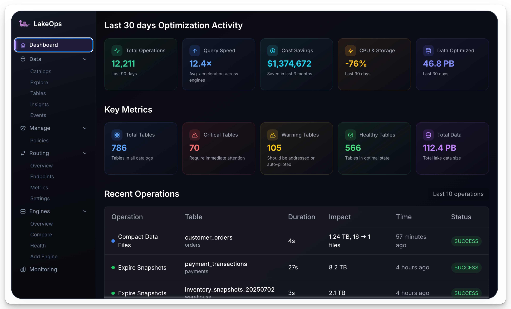{width="600"}
/// caption
[LakeOps](https://lakeops.dev/)
///

## 1. 減少使用者導入 Iceberg 時的維護負擔

這幾家公司在設計 TMS 時，不約而同地把一件事當成設計目標：讓使用者不需要理解 Iceberg 維護的細節就能用 Iceberg。資料的價值來自背後要解決的問題跟商業目標，不是來自搞懂 compaction 跟 snapshot expiry 怎麼運作。如果每個團隊要把資料 onboard 到 Iceberg 時都得先學會這些，Iceberg 就很難被大規模採用。

**Slack**

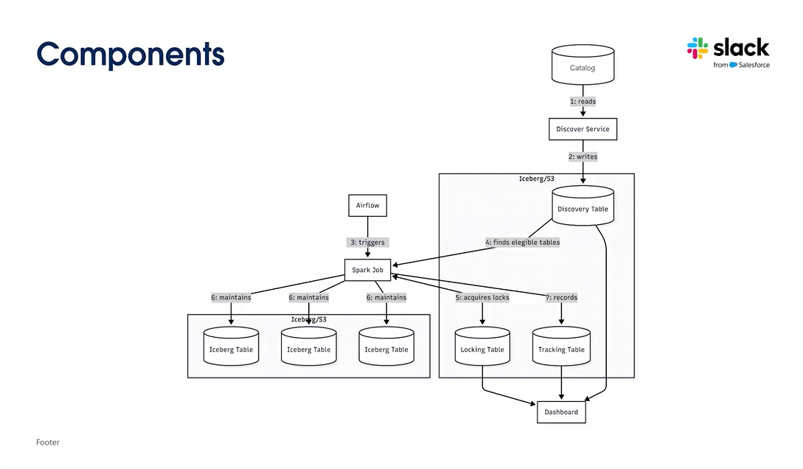{width="600"}
/// caption
[Slack IceChipper Architecture](https://www.youtube.com/watch?v=NRSlundcwvc)
///
Slack 在 IceChipper 裡建了一個 **discovery service**，自動從 catalog 掃描 Iceberg tables 並納入維護範圍。團隊不需要手動註冊，tables 建立後就會被自動發現、自動維護。

**Netflix**

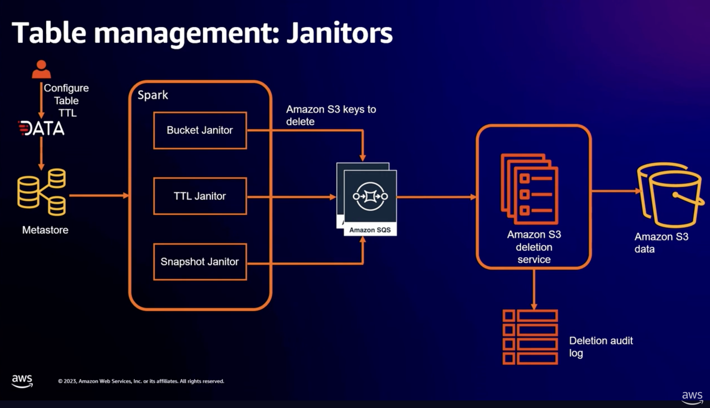{width="600"}
/// caption
[Janitors](https://youtu.be/jMFMEk8jFu8)
///

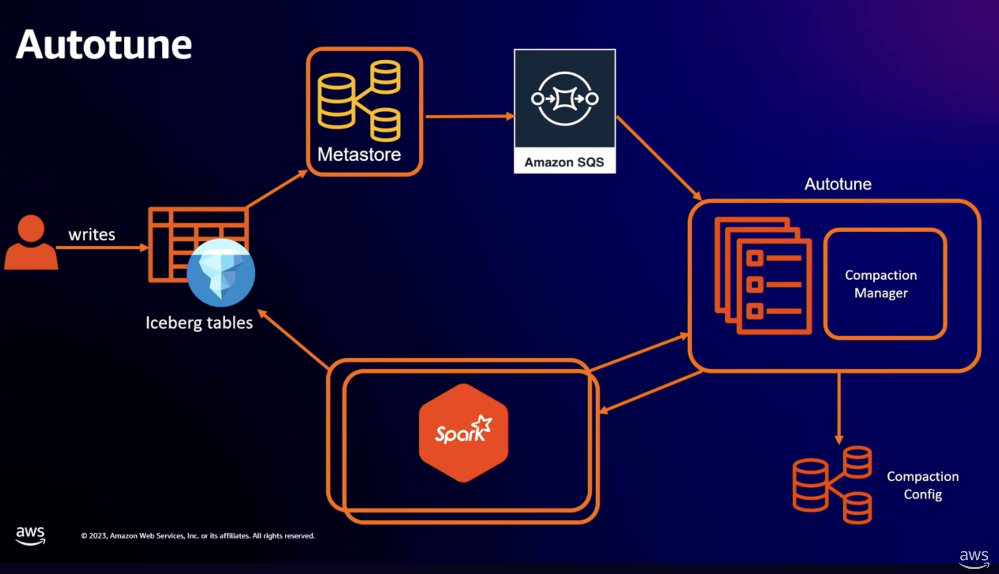{width="600"}
/// caption
[AutoTune](https://youtu.be/jMFMEk8jFu8)
///

Netflix 把維護工作拆成三個獨立的 **Janitor** 服務（TTL janitor、snapshot janitor、orphan file janitor），使用者只需要透過 portal 設定一個 TTL，背後的 data expiry、snapshot cleanup 跟 orphan file deletion 就會自動處理。另一個服務 **Autotune** 則完全在背景跑 compaction 跟 file layout 優化，使用者甚至不需要知道這個服務的存在。

**LinkedIn**

LinkedIn 的 **OpenHouse** 更進一步：使用者用 SQL 宣告 `retention = 30 days` 或 `replication = 'clusterB'`，整個 maintenance lifecycle 就交給平台。背後的 data services 會自動處理 data expiry、跨 data center 的 incremental replication、snapshot expiry、orphan file deletion 等工作。使用者不需要知道哪個 Spark application 在跑、排程是怎麼決定的，只要表達 desired state 就好。OpenHouse 在分享中把這個設計理念稱為「control that liberates」：平台拿回控制權，反而讓使用者不用再操心低層級的基礎設施。

!!! success "Takeaway"

    三家的做法不同，但方向一致：maintenance workload 集中到平台層處理，讓每個使用資料的團隊可以專注在自己的業務上。

## 2. 去耦合 Control Plane 跟 Data Plane

每家公司的架構裡都可以觀察到同一個現象：「決定要做什麼、什麼時候做、用什麼規格做、持續管理任務生命週期」的 Control Plane 跟「真正去跑 compaction、snapshot expiry、orphan cleanup」的 Data Plane 被拆成兩層。即使不是每家公司都在分享裡用了 control plane / data plane 這套說法，實際的架構也都有這個分離。有了這個分層，兩邊可以各自獨立演進：升級調度策略時不用動 Spark，想把 Data Plane 從 Spark 換成其他 compute engine 時也不用重寫調度邏輯。

**Apple**

Apple 在這件事上講得最具體。他們在分享中比較了兩種 Control Plane 跟 Data Plane 之間的溝通方式。

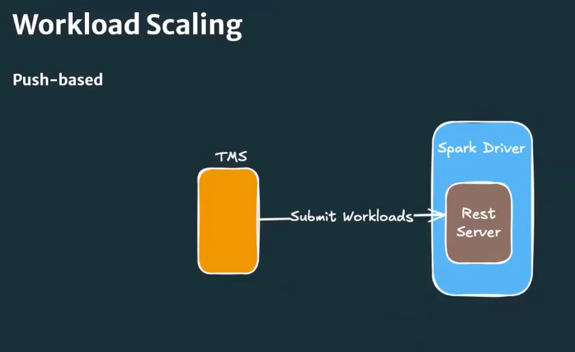{width="600"}
/// caption
[Apple Push-based Workload Scaling](https://youtu.be/JN6K1pdFImc)
///

第一種是 Control Plane 直接透過 lightweight REST server 跟 Spark driver 溝通，簡單直接但兩邊耦合度高，難以各自擴展。

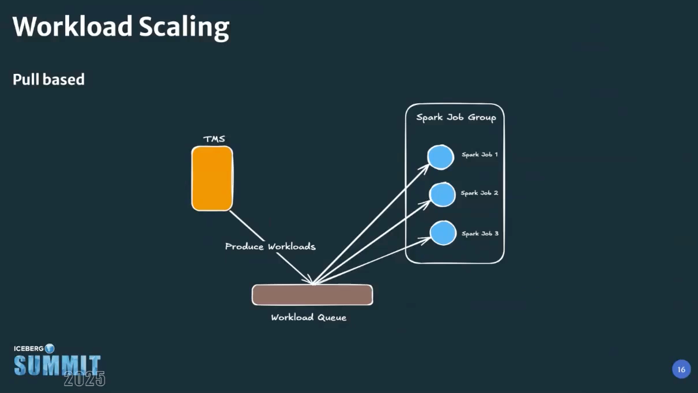{width="600"}
/// caption
[Apple Pull-based Workload Scaling](https://youtu.be/JN6K1pdFImc)
///

另一種則是在中間加上 queue，Control Plane 把 workloads 放進 queue，Spark applications 主動 pull 出來執行。Queue-based 的做法讓兩邊徹底解耦：Control Plane 不用直接管理 Spark application 的 lifecycle，Data Plane 也可以根據自身的資源狀況決定什麼時候拿下一個 workload。

**LinkedIn**

{width="350"}
/// caption
[OpenHouse Architecture](https://github.com/linkedin/openhouse)
///

LinkedIn 的 OpenHouse 在架構上把 Control Plane（declarative catalog + API 層）跟 Data Plane（一組獨立運作的 data services）明確分開。Control Plane 負責收 policies 跟追蹤 desired state，Data Plane 的 data services（retention、replication、Iceberg maintenance、data layout optimization）各自以獨立的 background jobs 跑在 Spark 上，自行決定什麼時候執行、怎麼 reconcile。兩邊透過 reconcile 模式溝通，不直接耦合。

!!! success "Takeaway"

    兩家的做法風格不同，但都指向同一個設計原則：Control Plane 跟 Data Plane 之間不應該有直接的依賴，去耦合讓兩邊可以各自 scale、各自演進。

## 3. 以 Iceberg Rest Catalog (IRC) 為中心建構 Control Plane

每家的 Control Plane 都選擇從 IRC 這個位置往外擴充，把 policy store、orchestrator、workload scheduler 等元件加上去，讓 catalog 不再只是 metadata store，而是整個 TMS 調度邏輯的起點。

**Netflix**

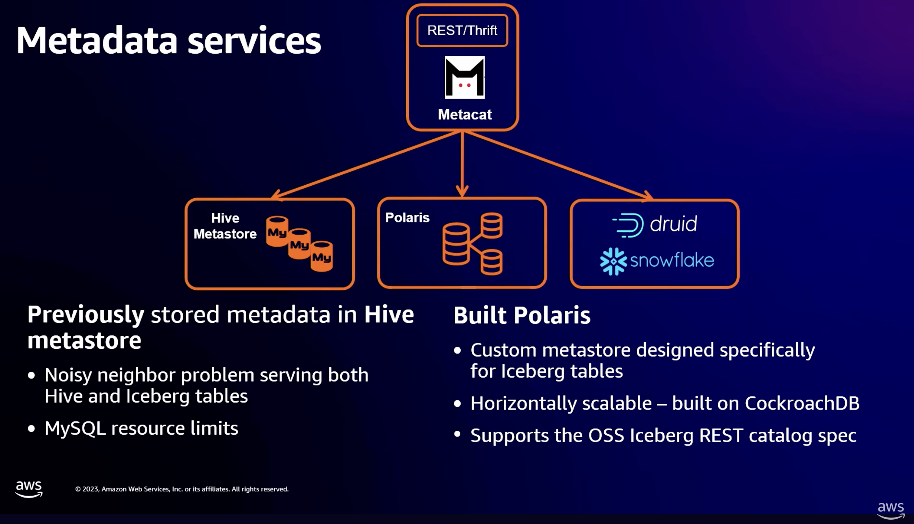{width="600"}
/// caption
[Netflix's metadata services layer with Metacat](https://youtu.be/jMFMEk8jFu8)
///

Netflix 在 2023 年的演講提到，他們用的是內部的 **Metacat** 當 metadata 抽象層。Metacat 是一個 federated metadata store，底下整合了 Hive Metastore、Netflix 自己客製的 Polaris IRC、以及 Druid 跟 Snowflake 等其他資料來源，對上層提供統一的 API 跟 type system，讓公司內部的人可以用同一套 metadata system 查詢，不需要知道底層的資料儲存細節。

所有 maintenance 服務（Autotune、Janitor、Autolift）都跑在 Metacat 之上，透過開源 Iceberg API 操作 metadata。從架構上看，Metacat 在 Netflix 系統裡承擔的就是「catalog 兼 control plane」這個角色。

**Apple**

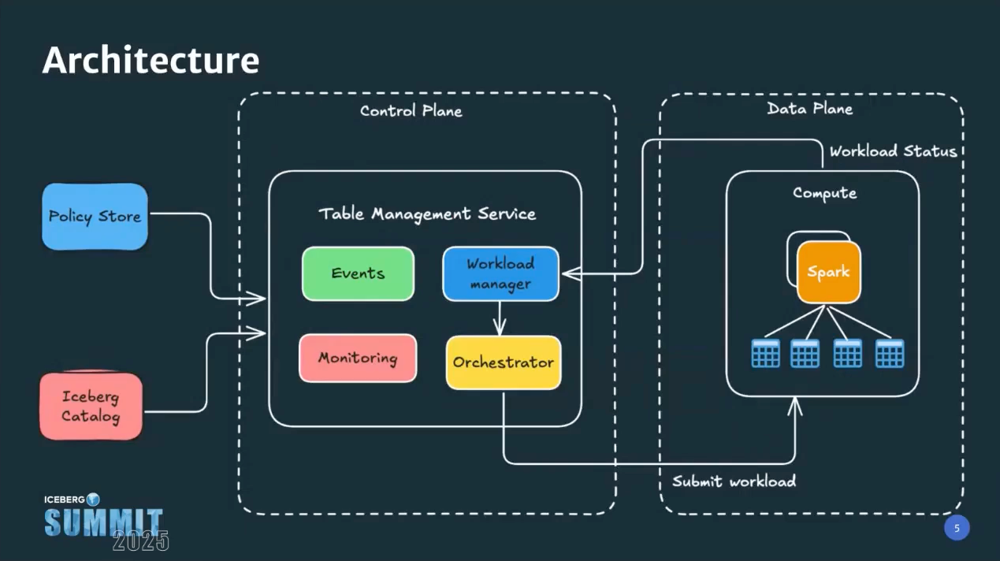{width="600"}
/// caption
[Apple TMS architecture](https://youtu.be/JN6K1pdFImc)
///

Apple 的 TMS 設計從一開始就把 IRC 放在最核心的位置。他們明確說，TMS 必須能跨 catalog 實作運作，而 IRC 剛好提供了這層抽象，把 catalog 實作從 service interface 解耦。

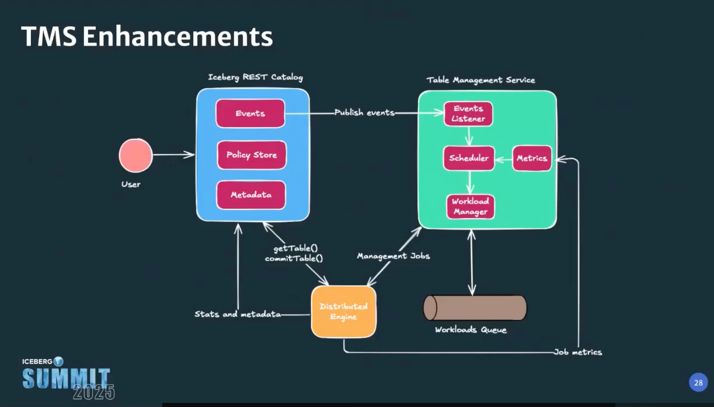{width="600"}
/// caption
[Apple TMS enhancements: event-driven architecture](https://youtu.be/JN6K1pdFImc)
///

光是解耦還不夠。Apple 進一步在 IRC 之上**擴充 policy store**：table-level 的 maintenance 設定（例如哪些 tables 要 compaction、什麼情況下該觸發 maintenance workloads、誰有權限改等）都寫進 catalog，讓 catalog 變成 TMS 的 single source of truth。這麼設計的好處是，table owner 設定 policy，control plane 就能知道自動化維護每張 table。

!!! success "Takeaway"

    兩家走的路徑不同，但都從 catalog 出發往外擴充 Control Plane 元件。Catalog 作為 TMS 的 single source of truth，是目前看到最自然的起點。

## 4. 根據 table 的實際變化觸發維護，不只靠固定排程

固定排程（cron）是最基本的觸發機制，但單靠排程在數萬張 tables 的規模下有兩個不足：

- 不需要 maintenance 的 tables 照樣被排進去浪費資源
- 真正需要 maintenance 的 tables 卻得等到下一個排程才能跑

這幾家公司所建立的 TMS 都在固定排程之外**加上了 event-driven 的觸發方式，讓 TMS 可以根據 table 上實際發生的變化即時回應。**

**Netflix**

仔細看 Netflix 的 Autotune 服務，你會發現有 AWS SQS 的身影：每當 user 寫入 Iceberg table，Metacat（前面提到的 metadata service）就會發一個 event 到 SQS，內容是「這張 table 剛 commit 了這些 snapshots」。

Autotune 在背景跑，subscribe 那個 SQS queue。收到事件之後查自己存的 compaction config 以決定要不要啟動 Spark application 重寫資料。整套設計把 Autotune 跟使用者完全解耦：使用者只管寫入，後續的優化交給 Autotune，使用者不需要知道這個服務存在。

{width="600"}
/// caption
[AutoTune](https://youtu.be/jMFMEk8jFu8)
///

**Apple**

{width="600"}
/// caption
[Apple TMS enhancements: event-driven architecture](https://youtu.be/JN6K1pdFImc)
///

Apple 的 TMS 也有類似的 event-driven 的設計。他們的 TMS 原本從 policy store 取靜態 schedule 來觸發 maintenance，後來在這基礎上加入了從 data ingestion pipelines 跟 metadata catalogs 取 real-time events 的能力。他們明確列出優先支援的 **4 種核心 event types**：

- **Ingestion Volume**：寫入資料量超過閾值。
- **Ingestion Count**：寫入次數累積到一定數量。
- **Small File Count**：累積的小檔達到一定數量。
- **Metadata Changes**：catalog 上的 schema / table 變更事件。

這 4 種 events 分別連到不同的 maintenance 操作。Apple 在 talk 裡把這個設計形容為「**從 reactive 到 proactive**」：排程仍然在跑，但 TMS 不需要被動等到下一個排程才能反應，看到指標越界就可以立刻觸發 maintenance。

Apple 也明確提到 TMS 同時保留**手動觸發 ad-hoc run** 的能力，方便處理 outlier 情況（一張 table 突然需要重建），維運人員可以直接呼叫 API 觸發，不用等下一個排程或事件。排程、event-driven、手動觸發三種入口並存，不是互斥。

**LinkedIn**

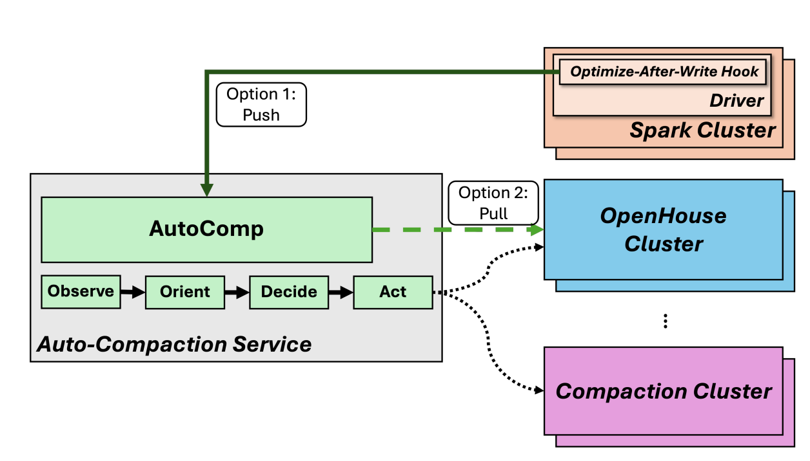{width="600"}
/// caption
[AutoComp cluster integration](https://arxiv.org/pdf/2504.04186)
///

**AutoComp** 是 LinkedIn 在 OpenHouse 裡打造的 automated compaction service，負責在數萬張 Iceberg tables 中決定哪些該做 compaction、什麼時候做。在觸發機制上，AutoComp 同時支援 push 跟 pull 兩種模式：

**Push 模式**是把 hook 嵌進 Spark ingestion pipeline，每當寫入完成後，若小檔數量超過閾值、或新寫入的資料量達到一定規模，就直接通知 AutoComp 觸發 compaction。延遲低，適合需要即時維護的 critical tables。

**Pull 模式**則是 AutoComp 以獨立 service 跑，按固定排程（例如每天一次、或每小時一次）從 catalog 跟 Iceberg system tables 主動蒐集統計資料，找出需要維護的 tables。這條 path 不需要修改 ingestion pipeline 的程式碼，部署成本低，適合大量但不急迫的 tables。

LinkedIn 可以根據需求搭配：critical tables 用 push 確保即時性，其他 tables 用 pull 控成本。

!!! success "Takeaway"

    三家的做法各有側重，但都認同同一件事：觸發機制不能只有一種，排程、event-driven、手動觸發各有適用的情境，並存才能覆蓋不同需求。

## 5. 發展出綜合多個目標的調度機制來排序 maintenance workloads

Maintenance workload 被觸發之後不是馬上執行。在 trigger 跟 execution 之間，這幾家 TMS 都加入了一層調度邏輯：根據 table 的狀態、業務重要性、預估成本等多個目標綜合評估，決定哪些先做、用什麼規格做、什麼條件下可以跳過。之所以非做不可，是因為 maintenance 需求永遠大於可用的 compute 資源；如果不做分級，低價值的任務會吃光資源，真正關鍵的 table 反而永遠排不到。

**Floe**

{width="600"}
/// caption
[Health assessment, auto-mode status, thresholds, and recommendations](https://nssalian.github.io/floe/operations/dashboard/)
///

Floe 採 declarative 設計，它定義了 maintenance **debt score** 跟 **severity levels**（critical 10x、warning 3x、info 1x），系統根據每張 table 的真實健康指標（小檔比例、snapshot 數、delete file ratio、partition skew）算出分數，sicker tables 排在前面跑。同一個 policy file 可以用 glob pattern 套到多張 tables，priority 跟 schedule 都是 policy 的一部分。

Floe 還在 policy 上面再加了一層 maintenance planner：在真正 trigger job 之前，根據當下指標再判斷一次「這張 table 真的需要 maintenance 嗎」，避免 cron-triggered 但其實沒必要跑的 no-op job 浪費 compute。

**LinkedIn**

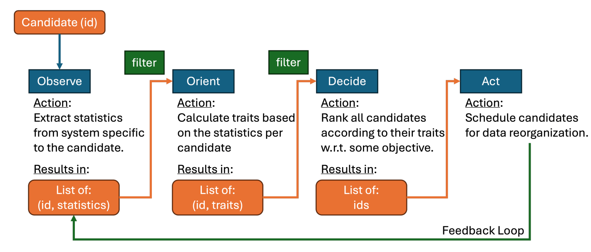{width="600"}
/// caption
[AutoComp E2E workflow (OODA loop)](https://arxiv.org/pdf/2504.04186)
///

LinkedIn 的 AutoComp 是我覺得做得最極致的一家公司。E2E workflow 套用 **OODA** feedback loop（Observe、Orient、Decide、Act 四個階段不斷循環）：

- 先從 Iceberg tables 蒐集每張 table 的統計資料（Observe）
- 根據成本與效益，算出標準化的分數（Orient）
- 在固定 compute budget 內排出 top-K（Decide）
- 執行 table compaction（Act）

在 Decide 這一步，AutoComp 直接把「該維護哪些 tables」當成 **multi-objective optimization problem (MOOP)** 處理。

問題的數學形式是：在數十萬張候選 tables 之中、固定 compute budget 之下，挑出 top-K 個能帶來最大 benefit 的 tables 去做 compaction。成本與效益是兩個衝突的目標：

- 成本是 GBHr（compute hours）
- 效益包含 small file count reduction、query latency 改善等

MOOP 在這兩個目標之間找 Pareto 最優。

另外 AutoComp 還有一個關鍵設計：**hybrid scoping**。原本是在 table-level 排名 top-K，但對大 table 來說整張表 rewrite 太貴；他們改成可以在 **table-partition 層級**做排名，把大 table 拆成以 partition 為粒度的候選。production 比較三種設定（no compaction / table-only top-10 / hybrid top-500），hybrid 的執行時間最穩定、效益最高。

!!! success "Takeaway"

    兩家的做法各有側重：Floe 用 health-driven debt score 根據 table 的即時狀態決定優先順序；LinkedIn 則用 MOOP 把調度問題提升到數學最佳化的層次。但都認同同一個前提：maintenance 需求永遠大於可用的 compute 資源，智慧調度是 TMS 不能不做的核心職責。

## 6. 提升 Data Plane 的資源利用率

**Apple**

Data Plane 這邊也有很多可以優化的空間。以 Apple 為例，他們做了 3 件事來提升 Data Plane 的資源效率：

第一件是 **shared Spark applications**。原本每個 maintenance workload 起一個專屬 Spark application，但 bootstrapping 一個 application 本身（JVM 啟動、SparkContext init、executor 配置）要花掉相當可觀的時間，在數萬個 workload / 天的規模下光是 bootstrap 就是顯著的成本。Apple 的做法是讓同一個 catalog 內的所有 tables 共用一個 Spark application 處理 maintenance，前提是這些 tables 共用同一組 security credentials（catalog 作為 tenant boundary）。

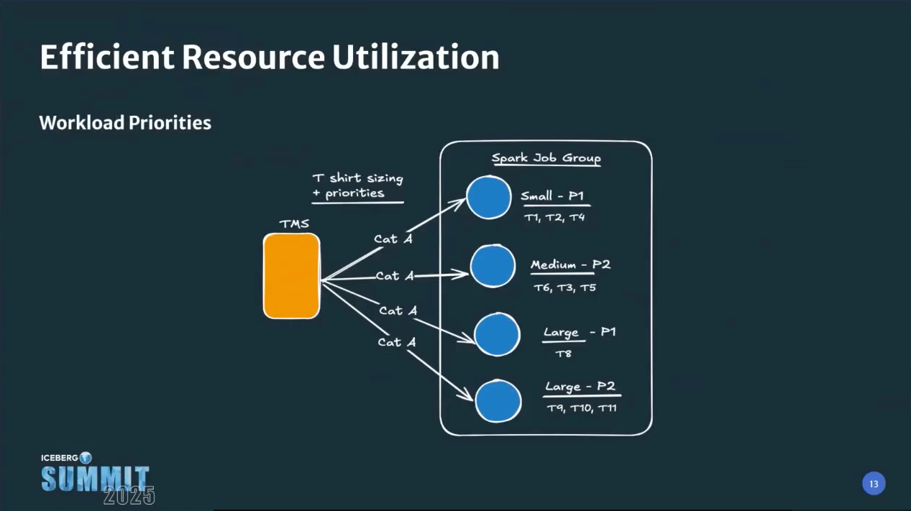{width="600"}
/// caption
[Apple — t-shirt sizing 跟 workload priorities](https://youtu.be/JN6K1pdFImc)
///

第二件是 **t-shirt sizing**。Share Spark applications 之後，下一個問題是怎麼讓不同 size 的 workload 配到適合的 application 規格。Apple 把 Spark application 規格分成 small / medium / large 幾個固定 size（透過 executor 數 + memory 配置），每個 incoming workload 評估之後分配到對應 t-shirt size。例如 small 是 16GB × 5 executors、medium 是 24GB × 10 executors。這樣小任務不會吃掉大規格的資源，大任務也不會被小規格卡住。

第三件是 **DRA + workload forecasting**。Spark application 內部開 DRA（dynamic resource allocation）讓 executor 數量隨 runtime 需求自動伸縮；同時 control plane 根據 ingestion rate、data volume、metadata changes 預測未來資源需求，動態啟動足量的 Spark applications。三件事加起來，TMS 在資源使用上做到了 Apple 自己形容的「lean and responsive」。

!!! success "Takeaway"

    這些做法的目標一致：在有限的 compute 資源內，把 Iceberg tables 的維護做到最有效率。Apple 用 shared Spark applications、t-shirt sizing 跟 DRA 從 infrastructure 層面優化，LinkedIn 的 AutoComp 則透過 OODA workflow 持續根據即時狀態動態調整資源分配，方向相同。

## 反推一個能在多團隊、大規模下擴展的 TMS 該長什麼樣？

回到一開始的問題：一個能管好上萬張 Iceberg tables 的 TMS 該長什麼樣？從前面幾個觀察裡反推回來，如果從零開始設計一個能擴展到數萬張 tables、同時服務多個團隊跟不同 workload 需求的 TMS，我覺得至少需要這幾個 building blocks：

!!! success "Building Blocks"
    - [x] **Onboarding 的摩擦成本要夠低**。資料的價值來自背後要解決的問題跟商業目標，不是來自搞懂 Iceberg 的維護機制。如果每個團隊要把資料 onboard 到 Iceberg 時都得先理解 compaction、snapshot expiry、orphan cleanup 這些維護細節，這件事就很難被大規模採用。一個好的 TMS 應該讓其他團隊幾乎感覺不到它的存在，讓他們可以專注在自己的業務上。
    - [x] **Control Plane 跟 Data Plane 去耦合**，讓調度邏輯跟執行層可以各自獨立演進。其中一個常見的做法是在兩者之間加上 queue，讓 Control Plane 不需要直接管理 Spark application 的 lifecycle，Data Plane 也可以根據自身的資源狀況主動 pull workloads。
    - [x] **Control Plane 要能跨 catalog 運作、統一管理 policies 跟 workload lifecycle**。具體來說，需要 **policy store** 集中定義每張 table 的 maintenance 規則（什麼時候做、做哪些操作、用什麼規格做）、**workload manager** 追蹤每個 workload 的狀態跟執行歷史、**scheduler / orchestrator** 負責把 workloads 分配到合適的 Data Plane 資源上。從 IRC 為中心往外擴充這些元件，是目前看到最自然的起點。
    - [x] **Maintenance workload 的觸發機制要多元**，除了固定排程之外，還需要 event-driven 跟手動觸發等不同入口，讓 TMS 能根據不同情境選擇最合適的觸發方式。
    - [x] **Control Plane 裡要有智慧調度的能力**。Maintenance workload 被觸發之後不是馬上執行，中間要有一層智慧調度，綜合多種資訊來排序：table 目前的健康狀態（小檔比例、snapshot 數量）、table 的業務重要性（P0 table 必須優先）、是否有突發事件需要插隊（例如剛發生的 incident 需要立刻對某張 table 做 compaction）、以及當下 Data Plane 的 resource capacity 還剩多少，從候選裡挑出最值得先做的送去執行。
    - [x] **Data Plane 也要考慮資源效率**。目標是在有限的 compute 資源內把 Iceberg tables 的維護做到最有效率。共用 Spark applications 減少 bootstrapping 成本、用 t-shirt sizing 讓不同規模的 workload 配到合適的資源規格、用 DRA 讓 executor 數量隨需求伸縮，都是可行的做法。

研究完這 6 家公司之後，我自己最大的感受是：從零自建一個能 scale 的 TMS 真的不是簡單的事，需要考量的層面很多。那就會有一個自然的疑問：既然 Iceberg spec 留白了這麼多東西，為什麼這些大公司還願意把自己的資料全面遷到 Iceberg 上？

我這一個月一直在想這個問題。我目前的想法是：因為 Iceberg 是開源的，大家信任的不只是 table format 本身，更是背後那套跨公司凝聚共識的治理制度和流程。沒有任何一家公司可以單方面主導 spec 的走向，技術不會被綁定在單一廠商上。我想這應該是為什麼這麼多公司願意承擔自建 TMS 的成本、也要大規模導入 Iceberg 的其中一個原因。

好在這些公司願意把自己的經驗公開分享，加上越來越多開源專案跟商業產品的出現，後來的團隊不需要再完全從零開始。希望這篇整理對正在面對同樣問題的你有幫助。
