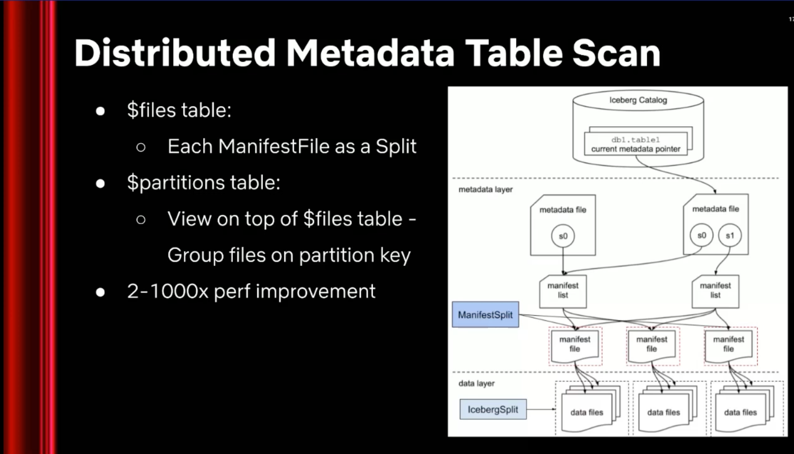

---
authors:
  - kuanchoulai10
date:
  created: 2026-06-15
  updated: 2026-06-26
categories:
  - Data
links:
  - blog/posts/2026/01-06/iceberg-challenges-from-the-field/iceberg-challenges-from-the-field.md
  - blog/posts/2026/01-06/rethinking-iceberg-metadata-v4/rethinking-iceberg-metadata-v4.md
  - blog/posts/2026/01-06/lessons-from-slack-iceberg/lessons-from-slack-iceberg.md
  - blog/posts/2026/01-06/iceberg-efficient-column-update-and-column-families/iceberg-efficient-column-update-and-column-families.md
  - "AWS re:Invent 2023 - Netflix's journey to an Apache Iceberg–only data lake (NFX306)": https://youtu.be/jMFMEk8jFu8
  - "AWS re:Invent 2024 - Efficient incremental processing with Apache Iceberg at Netflix (NFX303)": https://youtu.be/s1ySnxVg5rk
  - "AWS re:Invent 2025 - How Netflix uses Amazon S3 Storage Lens to track exabytes of data (STG214)": https://youtu.be/Q2YoHfhFuI8
  - "Running Trino as exabyte-scale data warehouse": https://youtu.be/WuUS73QPuZE
  - "ClickHouse at Netflix: Petabyte-Scale Log Storage for Microservices": https://youtu.be/64TFG_Qt5r4
  - "How Netflix ingests 10 Million events per second with ClickHouse": https://youtu.be/CNdA0r6zbe4
  - "Lakehouses: A Path to Low-Cost, Scalable, No-Lock-in Observability (ClickHouse blog)": https://clickhouse.com/blog/lakehouses-path-to-low-cost-scalable-no-lockin-observability
  - "Leveraging Iceberg in Netflix Studio and Creative Production": https://youtu.be/xrMaG2G7KX0
  - "Scaling Multimodal Data Curation with Ray and LanceDB (Ray Summit 2025)": https://youtu.be/1hBesu2Erg0
  - "Netflix Case Study (LanceDB blog)": https://www.lancedb.com/blog/case-study-netflix
  - "From Facts & Metrics to Media Machine Learning: Evolving the Data Engineering Function at Netflix": https://netflixtechblog.com/from-facts-metrics-to-media-machine-learning-evolving-the-data-engineering-function-at-netflix-6dcc91058d8d
  - "Data Mesh Principles and Logical Architecture": https://martinfowler.com/articles/data-mesh-principles.html
  - "How to Move Beyond a Monolithic Data Lake to a Distributed Data Mesh": https://martinfowler.com/articles/data-monolith-to-mesh.html
tags:
  - Apache Iceberg
  - The Lakehouse Series
  - Netflix
comments: true
---

# 從 Netflix 看 Iceberg 在 Exabyte 規模下還沒解決的問題

!!! info "After reading this article, you will be able to answer..."

    - 為什麼 Netflix 全面採用 Iceberg 之後，還需要額外引入這麼多系統？
    - Table maintenance、Trino、ClickHouse、LanceDB 這四個 use cases 反映了 Iceberg 的哪些不足？
    - 資料平台團隊在導入 Iceberg 前，應該先想清楚哪些問題？

<!-- more -->

Iceberg 已經是 open table format 的事實標準，而 Netflix 是規模上最大的使用者之一，也是把工程細節公開得最徹底的一家公司。從 2023 年起，Netflix 在 AWS re:Invent 與各家 summit 上連續幾年公開分享他們如何把整個 EB 級的 data warehouse 全面遷到 Iceberg、又在這個規模下遇到了哪些工程挑戰。

把這些公開分享跨年度、跨 workload 放在一起仔細研究，可以觀察到一件有意思的事：Netflix 大規模採用 Iceberg 的同時，在幾個特定情境下都另外引入了新的系統，來涵蓋 Iceberg 本身不直接處理的部分。這篇文章主要引用的幾場 talks 如下：

[AWS re:Invent 2023 - Netflix's journey to an Apache Iceberg-only data lake (NFX306)](https://youtu.be/jMFMEk8jFu8)，記錄了 Netflix 從 Hive 全面遷到 Iceberg 的工程旅程，以及他們圍繞 Iceberg 建立起來的 table maintenance platform。

<iframe width="560" height="315" src="https://www.youtube.com/embed/jMFMEk8jFu8?si=a63wYcdTTp3dpuSY" title="YouTube video player" frameborder="0" allow="accelerometer; autoplay; clipboard-write; encrypted-media; gyroscope; picture-in-picture; web-share" referrerpolicy="strict-origin-when-cross-origin" allowfullscreen></iframe>
/// caption
[AWS re:Invent 2023 - Netflix's journey to an Apache Iceberg-only data lake (NFX306)](https://youtu.be/jMFMEk8jFu8)
///

[Running Trino as exabyte-scale data warehouse](https://youtu.be/WuUS73QPuZE)，回顧 Netflix 在 Trino 之上跑 EB 級 data warehouse 時遇到的 metadata planning 瓶頸與解決方法 (distributed table scan)。

<iframe width="560" height="315" src="https://www.youtube.com/embed/WuUS73QPuZE?si=Vyl9WFmy_0MPzAiw" title="YouTube video player" frameborder="0" allow="accelerometer; autoplay; clipboard-write; encrypted-media; gyroscope; picture-in-picture; web-share" referrerpolicy="strict-origin-when-cross-origin" allowfullscreen></iframe>
/// caption
[Running Trino as exabyte-scale data warehouse](https://youtu.be/WuUS73QPuZE)
///

[ClickHouse at Netflix: Petabyte-Scale Log Storage for Microservices](https://youtu.be/64TFG_Qt5r4)，講 Netflix 為什麼把 logging workload 從 Iceberg 搬出來、轉到 ClickHouse 作為 hot tier。

<iframe width="560" height="315" src="https://www.youtube.com/embed/64TFG_Qt5r4?si=B3jNjCLwO6pL_FV4" title="YouTube video player" frameborder="0" allow="accelerometer; autoplay; clipboard-write; encrypted-media; gyroscope; picture-in-picture; web-share" referrerpolicy="strict-origin-when-cross-origin" allowfullscreen></iframe>
/// caption
[ClickHouse at Netflix: Petabyte-Scale Log Storage for Microservices](https://youtu.be/64TFG_Qt5r4)
///

[How Netflix ingests 10 Million events per second with ClickHouse](https://youtu.be/CNdA0r6zbe4)，補充說明 ClickHouse 在 Netflix logging 架構裡如何每秒 ingest 10M 筆事件的。

<iframe width="560" height="315" src="https://www.youtube.com/embed/CNdA0r6zbe4?si=AOOr-He1NpdNb4Ay" title="YouTube video player" frameborder="0" allow="accelerometer; autoplay; clipboard-write; encrypted-media; gyroscope; picture-in-picture; web-share" referrerpolicy="strict-origin-when-cross-origin" allowfullscreen></iframe>
/// caption
[How Netflix ingests 10 Million events per second with ClickHouse](https://youtu.be/CNdA0r6zbe4)
///

[Scaling Multimodal Data Curation with Ray and LanceDB (Ray Summit 2025)](https://youtu.be/1hBesu2Erg0)，講 Netflix 的 Media Data Lake 為什麼選 LanceDB 作為 multi-modal access 的核心。

<iframe width="560" height="315" src="https://www.youtube.com/embed/1hBesu2Erg0?si=BT1x3J-SEC3ZRHl0" title="YouTube video player" frameborder="0" allow="accelerometer; autoplay; clipboard-write; encrypted-media; gyroscope; picture-in-picture; web-share" referrerpolicy="strict-origin-when-cross-origin" allowfullscreen></iframe>
/// caption
[Scaling Multimodal Data Curation with Ray and LanceDB (Ray Summit 2025)](https://youtu.be/1hBesu2Erg0)
///

[AWS re:Invent 2024 - Efficient incremental processing with Apache Iceberg at Netflix (NFX303)](https://youtu.be/s1ySnxVg5rk)，講 Netflix 用 Maestro + Iceberg 做 incremental processing 的整體設計

<iframe width="560" height="315" src="https://www.youtube.com/embed/s1ySnxVg5rk?si=gs9yUO7sgD5uuRV-" title="YouTube video player" frameborder="0" allow="accelerometer; autoplay; clipboard-write; encrypted-media; gyroscope; picture-in-picture; web-share" referrerpolicy="strict-origin-when-cross-origin" allowfullscreen></iframe>
/// caption
[AWS re:Invent 2024 - Efficient incremental processing with Apache Iceberg at Netflix (NFX303)](https://youtu.be/s1ySnxVg5rk)
///

只看一家公司，當然不足以推論到所有使用 Iceberg 的公司，但 Netflix 的規模與公開程度，讓他們在特定情境下遇到的 Iceberg 不足，更容易被看見。這篇文章我們會先看 Netflix 把 Iceberg 用到什麼規模、又為了維護這個規模做了哪些事；接著從 table maintenance、Trino metadata planning、ClickHouse logging 與 LanceDB multimodal 四個面向，看 Netflix 分別怎麼處理 Iceberg 沒有直接涵蓋的需求；最後從這四個面向反推 Iceberg 目前還沒解決的設計問題。

## Netflix 把 Iceberg 用到什麼規模

Netflix 在 2023 年 AWS re:Invent 的 [Netflix's journey to an Apache Iceberg-only data lake](https://youtu.be/jMFMEk8jFu8)、2024 年 Trino Summit 的 [Running Trino as exabyte-scale data warehouse](https://youtu.be/WuUS73QPuZE) 與 2025 年 AWS re:Invent 的 [How Netflix uses Amazon S3 Storage Lens to track exabytes of data](https://youtu.be/Q2YoHfhFuI8) 中，陸續揭露了他們在 Iceberg 上的整體規模：

- **Data Size**：data warehouse 超過 1 EB；Netflix 在 S3 上的 total storage 超過 2 EB，涵蓋 big data、media、ML 三大 use case。
- **Table Scale**：超過 **3M** 張 Iceberg tables，整體 Iceberg adoption rate 達 99.5% 以上；單張最大的 table 約 36 PB 且持續成長。
- **Daily Throughput**：每日 ingestion 約 10 PB、deletion 約 9 PB；跨 region replication 約 2 PB；logs 約 5 PB。
- **Peak Per-Second Load**：每秒最高 600 次 table commits、12,000 次 table loads；logs 平均每秒處理 1,060 萬個 events。
- **Query Scale**：Trino 每日處理超過 50 萬次查詢，僅 2024 年 11 月單月就執行了約 1,500 萬次。

這個規模下，任何 table format 的設計選擇都會被放大。下面要看的，就是 Iceberg 在這個規模下分別在哪些情境上需要 Netflix 額外做事。

## Iceberg 不會自己維護自己

Iceberg 雖然解決了 Hive 時代 schema evolution、partition evolution、ACID transaction 這些 table abstraction 層面的問題，但它沒有把 table 的維護工作一起解決。**snapshot 累積、小檔案膨脹、跨 region 資料分散，這些事情都會跟著 table 規模一起變大**，而 Iceberg spec 本身對「誰來做這些事」沒有規定。Netflix 在前面提到的 [Iceberg-only data lake 分享](https://youtu.be/jMFMEk8jFu8) 中說明他們圍繞 Iceberg 自行研發了三個 background services 來承擔這層工作：Janitors、AutoTune 與 AutoLift。

### Janitors：把過期 snapshot 與 orphan files 統一清掉

/// caption
[Janitors](https://youtu.be/jMFMEk8jFu8)
///

Iceberg 的 snapshot 設計讓 time travel、rollback、incremental processing 變成可能，但每一個 snapshot 都會在 metadata 與底層 data files 上留下實體。如果沒有人定期清理，snapshot 數量會隨著每次寫入無限累積，metadata file 會跟著膨脹，舊版本的 data files 也會持續佔用 S3 空間。Iceberg open-source API 提供了 expire snapshots、remove orphan files 的操作，但什麼時候執行、用什麼策略執行，是平台的事。

Janitors 是 Netflix 把這層清理工作背景化的服務，內部又分成三類：

- **TTL Janitors**：根據使用者設定的過期時間清理 table 內過期的 rows。
- **Snapshot Janitors**：根據 snapshot 的 TTL 規則 expire 舊 snapshots。
- **Orphaned File Janitors**：清理 commit 失敗或其他原因留下的 orphan files。

對使用者而言，這些行為都在背景發生，他們只需要在 table 層級設定 retention policy。

### AutoTune：在背景把小檔案合併、layout 持續優化

/// caption
[Autotune](https://youtu.be/jMFMEk8jFu8)
///

第二個面向是查詢效能。Streaming 與高頻 ingestion 場景常常會留下大量小檔案，每個小檔案在 query planning 時都是一份 manifest entry，在 query execution 時也是一次 object storage 請求。這兩件事都會讓查詢成本不必要地放大。Iceberg 規範本身不規定 file 該多大、何時該 compact、layout 該怎麼排列。

AutoTune 在背景持續做這層工作：把小檔案合併成大小合理的 data files、依 query pattern 調整 layout 與排序，對使用者完全 transparent。配合 Zstandard 壓縮與 Janitors 的清理，這層 background optimization 整體節省了大約 25% 的儲存成本。

### AutoLift：把跨 region 的 data files 搬回主 region 降低 bandwidth 成本

第三個面向是地理位置。Netflix 的資料寫入會發生在多個 region，例如 Flink job 在 remote region 寫入 Iceberg table，但 Trino、Spark 等查詢負載集中在 US-East-1。每一次 cross-region 的資料讀取都會產生 bandwidth 成本。Iceberg 的 metadata 可以記錄 data files 的位置，但「把 remote 寫入的資料搬回主 region」是另一件事。

AutoLift 在背景把 remote region 的 data files localize 到主 region，讓查詢端只需要從本地讀取。Iceberg metadata 在搬移後會更新指向新的位置，整個過程對查詢端透明。

Janitors、AutoTune 與 AutoLift 一起說明了一件事：Iceberg 雖然解決了「table 應該長什麼樣子」，但「table 怎麼維持在那個樣子」仍然是平台層的工作。

## Iceberg metadata layer 在百萬 files 規模下需要分散處理

Iceberg 把 table 的所有資訊串成一個 metadata tree：最上層的 metadata file 指向 manifest list，manifest list 列出所有 manifest files，每份 manifest file 再列出對應的 data files。query engine 在開始讀資料前，會先沿著這個 tree 把哪些 data files 該被讀、哪些可以被 prune 掉算出來。這層 metadata planning 在小規模下非常便宜：metadata 的層數固定、每份檔案不大、由 query coordinator 一個節點完成是合理的設計。但當 table 大到某個程度，這個假設就不成立了。

Netflix 在 [Running Trino as exabyte-scale data warehouse](https://youtu.be/WuUS73QPuZE) 的分享中提到，他們有些 table 的 data file 數量超過 100 萬個、metadata file 大小超過 100 GB。在這個規模下，標準 Iceberg connector 對 `$files`、`$partitions` 這類 metadata table 的掃描還是預設由單一 coordinator 執行。coordinator 一邊要解析所有 manifest、一邊要回應其他查詢，很快就變成 bottleneck，簡單的 metadata 查詢變慢、複雜一點的會直接 OOM 失敗。

/// caption
[Distributed Metadata Iceberg Table Scan](https://www.youtube.com/watch?v=WuUS73QPuZE)
///

Netflix 的處理方式是把 metadata table scan 自己重做一次成 distributed mode。他們把 manifest list 當成 splits 的來源，每份 manifest file 變成一個 work unit 派發給 Trino workers；`$partitions` table 直接建在 `$files` table 之上，跟著一起分散。重構後的分散式 metadata table scan，依 table 大小不同可以把查詢加快 2x 至 1000x。

把這個 use case 抽象出來看，Iceberg spec 規定的是 metadata 的 layout，讀這層 metadata 的方式則由各家 query engine 自己決定，所以不同 query engine 的實作細節會大大影響讀取 Iceberg tables 的效能。同樣的觀察我在前一篇 [從三家 OLAP 產品反推 Iceberg 的設計挑戰](../iceberg-challenges-from-the-field/iceberg-challenges-from-the-field.md) 也看到 ClickHouse、Firebolt、StarTree 三家在整合 Iceberg 到自家產品時，也都在 table metadata scan 這件事情上各自重新設計了一輪，Netflix 在 EB 級 warehouse 上做的事，也是同一回事。

## Iceberg 在 sub-second logging 場景不適合當 serving layer

前兩個面向分別聚焦在 table 的維護與 metadata planning，第三個則是把 workload 轉往 sub-second logging query 場景。Netflix 在 [ClickHouse at Netflix: Petabyte-Scale Log Storage for Microservices](https://youtu.be/64TFG_Qt5r4) 與 [How Netflix ingests 10 Million events per second with ClickHouse](https://youtu.be/CNdA0r6zbe4) 兩場分享中說明了 logging 的規模：每天約 5 PB logs、平均每秒處理 1,060 萬個 events。工程師在 troubleshooting 時需要接近 observability system 的互動式體驗，sub-second response、隨時 filter、隨時聚合，這跟分析型查詢的 access pattern 不一樣。

Netflix 一開始確實試過把 logs 寫進 Iceberg，再用 Trino 查。便宜這件事是真的：相對於 ElasticSearch，這套架構估計可以省下 250 到 300 倍的成本。但兩個結構性的問題很快就讓這條路走不下去。第一個是 Data Freshness。為了讓 Iceberg 上的 data files 維持合理大小（128 MB 左右），ingestion pipeline 必須在多層 buffer 累積到一定量再 flush，從 log 產生到可查最少要 3 到 5 分鐘。第二個是查詢延遲。即便是簡單的 Trino 查詢也常常落在 2 到 5 秒，對需要反覆刷新頁面排查問題的工程師來說太慢。

/// caption
[Dual-write into Clickhouse & Iceberg as hot/cold tier](https://clickhouse.com/blog/lakehouses-path-to-low-cost-scalable-no-lockin-observability)
///

/// caption
[Ingestion pipeline architecture](https://clickhouse.com/blog/netflix-petabyte-scale-logging)
///

Netflix 的處理方式是引入 ClickHouse 作為 hot tier，把最近一段時間的 logs 從 Iceberg 移到 ClickHouse 上，讓查詢端直接打 ClickHouse。同樣兩個指標都得到很大的改善：

- Data Freshness 縮短到 20s 以內
- 多數查詢落在 500ms 左右

但這不代表 Iceberg 不重要，它在這場景中裡仍然佔有一席之地：Iceberg 改作為長期儲存的 cold tier 以節省成本。

不過這套架構不是沒有代價的。根據 [ClickHouse 自己回顧 lakehouse-style observability 的文章](https://clickhouse.com/blog/lakehouses-path-to-low-cost-scalable-no-lockin-observability)，Netflix 採用的是 dual-write 模式：同一份 logs 同時寫進 ClickHouse 與 Iceberg，兩邊各自服務 hot 與 cold 兩個 tier。這代表著要長期維護兩條 ingestion 路徑、兩套 schema evolution 與 consistency alignment logic、以及 hot tier 過期後資料如何乾淨地讓給 cold tier 接續查詢。**Netflix 等於是用這層額外的工程代價，去換取 cold tier 的儲存成本優勢與 hot tier 的延遲體驗。**

把這個 use case 抽象出來看，**logging 的瓶頸來自整套 object storage 加 open table format 的架構：它本來就不是為 sub-second interactive serving 設計的**。data files 要維持合理大小才能讓 metadata pruning 有效，而合理大小代表著 ingestion 必須 batch；S3 / object storage 對單個物件的 access latency 動輒 100ms 以上，連 metadata 都還沒讀完，sub-second 預算就被消耗掉一大半。Netflix 直接把 hot-tier 這層查詢交給 ClickHouse，等於劃出 Iceberg  沒辦法滿足的情境：sub-second latency serving layer。

## Iceberg 在 Multimodal AI Workload 不適合當 Random Access 層

第四個面向把 workload 的型態本身換了。Netflix Studio 與 ML 團隊處理的內容已經超出傳統 row 與 column 的範圍：影片、圖片、音訊、字幕、transcripts、embeddings 與 derived features 這類 Multimodal assets 都要存得進、查得到、能參與下游 ML 訓練。Netflix 在 2024 與 2025 兩場公開分享中，把這條路線的演進呈現得很清楚。

2024 年的 [Leveraging Iceberg in Netflix Studio and Creative Production](https://youtu.be/xrMaG2G7KX0) 是引入 LanceDB 之前的狀態。當時 script understanding 模型把劇本轉成 1 x 256 維 embeddings，這些 embeddings 連同 derived features 一起寫回 Iceberg tables，給研究人員用 Trino 查詢。但同一場分享裡也很坦白地交代了幾個必須繞過 Iceberg 才能解決的問題：embedding 欄位太大，Trino worker 很容易直接 OOM，他們只能用 arbitrary batch ID 把 embeddings 重新切成更小的 S3 files 才能讓查詢能完成；對需要穩定服務的 app layer，他們不直接讓 app 查詢 Iceberg，而是另外架一個 in-memory DB，用 schema 當合約把資料同步過去；而在會後 Q&A 裡 Netflix 自己也直白回答了原因：之所以選 Iceberg 而不是 vector database，是因為當時還在 R&D 階段、不確定 query pattern，Iceberg 對他們而言只是一個低成本的 ad hoc 試驗場。技術上它是不是這類 workload 的合適選擇，當時沒有回答。

/// caption
[Media Tables that are stored in LanceDB table format @Netflix ](https://netflixtechblog.com/from-facts-metrics-to-media-machine-learning-evolving-the-data-engineering-function-at-netflix-6dcc91058d8d)
///

到了 2025 年的 [Scaling Multimodal Data Curation with Ray and LanceDB](https://youtu.be/1hBesu2Erg0)，這條路線被改寫了。這場由 Netflix 的 Pablo Delgado 與 LanceDB co-founder Lei Xu 共同分享，Lei 在 talk 裡點出 last-generation format 的根本問題：當你設計 Iceberg、Parquet 與 Spark 時，是為「大規模 scan + aggregation」優化的；但 ML / multimodal workload 的核心需求是「盡快讀出某 10 列」，這兩種 access pattern 本質上就不同。**Netflix 的答案是另外建立 Media Data Lake，底層採用 LanceDB / Lance format**。Lance 把 blobs（影片、圖片等大型二進位資產）視為 first-class，新欄位以 zero-copy 方式追加（manifest 重新指向新檔案，原始 data files 不動），研究人員產出新的 embeddings 或 captions 時不需要重寫原始 data。向量搜尋、全文檢索與 SQL filter 也整合在同一個查詢路徑上，下游 PyTorch / JAX loader 可以直接從 Media Data Lake 拉資料訓練。

[LanceDB 的 Netflix case study](https://www.lancedb.com/blog/case-study-netflix) 補完了規模面的數字。Media Data Lake 目前

- 統一管理數十 PB 的 Multimodal assets
- 分散式 NVMe cache 則可提供 5M IOPS
- 支援 20k QPS embeddings 查詢
- Billions level embeddings 可以在小時內完成 indexing

Netflix Media ML Data Engineering 的 Dao Mi（也是 2024 年那場 Studio talk 的講者之一）在 case study 裡直接說明了這個選擇背後的判斷：

> **The nature of media data is fundamentally different. It is multi-modal, it contains derived fields from media, it is unstructured and massive in scale.**

這些性質剛好都是 Iceberg、Parquet 這一代為 structured analytics 設計的格式沒有原生支援的範圍。

Iceberg 在這套 Media Data Lake 新架構裡並沒有消失，反而變成 Governance Layer：不論是 structured metadata、dataset versioning、multi-engine interoperability、還是跟既有 Spark / Trino / Flink pipeline 的整合，都還是由 Iceberg 處理。media assets、embeddings 與隨機存取的部分則交給 LanceDB。

把這個 use case 抽象出來看，Iceberg + Parquet 在設計上服務的是 analytical scan 這類 workload，跟 ML 與 multimodal AI 需要的 random access、point lookup、vector retrieval 是兩種不同的 access pattern。要在同一套 lakehouse 架構上同時涵蓋這兩類 access pattern，目前的 Iceberg spec 還沒提供完整的解法，**整合方仍然需要額外導入一層 storage abstraction 才有辦法達成**。Netflix 把 Media Data Lake 建在 LanceDB 上，等於再劃一次 Iceberg 的適用範圍：**當 access pattern 從 scan 變成 random、vector 與 multimodal 時，可能就需要另一層格式來承擔。**

## 四個面向反應了什麼？

把 table maintenance、Trino、ClickHouse、LanceDB 四個情境放在一起看，有一個共同的取捨方式：Netflix 四次都讓 Iceberg 維持原樣，額外引入新的系統來處理新的需求。

- **Table Maintenance use case**：Iceberg spec 不規定 table 的維護策略，Netflix 自行建了 Janitors、AutoTune、AutoLift 三個 background services 來處理 snapshot 清理、小檔案合併與跨 region 資料搬移。
- **Trino use case**：Iceberg 的 metadata layer 沒變，Netflix 在 Trino connector 那一端重構了 metadata table scan，讓 planning 可以分散到 worker 上，已解決 metadata as big data 的問題。
- **ClickHouse use case**：Netflix 額外引入 ClickHouse 作為 hot tier，Iceberg 則作為 cold tier 儲存長期 logs，兩邊 dual-write。
- **LanceDB use case**：Netflix 額外建立 Media Data Lake on LanceDB，Iceberg 則扮演 Governance Layer，繼續做它擅長的部分。

把四個放在一起，共同的訊息是：Iceberg 適合做 modern lakehouse 的基礎，提供 table abstraction、metadata 一致性、schema / partition evolution、多引擎 interoperability。但 workload 一旦離開 batch analytics 的核心區域，例如進入 background table maintenance、large-scale metadata planning、sub-second serving、random access 加 vector retrieval，Iceberg 本身就不會自動延伸到這些場景。Netflix 在四個情境上的回應都選擇了同一條路：額外引入一層系統。

當然這只是針對一家公司的觀察而已。但 Netflix 之所以值得這樣觀察，是因為他們在這件事上做得特別徹底、又把過程公開得最完整，他們在不同 workload 上的取捨比一般公司更容易被看見。其他公司面對同一個問題可能會用不一樣的形態回應，例如我在前一篇 [從三家 OLAP 產品反推 Iceberg 的設計挑戰](../iceberg-challenges-from-the-field/iceberg-challenges-from-the-field.md) 看到 ClickHouse、Firebolt、StarTree 三家也各自走出不同的路。但把這些跨公司的觀察放在一起看，「需求離開 Iceberg 核心區域時就會額外引入一層架構」這個 pattern 反覆出現，至少可以說明：把 Iceberg 當成萬能解，在那個規模上是不成立的。

## 我們可以從 Netflix 學到什麼？

Netflix 四個情境傳遞的核心訊息其實只有一個：Iceberg 是 modern data lake 的 foundation，但這個 foundation 跟你 workload 的形狀對不上時，就需要額外導入別的系統。具體做法不用照搬，大多數團隊也沒有 Netflix 那種規模的工程資源。要把這個取捨方式套到自己的團隊上，可以從兩個角度想清楚：你的 workload 在什麼規模、是什麼形狀。

### Scale 不只是資料量，也包含 use case 的多樣性

先從規模這個角度看。評估「導入 Iceberg 會不會有問題」時，直覺上會看資料量、table 數、metadata 大小、查詢量這些指標。這些當然重要，但只是 scale 的一個維度。

Zhamak Dehghani 在 [How to Move Beyond a Monolithic Data Lake to a Distributed Data Mesh](https://martinfowler.com/articles/data-monolith-to-mesh.html) 與 [Data Mesh Principles and Logical Architecture](https://martinfowler.com/articles/data-mesh-principles.html) 兩篇文章裡指出一個重要的點：過去十年技術上解決的是 data volume 與 processing compute 的 scale，但**「其他維度的 scale」幾乎沒被解決，包含資料來源越來越多、用資料的團隊越來越多、以及這些團隊需要的 transformation 種類也越來越分歧。**

Netflix 在 ClickHouse、LanceDB 兩個情境上遇到的問題，有相當一部分都是這個 use case 維度的 scale 在作用。當 Iceberg table 只有少數固定 pipeline 在用，問題很單純；但當十個團隊、十個部門開始把 Iceberg table 當成共用的 data product，每個團隊期待的能力可能差異很大：有人要 CDC-style 查詢，有人要 branch / tag / experiment table，有人在意 query latency，有人在意 cross-region 成本，有人要把 table 接進 ML pipeline。所以導入 Iceberg 前要問清楚兩類問題。第一類問題是資料規模上的，像是：資料量會不會很大？tables 數會不會很多？metadata 會成長到什麼程度？第二類問題是 use case 規模上的，像是：未來會有多少不同類型的使用者用這些 tables？他們的需求差異有多大？其中有多少是 Iceberg 原生就能支援、有多少需要平台另外處理？

### 不同 workload 需要不同的 serving 層

另一個角度是 workload 的形狀，也就是「哪些工作該交給 Iceberg、哪些得用別的系統處理」。如果需求是 batch analytics、large-scale ETL、多引擎共享資料、schema / partition evolution、time travel、資料湖治理，Iceberg 很適合。但如果需求進入 sub-second latency（observability、troubleshooting、user-facing analytics），通常還是要搭配專門的 serving layer，例如 ClickHouse、Pinot、Druid、ElasticSearch。Netflix 的 logging case 就是這個判斷的具體呈現：即便 Iceberg 已經在他們資料湖的核心位置，logging 還是被搬到 ClickHouse 上去做。

如果需求是 AI / multimodal data，問題又會更不同。AI training 與 media workload 需要 sampling、point lookup、embedding retrieval、vector search、media asset access 這類存取模式，跟 analytical table scan 不一樣。Iceberg 可以做 dataset governance、metadata 管理、versioning、multi-engine interoperability，但不會自動成為 vector database 或 media-native storage。Netflix 把 Media Data Lake 建在 LanceDB 上、讓 Iceberg 轉作 Governance Layer，就是把不同 layer 的責任劃清楚的具體做法。

把這兩個角度合起來看，Netflix 四個情境給一般團隊的提醒就是：導入 Iceberg 時把問題問得更精準。Iceberg 要負責哪一層？哪些需求交給 Iceberg？哪些需求交給 query engine？哪些需求需要另一個 serving system？哪些 AI workload 需要不同的 data layout 或 indexing 系統？把這些問題先想清楚，Iceberg 才會在合適的層上發揮最大價值，也比較不會在 adoption 擴大後才發現需求已經超出它原本最擅長的範圍。

Iceberg 本身也正在這幾個面向上演進：

- Catalog 端的 server-side scan planning 與 File Format API 都在 [1.11.0（2026 年 5 月）](https://github.com/apache/iceberg/releases/tag/apache-iceberg-1.11.0) 釋出，query engine client 原本要做的 metadata traversal 與 scan planning，現在可以交由 catalog 處理
- v4 的 metadata 重新設計、index 升級為 first-class concept 的提案則還在進行中。對這幾個方向有興趣的讀者，前面引用的 [從三家 OLAP 產品反推 Iceberg 的設計挑戰](../iceberg-challenges-from-the-field/iceberg-challenges-from-the-field.md) 與 [Iceberg v4 的 metadata 重新設計](../rethinking-iceberg-metadata-v4/rethinking-iceberg-metadata-v4.md) 兩篇我整理過更完整的脈絡，可以接著看。

我非常看好 Iceberg 在這幾個面向上的發展，也很期待這個 foundation 最終能滿足當初 Lakehouse 被提出來的模樣。
