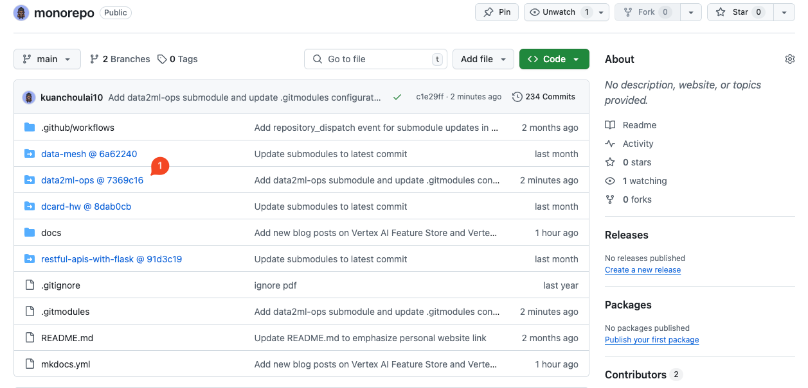
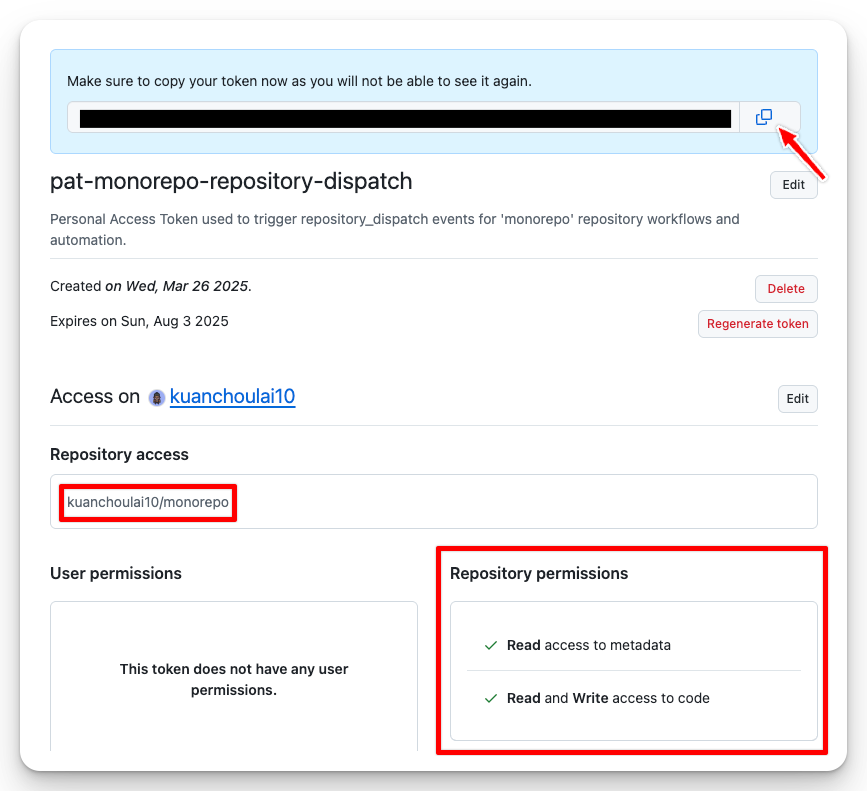
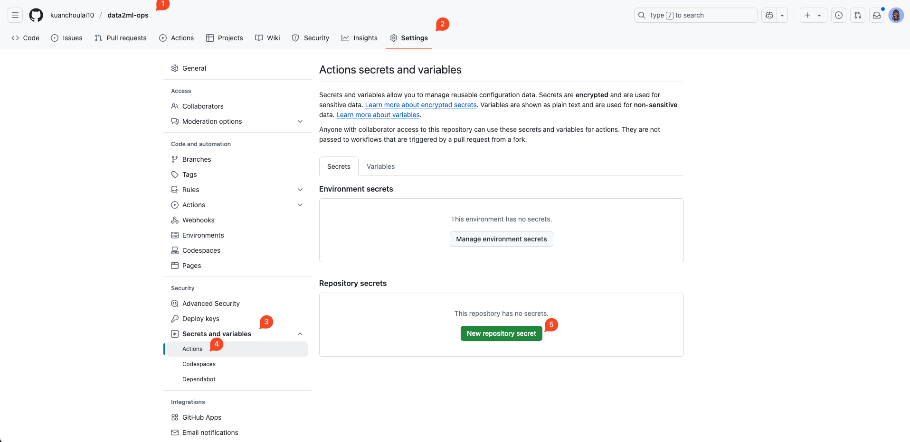
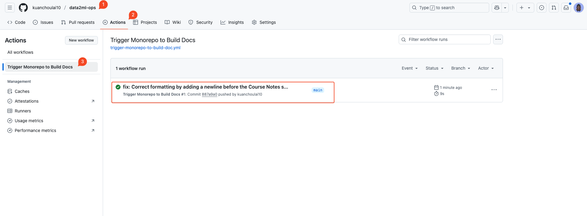
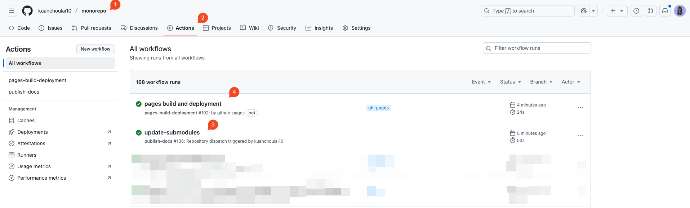
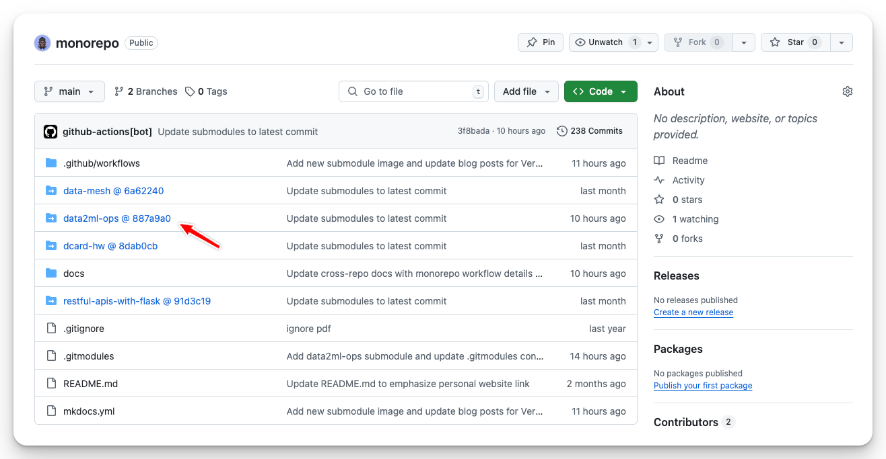
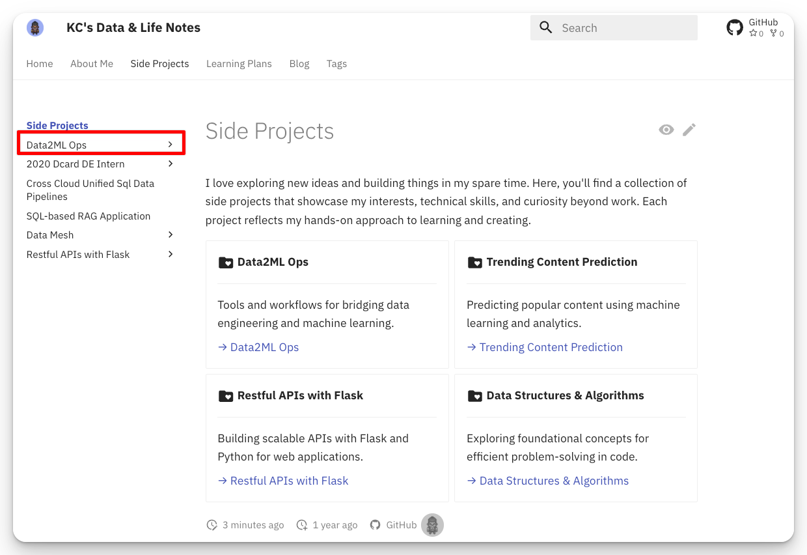

---
authors:
  - kuanchoulai10
date:
  created: 2025-05-05
  updated: 2025-06-02
categories:
  - MkDocs
  - CI/CD
tags:
  - github-actions
  - git-submodules
  - mkdocs
comments: true
---

# How to Use MkDocs to Integrate GitHub Actions and Git Submodule for Cross-repo Documentation

!!! info "TLDR"

    After reading this article, you will learn how to:

    - Use **Git Submodule** to centrally manage documentation sources across multiple projects  
    - Configure **GitHub Actions** for cross-project automation and integration workflows  
    - Utilize **Reusable Workflows** to reuse CI/CD scripts and reduce maintenance costs  
    - Leverage **MkDocs Monorepo Plugin** to merge documentation from multiple projects into a single website

<!-- more -->

Ever tried hunting for that one crucial piece of documentation across five different repositories? It's like playing an exhausting game of hide-and-seek where the information you need is always in the *other* repo. Sound familiar?

In many organizations, teams scatter their documentation across separate Git repositories like breadcrumbs in a forest. Frontend docs live here, backend knowledge sits there, and that critical ML pipeline explanation? Somewhere in yet another repository. While this approach keeps ownership clear and projects manageable, it creates a documentation nightmare that would make even the most patient developer pull their hair out.

Picture this: a new team member joins your organization. Instead of a smooth onboarding experience, they embark on a treasure hunt across repositories, asking colleagues endless questions and trying to piece together how everything connects. It's like trying to assemble IKEA furniture with instructions scattered across different boxes – technically possible, but unnecessarily frustrating.

I've been there too. While switching to a monorepo seemed tempting (like moving all your furniture to one room), we decided to keep our multi-repo structure for good reasons – authorization boundaries, deployment flexibility, and version independence. But I wasn't about to let scattered documentation continue being the thorn in our side.

That's when I discovered the perfect recipe: combining Git Submodules (think of them as neat organizational folders), MkDocs Monorepo Plugin (the master chef that brings everything together), and GitHub Actions (your tireless automation assistant). The result? A centralized documentation platform that updates itself automatically. It's like having a personal librarian who keeps all your books organized and up-to-date!


Specifically, this setup involves three repositories:

- [`monorepo`](https://github.com/kuanchoulai10/monorepo) (Main Repo) is the repository I use to build my personal website, utilizing MkDocs and deployed on GitHub Pages. It already has a predefined `publish-docs.yml` GitHub Actions Workflow.
- [`data2ml-ops`](https://github.com/kuanchoulai10/data2ml-ops) (Sub Repo) is my personal project for practicing DataOps and MLOps, which also uses MkDocs for documentation building.
- [`reusable-workflows`](https://github.com/kuanchoulai10/reusable-workflows) is used to store reusable workflows.

My mission? Merge the learning notes from `data2ml-ops` into `monorepo` so I can showcase insights from different projects on one beautiful website. No more jumping between sites or wondering if documentation is outdated!

The magic happens like this: whenever `data2ml-ops` gets updated documentation and pushes to GitHub, it automatically triggers the documentation build and deployment in `monorepo`. It's like having a loyal assistant who immediately updates your main presentation whenever you make changes to your notes. No more worrying about documentation drift!

This article will explain step by step how I completed this integration, including implementation methods and considerations.

1. **Add Submodule**  
   Add `data2ml-ops` as a Git Submodule in `monorepo`.

2. **Create Documentation Deployment Workflow**  
   Add a GitHub Actions Workflow in `monorepo` responsible for building and deploying documentation to GitHub Pages.

3. **Create Reusable Workflow**  
   Create a Reusable Workflow in `reusable-workflows` responsible for triggering the documentation deployment process from step 2.

4. **Configure Sub-repo Workflow**  
   Create a Workflow in `data2ml-ops` that uses the Reusable Workflow from step 3 to trigger the documentation deployment process in `monorepo`.

5. **Integrate MkDocs Monorepo Plugin**  
   Add the MkDocs Monorepo Plugin to `monorepo` to integrate multiple documentation sources.

6. **Testing and Verification**  
   Submit new changes, test whether the overall process works properly, and check if documentation is successfully deployed.


## 1. Add Submodule

!!! info "[kuanchoulai10/monorepo](https://github.com/kuanchoulai10/monorepo)"

Think of Git Submodules as your project's way of having roommates – you can live together in the same house (repository) while keeping your personal belongings (version history) completely separate[^1]. It's perfect for these scenarios:

1. **Modular management**: Like having separate apartments for your frontend and backend teams, but with a shared lobby where they can meet and collaborate.
2. **Version independence**: Your main repository acts like a strict landlord, locking onto specific versions of submodules. No surprise changes allowed!
3. **Reusability**: That awesome utility library? Instead of copying it everywhere like a hoarder, just reference it as a submodule. Clean and efficient!

Let's invite `data2ml-ops` to move into our `monorepo` using the digital equivalent of a lease agreement:

```bash
git submodule add https://github.com/kuanchoulai10/data2ml-ops.git data2ml-ops
```

```bash
Cloning into '{==/Users/kcl/projects/monorepo/data2ml-ops'==}...
remote: Enumerating objects: 197, done.
remote: Counting objects: 100% (197/197), done.
remote: Compressing objects: 100% (110/110), done.
remote: Total 197 (delta 78), reused 183 (delta 66), pack-reused 0 (from 0)
Receiving objects: 100% (197/197), 1.04 MiB | 1.94 MiB/s, done.
Resolving deltas: 100% (78/78), done.
```

```bash
git status
```

```bash
On branch main
Your branch is up to date with 'origin/main'.

Changes to be committed:
  (use "git restore --staged <file>..." to unstage)
	modified:   {==.gitmodules==}
	new file:   {==data2ml-ops==}

Changes not staged for commit:
  (use "git add <file>..." to update what will be committed)
  (use "git restore <file>..." to discard changes in working directory)
```

Perfect! Git has thoughtfully created two essential files:

1. `.gitmodules` – Think of this as your address book, telling Git where to find each submodule:
    ```.gitmodules
    [submodule "data2ml-ops"]
      path = data2ml-ops
      url = https://github.com/kuanchoulai10/data2ml-ops.git
    ```
2. `data2ml-ops` – This is like a bookmark that points to exactly which version (commit) of the submodule we're using.

Time to share our changes with the world! Push these files to the remote repository:

```bash
git push
```

```bash
Enumerating objects: 5, done.
Counting objects: 100% (5/5), done.
Delta compression using up to 8 threads
Compressing objects: 100% (3/3), done.
Writing objects: 100% (3/3), 404 bytes | 404.00 KiB/s, done.
Total 3 (delta 2), reused 0 (delta 0), pack-reused 0
remote: Resolving deltas: 100% (2/2), completed with 2 local objects.
To https://github.com/kuanchoulai10/monorepo.git
   6c36b76..c1e29ff  main -> main
```

Now when you visit GitHub, you'll see something magical: `data2ml-ops @ 7369c16`. Click on it, and voilà! It teleports you to the actual repository. It's like having a portal in your house that leads directly to your friend's place – the reference is there, but you're not actually storing their stuff in your garage.



## 2. Create Documentation Deployment Workflow

!!! info "[kuanchoulai10/monorepo](https://github.com/kuanchoulai10/monorepo)"

Time to set up our documentation deployment pipeline! Think of GitHub Actions as your personal automation butler – and the best part? It works for free on public repositories[^2]. 

In the GitHub Actions universe, events are like doorbells that wake up your butler. Whether someone rings the `Push` doorbell, the `Pull Request` chime, or the `Merge` bell, each one triggers a workflow – basically a to-do list of automated tasks your butler follows religiously[^3].

I won't bore you with every detail of writing deployment workflows (that's a whole other adventure), but let's focus on the Git submodules magic tricks.

Our workflow has two ears, always listening for:

1. **New pushes to `monorepo`** – When the main house gets updates, rebuild everything!
2. **Special `repository_dispatch` webhook events** – Think of these as secret knock patterns that external repositories can use to wake up our workflow[^4][^5]. When other submodule repos update their docs, they'll send this special signal saying "Hey, time to rebuild!"

```yaml linenums="1" hl_lines="5 6" title=".github/workflows/publish-docs.yml"
--8<-- "./.github/workflows/publish-docs.yml:on"
```

Our workflow is like a well-organized recipe with one main job. The first step? Always get all the ingredients (checkout the codebase). But here's the crucial part – when using `actions/checkout@v4`, you absolutely must add `submodules: recursive`. Without this magical incantation, your submodule folders would be as empty as a diet soda's promise of satisfaction!

```yaml linenums="1" hl_lines="4" title=".github/workflows/publish-docs.yml"
--8<-- "./.github/workflows/publish-docs.yml:checkout"
```

Since our workflow might be awakened by updates from submodule repositories (like a helpful neighbor calling to say they've cleaned their yard), we need to be polite guests and:

1. **Update all submodules** – Fetch the latest changes from our submodule neighbors
2. **Commit and push changes** – If we found updates, we'll neatly file them away in our main repository

```yaml linenums="1" hl_lines="3 6-12" title=".github/workflows/publish-docs.yml"
--8<-- "./.github/workflows/publish-docs.yml:submodules"
```

This creates a beautiful synchronization dance – whenever a submodule updates, our documentation stays fresh and current. Don't forget to commit and push these changes when you're done!

## 3. Create Reusable Workflow

!!! info "[kuanchoulai10/reusable-workflows](https://github.com/kuanchoulai10/reusable-workflows)"

Time to create our universal remote control! This reusable workflow is like that friend who's really good at getting everyone organized for group projects – simple, reliable, and saves everyone time.

The logic is beautifully straightforward: use `curl` (the Swiss Army knife of web requests) to send a gentle tap on `monorepo`'s shoulder via the `repository_dispatch` webhook[^5]. It's like sending a text message that says "Hey, I updated my docs, could you refresh the website please?" The message includes `event_type: update-submodules` so our main repo knows exactly what kind of help we need.

Since this is a reusable workflow (the automation equivalent of a recipe you can share with friends), it listens for `workflow_call` events[^6]:

```yaml linenums="1" hl_lines="4 6 19 21 22" title=".github/workflows/trigger-monorepo-to-build-doc.yml"
--8<-- "https://raw.githubusercontent.com/kuanchoulai10/reusable-workflows/refs/heads/main/.github/workflows/trigger-monorepo-to-build-doc.yml"
```

Why go through the trouble of creating reusable workflows? Imagine updating your automation process and having to visit each repository individually to make changes – it's like manually updating your address on every account when you move. With reusable workflows, you update once and everyone benefits. Smart and efficient!

Remember to commit and push when you're done setting up this automation masterpiece.

## 4. Configure Sub-repo Workflow

!!! info "[kuanchoulai10/data2ml-ops](https://github.com/kuanchoulai10/data2ml-ops)"

Now comes the exciting part – teaching our sub-repository how to use that universal remote we just created! But first, we need to create a special key (Personal Access Token) that gives our automation the right permissions.

Head over to GitHub's top-right corner: click your profile picture > Settings > Developer Settings > Personal access tokens > Fine-grained tokens. Think of this token as a VIP pass that allows reading metadata from the monorepo and pushing code with new submodule commits. Make sure to grant "Contents" repository permissions (write)[^5] – it's like giving your automation assistant the keys to the filing cabinet.

{ width=600 }

Once you've created your token (and copied it – this is important!), head back to `data2ml-ops` and create a repository secret called `PAT`. Paste your token there like you're hiding a spare key under a digital doormat.



Now for the grand finale – creating the workflow that calls our reusable workflow[^8]. It's surprisingly simple, like speed-dialing a friend. Just use `uses` in your job and point it to where your reusable workflow lives:

```yaml  linenums="1" hl_lines="4 6-8 12 14" title=".github/workflows/trigger-monorepo-to-build-doc.yml"
--8<-- "https://raw.githubusercontent.com/kuanchoulai10/data2ml-ops/887a9a0361e4f4b4c2491f470c49d25bd28c7243/.github/workflows/trigger-monorepo-to-build-doc.yml"
```

Commit and push these changes, and you've just created your first cross-repository communication channel!

## 5. Integrate MkDocs Monorepo Plugin

!!! info "[kuanchoulai10/monorepo](https://github.com/kuanchoulai10/monorepo)"

Almost there! Time to add the secret sauce that makes multiple documentation sources sing in harmony. Enter `mkdocs-monorepo-plugin` – the conductor of our documentation orchestra, crafted by the brilliant minds at Backstage.

Quick backstory: Backstage is Spotify's gift to the developer world (it joined CNCF in 2020). Think of it as the ultimate dashboard for your engineering organization – like a mission control center where you can see all your microservices, documentation, CI/CD pipelines, and APIs in one beautiful, organized view[^9].

First, let's invite this plugin to the party:

```
pip install mkdocs-monorepo-plugin
```

Once installed, the magic happens with just a few lines. Add `monorepo` to your plugins, and suddenly you have access to a powerful new syntax: `!include`. It's like having a magic wand that can summon documentation from other repositories:

```yaml
...

nav:
  - Data2ML Ops: "!include ./data2ml-ops/mkdocs.yml"

...

plugins:
  - monorepo
```

This elegant little configuration tells MkDocs: "Hey, go grab the navigation structure from that submodule and weave it seamlessly into our main site." It's documentation magic at its finest!

Don't forget to commit and push these changes – we're almost ready for the big reveal!

## 6. Testing and Verification

!!! info "[kuanchoulai10/data2ml-ops](https://github.com/kuanchoulai10/data2ml-ops)"

The moment of truth has arrived! Time to put our automation masterpiece to the test. Let's make some updates to the documentation in `data2ml-ops` and push them to GitHub, then sit back and watch our creation come to life.

Check out the GitHub Actions workflow doing its thing:



[`data2ml-ops` run history](https://github.com/kuanchoulai10/data2ml-ops/actions/runs/14824960685)

Behind the scenes, our workflow is using that reusable workflow like a well-oiled machine. It sends a polite `curl` request to the GitHub API, creating a `repository_dispatch` event in `monorepo`. This digital tap on the shoulder then wakes up the `publish-docs.yml` workflow – it's like watching a perfectly choreographed dance!

Switch over to the `monorepo` page, and you'll see our documentation deployment process has indeed sprung into action:



[`monorepo` run history](https://github.com/kuanchoulai10/monorepo/actions/runs/14824961637)

Look at that beautiful update! Our submodule reference has smoothly transitioned from `data2ml-ops @ 7369c16` to `data2ml-ops @ 887a9a0`. It's like watching your bookmark automatically update to point to the latest chapter of your favorite book.



The final proof? Visit the actual website, and there it is – the documentation from my `data2ml-ops` project, freshly deployed and beautifully integrated! It's like watching all the pieces of a puzzle click into place.



And just like that, we've created a self-updating documentation ecosystem that keeps everything in sync without manual intervention. No more documentation archaeology expeditions or wondering if what you're reading is current. Your cross-repository documentation now flows as smoothly as a well-conducted symphony!

## References

[^1]: [Git Submodules Basic Explanation | gitaarik GitHub](https://gist.github.com/gitaarik/8735255)
[^2]: [About billing for GitHub Actions | GitHub Docs](https://docs.github.com/en/billing/managing-billing-for-your-products/managing-billing-for-github-actions/about-billing-for-github-actions)
[^3]: [The components of GitHub Actions | GitHub Docs](https://docs.github.com/en/actions/about-github-actions/understanding-github-actions#the-components-of-github-actions)
[^4]: [`repository_dispatch` Event | GitHub Docs](https://docs.github.com/en/actions/writing-workflows/choosing-when-your-workflow-runs/events-that-trigger-workflows#repository_dispatch)
[^5]: [Create a repository dispatch event | GitHub Docs](https://docs.github.com/en/rest/repos/repos#create-a-repository-dispatch-event)
[^6]: [Creating a reusable workflow | GitHub Docs](https://docs.github.com/en/actions/sharing-automations/reusing-workflows#creating-a-reusable-workflow)
[^7]: [Creating a fine-grained personal access token | GitHub Docs](https://docs.github.com/en/authentication/keeping-your-account-and-data-secure/managing-your-personal-access-tokens#creating-a-fine-grained-personal-access-token)
[^8]: [Calling a reusable workflow | GitHub Docs](https://docs.github.com/en/actions/sharing-automations/reusing-workflows#calling-a-reusable-workflow)
[^9]: [backstage/mkdocs-monorepo-plugin | GitHub](https://github.com/backstage/mkdocs-monorepo-plugin)