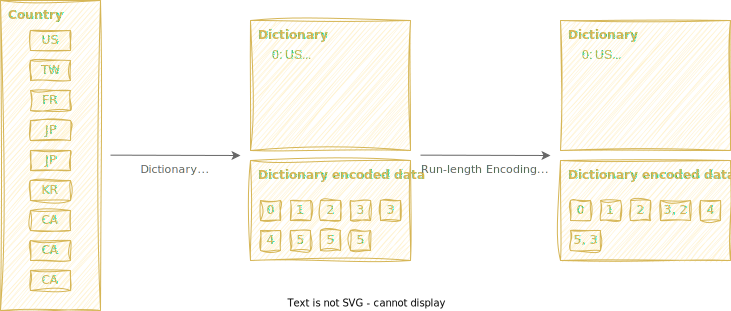

---
authors:
  - kuanchoulai10
date:
  created: 2025-06-02
  updated: 2025-06-02
categories:
  - Data
tags:
  - The Lakehouse Series
comments: true
---

# The Lakehouse Series: OLTP vs. OLAP (A Parquet Primer)

!!! info "TLDR"

    After reading this article, you will learn:

    - The key differences between **OLTP** and **OLAP** workloads, and why storage format matters
    - How **Parquet** organizes data internally and optimizes data storage using compression techniques like dictionary encoding and RLE
    - Where Parquet falls short in today's data landscape

<!-- more -->

## OLTP vs. OLAP: The Data Processing Showdown

Picture this: you're at a bustling coffee shop. The barista (OLTP) takes your order, processes payment, and updates inventory — all in seconds. Meanwhile, the shop owner (OLAP) sits in the back office, analyzing months of sales data to figure out which pastries sell best on rainy Tuesdays. Same data, completely different games!

### What is OLTP? (The Speed Demon)

OLTP stands for **Online Transaction Processing** — think of it as your data's personal speed trainer. It's obsessed with handling individual transactions faster than you can say "latte with oat milk."

OLTP is like that friend who finishes your sentences before you're halfway through. It specializes in **real-time data updates and retrievals** with the patience of a caffeinated hummingbird. Here's where it shines:

- **Banking Scenario**: When you withdraw cash, OLTP updates your balance faster than you can pocket the money. It's also the invisible hero when you update your address for that credit card application — boom, done, next!
- **E-commerce Scenario**: Adding items to your cart, completing purchases, or deleting that embarrassing profile from your teenage years — OLTP handles it all with sub-second precision.

The magic? OLTP focuses on **processing individual rows of data**, making it the perfect sprinter for workloads that demand instant gratification and rock-solid reliability.

### What is OLAP? (The Deep Thinker)

OLAP stands for **Online Analytical Processing** — imagine a brilliant detective who loves crunching numbers more than solving crimes. While OLTP races around handling transactions, OLAP sits in a cozy chair, analyzing patterns like Sherlock Holmes with a spreadsheet addiction.

OLAP is your go-to when you need to **analyze massive datasets and extract insights**. It's less interested in individual records and more fascinated by **the big picture across specific columns**. Check out its superpowers:

- **Banking Scenario**: Need to know the average age of customers across different branches? OLAP dives into thousands of records, groups them by location, and serves up insights that would make a marketing manager weep with joy.
- **E-commerce Scenario**: Those beautiful dashboards showing sales trends, customer demographics, and year-over-year growth? That's OLAP flexing its analytical muscles.

The secret sauce? OLAP excels at **processing subsets of columns** rather than individual rows, making it the marathon champion of data aggregation and business intelligence.

## Why Storage Formats Matter

Choosing the right data format is like picking the perfect tool for a job — use a hammer when you need a screwdriver, and you'll have a very bad time!

Before we dive into the storage format showdown, let's map out the data landscape. Imagine data formats on a spectrum:

At one end, we have **unstructured data** — the wild west of information. Think images, videos, and that chaotic folder of memes on your desktop. No rules, no schema, just pure digital chaos.

At the other end sits **structured data** — the neat freak of the data world. CSV files fall here, with their obsessive love for rows and columns, following rules stricter than a Swiss train schedule.

Hanging out in the middle is **semi-structured data** like JSON and XML — the cool kids who have some structure but refuse to be completely boxed in. They're like organized chaos, with key-value pairs that make sense but don't follow traditional table manners.

Now, let's get specific about structured data layouts. Imagine we have a `users` table with 5 rows and 4 columns (age, gender, country, and average order value) — our guinea pig for this storage format experiment:

<figure markdown="span">
  {width="500"}
</figure>

We can classify this logical structured data into two categories based on how the data is physically stored on disk.

**Row-Based Storage: The Transaction Speedster**

Row-based formats store data like reading a book — line by line, left to right. It's how traditional databases like PostgreSQL and MySQL organize their data, and for good reason!

Since **data is stored row by row**, it's incredibly efficient for typical OLTP operations. Want to insert a new user? Easy — just append a new row. Need to update someone's profile? Find the row offset and boom, mission accomplished. Deleting a user? Same deal.

<figure markdown="span">
  {width="500"}
</figure>

See how elegant it is? To delete the second row, we just need its offset — like having the exact address of a house. But here's the catch: if you want to analyze the average age of all users, you'd have to knock on every door in the neighborhood. Not exactly efficient!

**Column-Based Storage: The Analytics Powerhouse**

Column-based formats flip the script entirely — instead of reading like a book, they read like scanning a newspaper column. Each column lives together, creating some serious analytical superpowers.

This layout is **compression heaven**. That gender column with mostly "male" and "female" values? Column storage can compress it down to almost nothing, like vacuum-packing your winter clothes.

<figure markdown="span">
  {width="500"}
</figure>

Need the average age? Just grab the age column and you're done — no need to wade through irrelevant data. But deleting a specific user? Now you're playing hide-and-seek across multiple columns. Not exactly OLTP's cup of tea!

## Enter Parquet: The Best of Both Worlds

What if I told you there's a storage format that's like having a sports car that's also an SUV? Meet Parquet — the overachiever of the data storage world!

Parquet emerged from the brilliant minds at Twitter and Cloudera back in 2012. By 2013, it had graduated to become a top-level Apache project, and the data world hasn't been the same since.

<figure markdown="span">
  {width="675"}
</figure>

Here's the genius: Parquet organizes data into **row groups** (like small neighborhoods) that are then divided into **columns** (like sorting each neighborhood by house type). In our example, we have 2 row groups — the first contains rows 1-3, the second contains rows 4-5. Within each row group, columns live separately, enabling both row-wise convenience and column-wise efficiency.

It's like having the best of both worlds — you can quickly find a specific user (row-wise operations) or analyze age patterns across thousands of users (column-wise operations) without breaking a sweat!

**Parquet's Anatomy: A Peek Under the Hood**

<figure markdown="span">
  {width="500"}
</figure>

A Parquet file is like a well-organized filing cabinet with some seriously smart features:

1. **Magic Number**: Every Parquet file starts with "PAR1" — its digital signature that screams "I'm special!"
2. **Row Groups**: The main organizing principle, like having separate drawers for different categories of data
3. **Column Chunks**: Within each row group, columns get their own dedicated space — think individual folders within each drawer
4. **Pages**: The smallest storage unit, like individual documents within each folder
5. **Footer**: The master index at the end that contains all the metadata — like having a detailed table of contents that tells you exactly where everything is without opening every drawer

This structure enables lightning-fast metadata reading and incredibly efficient data retrieval. It's like having a librarian who knows exactly where every book is without checking the shelves!

**Efficient Compression in Parquet**

Efficient compression is a cornerstone of Parquet's design, enabling it to store massive datasets while minimizing disk usage and maximizing query performance. By leveraging techniques like **dictionary encoding**, **run-length encoding (RLE)**, and **bit-packing**, Parquet achieves remarkable compression ratios without sacrificing speed. Let's explore how these methods work together to optimize columnar data storage.

<figure markdown="span">
  {width="500"}
</figure>

The image illustrates how Parquet efficiently compresses columnar data using **dictionary encoding**, followed by **run-length encoding (RLE)** and **bit-packing**. In the original column `["US", "TW", "FR", "JP", "JP", "KR", "CA", "CA", "CA"]`, dictionary encoding first replaces each unique string with a unique integer ID. For example, `"US"` becomes `0`, `"TW"` --> `1`, ..., `"CA"` --> `5`, resulting in the encoded sequence: `[0, 1, 2, 3, 3, 4, 5, 5, 5]`.

To further reduce storage, Parquet applies RLE and bit-packing to the integer sequence. Run-length encoding compresses consecutive repeated values, such as `"JP"` `(3, 3)` and `"CA"` `(5, 5, 5)`, into pairs like `3,2` (meaning value 3 repeated 2 times) and `5,3`. Bit-packing then ensures each integer is stored using the minimum number of bits necessary (in this case, 3 bits for up to 6 dictionary values). This layered approach dramatically reduces data size and speeds up scan performance by enabling efficient decoding and skipping of unneeded values.

## Beyond Parquet: The Next Evolution

Even superheroes have kryptonite, and Parquet is no exception. Despite being the Swiss Army knife of data storage, it does have some Achilles' heels that can make you pull your hair out:

- **Subsecond latency**: Parquet struggles with workloads requiring microsecond updates, such as high-frequency trading.
- **High-concurrency read-write**: Maintaining consistency during concurrent operations is challenging.

Parquet shines in OLAP systems where batch processing and read-heavy workloads dominate. However, as modern data applications grow more interactive and collaborative, expectations have shifted. Today's data platforms increasingly require features like:

- **ACID transactions**: Ensuring data reliability during concurrent operations.
- **Time travel queries**: Accessing historical data snapshots.
- **Concurrent reads and writes**: Supporting high-performance, multi-user environments.

To address these needs, open formats like **Apache Hudi**, **Iceberg**, and **Delta Lake** have emerged. Built on top of Parquet, these formats extend its functionality to support advanced features, making them ideal for modern lakehouse architectures.

Stay tuned for the next chapter in our Lakehouse series, where we'll explore how these formats are revolutionizing data processing!

## References

I particularly enjoyed this talk by Boudewijn Braams, a senior software engineer at Databricks. He provided an insightful and engaging explanation of Parquet's internal structure and compression techniques, using vivid analogies that left a lasting impression. This presentation is not only suitable for beginners but also offers valuable insights and optimization tips for experienced data engineers.

<iframe width="560" height="315" src="https://www.youtube.com/embed/1j8SdS7s_NY?si=ulnjMUoUbx_63vYt" title="YouTube video player" frameborder="0" allow="accelerometer; autoplay; clipboard-write; encrypted-media; gyroscope; picture-in-picture; web-share" referrerpolicy="strict-origin-when-cross-origin" allowfullscreen></iframe>

For official documentation, you can refer to the [Parquet File Format](https://parquet.apache.org/docs/file-format/) documentation, which provides a comprehensive overview of its structure and features.