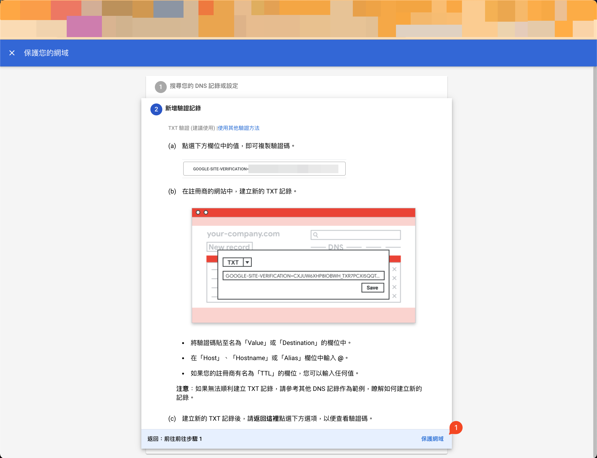
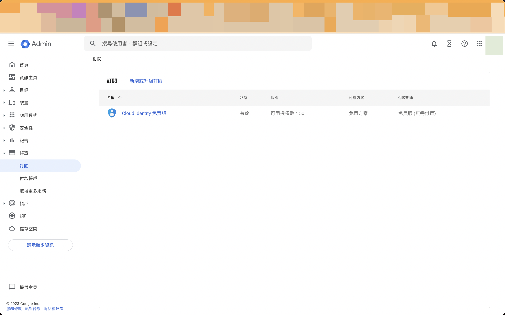

# 透過自有網域申請Google Cloud Identity

!!! info "TL;DR"
    Test

<!-- more -->

最近打算在Google Cloud建立Data Mesh架構作為Side Project，試圖打造大型企業中可能的去中心化數據團隊的協作樣貌。然而，我在過程中發現為了要模擬多個團隊在不同Google Cloud[資源階層](https://cloud.google.com/resource-manager/docs/cloud-platform-resource-hierarchy)中分別管理各自的專案，需要先註冊申請Cloud Identity或Google Workspace才有辦法在Google Cloud中建立[機構(Organization)](https://cloud.google.com/resource-manager/docs/creating-managing-organization)資源。而這篇文章就是在說明如何透過自有網域來申請Google Cloud Identity。

## 事前準備

### 購買網域

在開始之前，你會需要先購買網域。網路上已經有很多資源教你如何購買了，這邊就不多說了，就挑一家網域註冊商來購買吧。

我自己當初是在[GoDaddy](https://godaddy.com/)上購買網域(也就是你目前瀏覽的這個網域)，購買時也一併註冊了email服務，當作之後網站對外的電子信箱。

<figure markdown>
  { width=600 }
  <figcaption>GoDaddy "My Products" Page</figcaption>
</figure>

## 設定Google Cloud Identity

購買完後，就可以根據[Set up Cloud Identity as a Google Cloud admin]

Cloud Identity 註冊頁
公司名稱 員工人數 地區

<figure markdown>
  { width=300 }
  <figcaption></figcaption>
</figure>

姓名 目前的電子郵件地址
<figure markdown>
  { width=300 }
  <figcaption></figcaption>
</figure>

網域名稱
<figure markdown>
  { width=300 }
  <figcaption></figcaption>
</figure>

再次確定要使用這個網域設定帳戶
<figure markdown>
  { width=300 }
  <figcaption></figcaption>
</figure>

登入身分
<figure markdown>
  { width=300 }
  <figcaption></figcaption>
</figure>

我瞭解
<figure markdown>
  { width=600 }
  <figcaption></figcaption>
</figure>

保護
<figure markdown>
  { width=600 }
  <figcaption></figcaption>
</figure>

<figure markdown>
  { width=600 }
  <figcaption></figcaption>
</figure>

<figure markdown>
  { width=600 }
  <figcaption></figcaption>
</figure>

<figure markdown>
  { width=600 }
  <figcaption></figcaption>
</figure>

<figure markdown>
  { width=600 }
  <figcaption></figcaption>
</figure>

<figure markdown>
  { width=600 }
  <figcaption></figcaption>
</figure>

<figure markdown>
  { width=600 }
  <figcaption></figcaption>
</figure>

1. Sign up for Cloud Identity Free
2. Creating your first user
3. 

[Set up email with your domain]: https://support.google.com/cloudidentity/answer/7667994
[Set up Cloud Identity as a Google Cloud admin]: https://cloud.google.com/identity/docs/set-up-cloud-identity-admin