# 建立GA4資源並在`mkdocs-material`建置的網站中使用

!!! info "TL;DR"
    

<!-- more -->

## 1. 建立帳戶

首先，進到[Google Analytics](https://analytics.google.com/analytics/web/)介面點選「開始評估」：

<figure markdown>
  
  <figcaption></figcaption>
</figure>

接著，設定帳戶名稱和帳戶資料共用設定，自訂是否與Google分享在GA4中收集到的資料，以做其他用途，包括「
Google 產品和服務」、「根據輸入內容和業務洞察資料建立模型」、「技術支援」和「帳戶專家」：

<figure markdown>
  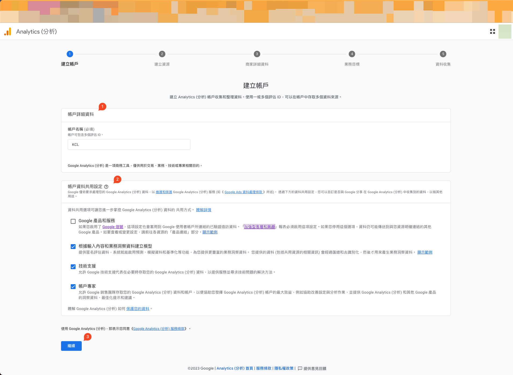
  <figcaption></figcaption>
</figure>

## 2. 建立資源

再來，根據個人偏好填入GA4資源名稱、報表時區和顯示貨幣：

<figure markdown>
  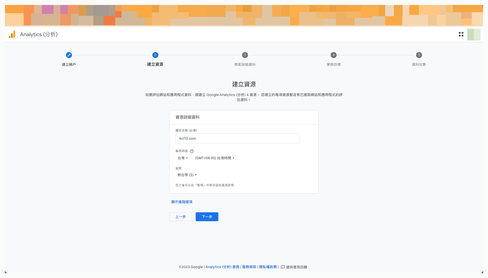
  <figcaption></figcaption>
</figure>

## 3. 填寫商家詳細資料

然後，根據你的目前現況填入產業類別和企業規模：

<figure markdown>
  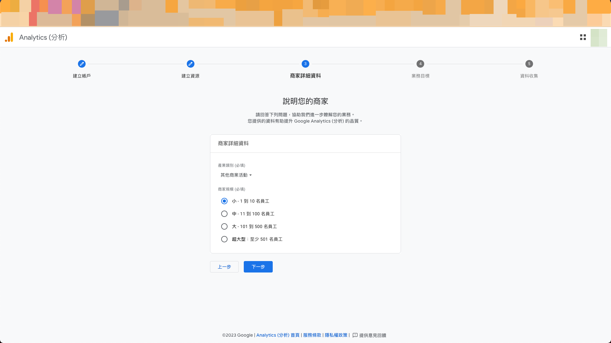
  <figcaption></figcaption>
</figure>

## 4. 選擇業務目標

填寫商家詳細資料後，再來就是根據你的業務需求，選擇業務目標。不同目標選擇會有不一樣的預設報表配置。詳情可以查看[[GA4] 業務目標集合](https://support.google.com/analytics/answer/12924488)。選擇完畢後請按「建立」，並接受Google Analytic和GDPR的合約：

<figure markdown>
  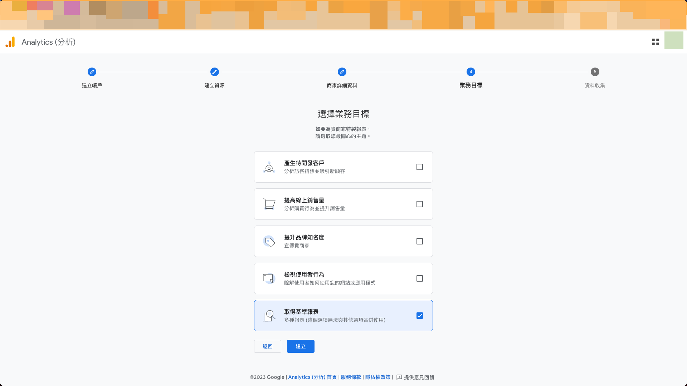
  <figcaption></figcaption>
</figure>

<figure markdown>
  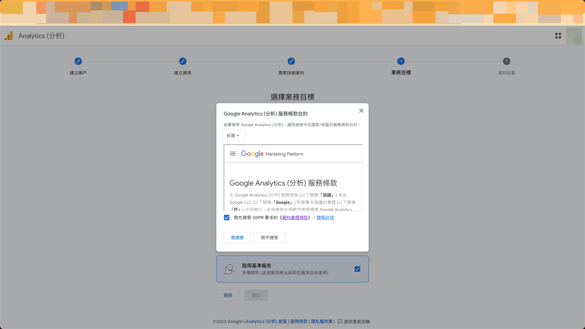
  <figcaption></figcaption>
</figure>

## 5. 資料收集

### 取得網站資料串流評估ID

填寫完一切資訊後，最後一步就是設定網站的GA4資料收集。由於我們是「網站」而非其它兩大平台應用程式，因此選擇「網站」：

<figure markdown>
  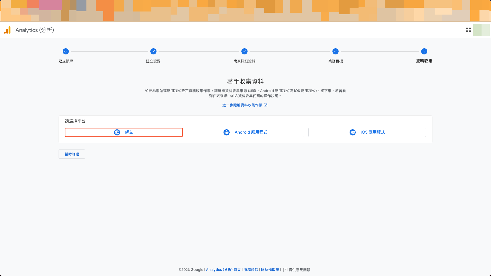
  <figcaption></figcaption>
</figure>

再來，替GA4[新增網站資料串流]((https://support.google.com/analytics/answer/9304153#zippy=%2Cweb))。填寫網站網址和串流名稱後，點選「建立串流」。值得注意的是，GA4預設會開啟[加強型事件評估](https://support.google.com/analytics/answer/9216061)，收集網頁瀏覽、站內搜尋、影片參與等瀏覽行為：

<figure markdown>
  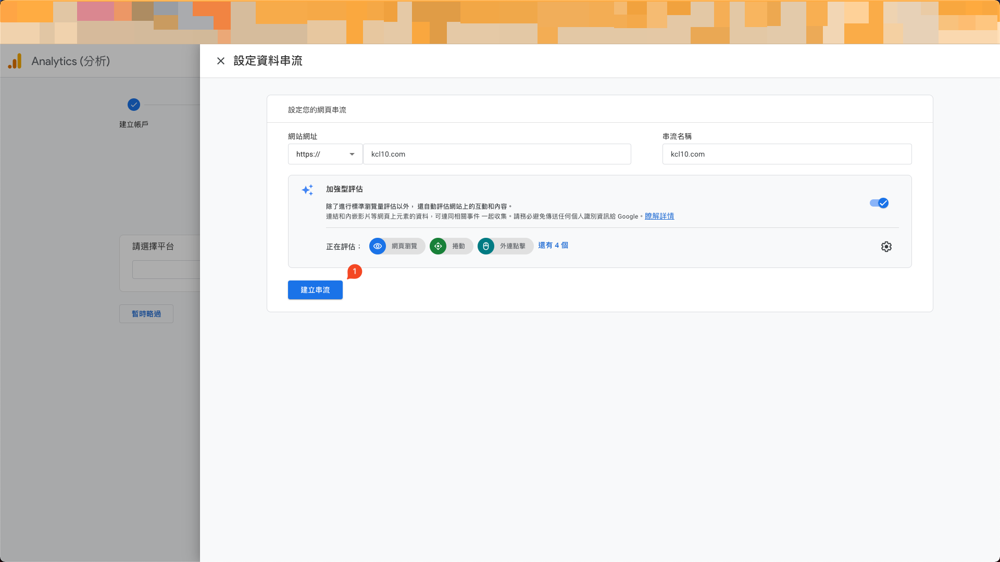
  <figcaption></figcaption>
</figure>

新增網站資料串流後，GA4會自動替你生成一組「[串流ID](https://support.google.com/analytics/answer/12332343)」和「[評估ID](https://support.google.com/analytics/answer/12270356)」，將「評估ID」複製起來，待會會使用到：

<figure markdown>
  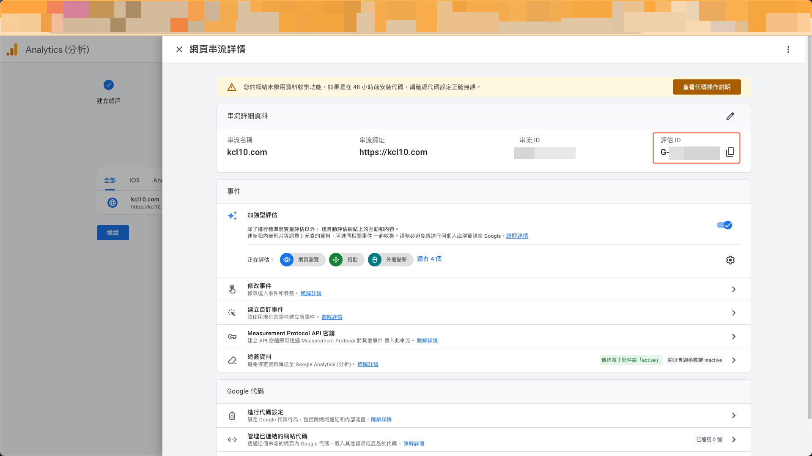
  <figcaption></figcaption>
</figure>

### 在`mkdocs-material`建置的網站中使用Google Analytics

閱讀完[Setting up site analytics](https://squidfunk.github.io/mkdocs-material/setup/setting-up-site-analytics/)後發現要在`mkdocs-material`設定其實挺容易的。只需替`mkdocs.yml`加上以下設定即可：

```YAML
extra:
  analytics:
    provider: google
    property: G-XXXXXXXXXX
```

不過我們想要根據不同環境而有不同的Google Analytics配置：在本地環境建置時不使用，但部署到正式環境時則使用。因此，我們會做一些調整。

先在GitHub對應的Repo裡設定名為`GA4_MEASUREMENT_ID`的Repo secrets：

<figure markdown>
  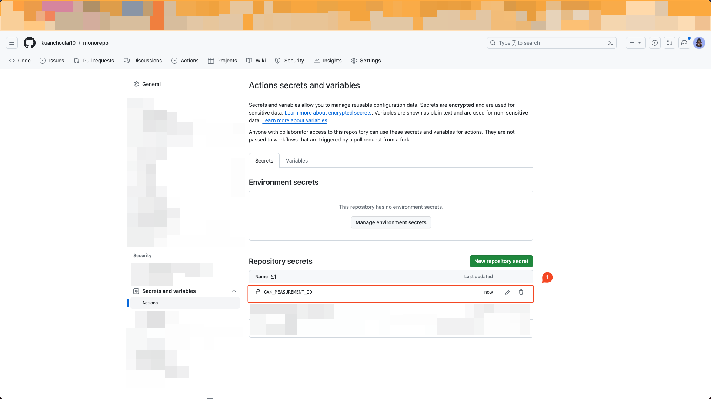
  <figcaption></figcaption>
</figure>

接著，在部署到正式環境時所使用的`publish-docs.yml`GitHub Actions workflow中[加入環境變數](https://docs.github.com/en/actions/learn-github-actions/variables#defining-environment-variables-for-a-single-workflow)，取用剛剛設定好的`GA4_MEASUREMENT_ID`的Repo secrets：

```YAML title="publish-docs.yml"
--8<-- ".github/workflows/publish-docs.yml:8:9"
```

再來，在`mkdocs.yml`中`property`改取用`GA4_MEASUREMENT_ID`環境變數：

```YAML title="mkdocs.yml"
extra:
  analytics:
    provider: google
    property: !ENV GA4_MEASUREMENT_ID
```

設定完畢後再重新部署一次，接著前往Google Analytics操作介面進行測試。如果顯示綠色勾勾圖示的話就代表GA4設定成功！

<figure markdown>
  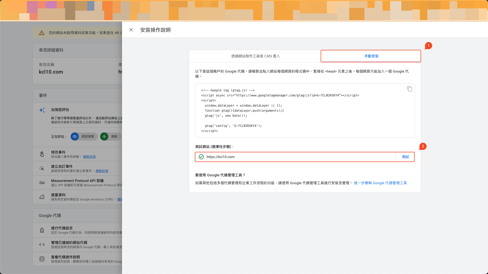
  <figcaption></figcaption>
</figure>

已啟用資料收集功能，即時在線人數為1 🎉：

<figure markdown>
  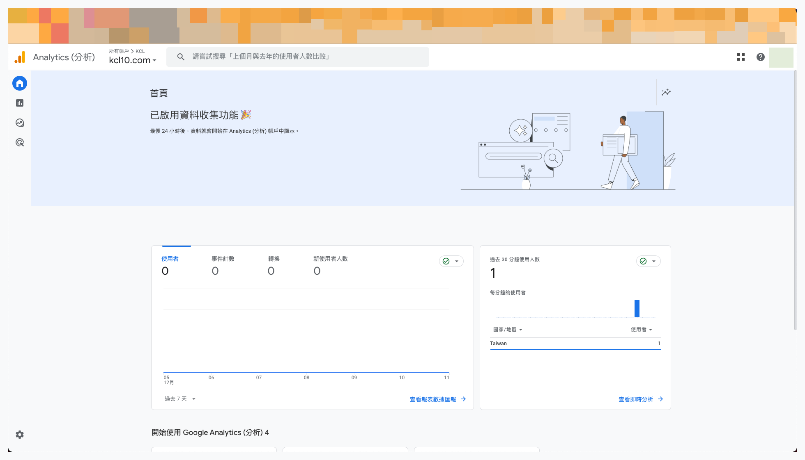
  <figcaption></figcaption>
</figure>

## 6. 追蹤網站主動回饋行為

不僅如此，`mkdocs-material`原生更提供了[頁面回饋機制](https://squidfunk.github.io/mkdocs-material/setup/setting-up-site-analytics/#was-this-page-helpful)，在每頁最下方會有個回饋區塊，提供讀者回饋，並蒐集至Google Analytics：

```YAML
analytics:
  feedback:
    title: Was this page helpful?
    ratings:
      - icon: material/thumb-up-outline
        name: This page was helpful
        data: 1
        note: Thanks for your feedback!
      - icon: material/thumb-down-outline
        name: This page could be improved
        data: 0
        note: Thanks for your feedback!
```
