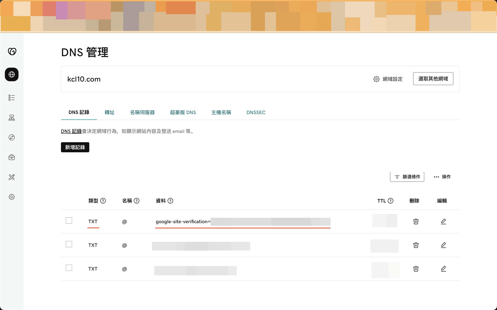

# 透過自有網域申請Google Cloud Identity

!!! info "TL;DR"
    Test

<!-- more -->

最近打算在Google Cloud建立Data Mesh架構作為Side Project，試圖打造大型企業中可能的去中心化數據團隊的協作樣貌。然而，在過程中發現為了要模擬多個團隊在不同Google Cloud[資源階層](https://cloud.google.com/resource-manager/docs/cloud-platform-resource-hierarchy)中分別管理各自的專案，需要先註冊申請Cloud Identity或Google Workspace才有辦法在Google Cloud中建立[機構(Organization)](https://cloud.google.com/resource-manager/docs/creating-managing-organization)資源。而這篇文章就是在說明如何透過自有網域來申請Google Cloud Identity。

## 事前準備

### 購買網域

在開始之前，你會需要先購買網域。網路上已經有很多資源教你如何購買了，這邊就不多說了，就挑一家網域註冊商來購買吧。我自己當初是在[GoDaddy](https://godaddy.com/)上購買網域(也就是你目前瀏覽的這個網域)：

<figure markdown>
  { width=600 }
  <figcaption>GoDaddy "My Products" Page</figcaption>
</figure>

## 設定Google Cloud Identity

### 提供基本資訊

Cloud Identity有Free和Premium兩種版本，購買完網域後接著要進行的是Google Cloud Identity Free版本註冊。詳情請參考[Set up Cloud Identity as a Google Cloud admin]。

首先，進入[註冊頁](https://workspace.google.com/gcpidentity/signup?sku=identitybasic)開始註冊流程，填入公司名稱、員工人數和地區並點選「下一步」：

<figure markdown>
  { width=300 }
  <figcaption></figcaption>
</figure>

接著，填入聯絡資訊，包括姓名和電子信箱：

<figure markdown>
  { width=300 }
  <figcaption></figcaption>
</figure>

再來，填寫你要使用哪個網域設定Cloud Identity：

<figure markdown>
  { width=300 }
  <figcaption></figcaption>
</figure>

<figure markdown>
  { width=300 }
  <figcaption></figcaption>
</figure>

### 建立新使用者

確認完要使用哪個網域做設定後，接下來就是在Cloud Identity中建立第一位使用者，完成後請點擊「同意並繼續」：

<figure markdown>
  { width=300 }
  <figcaption></figcaption>
</figure>

點選「我瞭解」以接受服務條款，系統會自動替你建立新帳號：

<figure markdown>
  { width=600 }
  <figcaption></figcaption>
</figure>

### 保護自有網域

最後，就是要來保護自有網域：

<figure markdown>
  { width=600 }
  <figcaption></figcaption>
</figure>

<figure markdown>
  { width=600 }
  <figcaption></figcaption>
</figure>

前往網域註冊商所提供的DNS服務，並回到流程頁點選「繼續：前往步驟2」：

<figure markdown>
  { width=600 }
  <figcaption></figcaption>
</figure>

Google Cloud Identity是透過在DNS服務中新增一筆`TXT`紀錄，保護你的個人網域。`TXT`紀錄內容則是由Google提供的驗證碼。

在Google Cloud Identity流程頁中複製驗證碼，接著前往DNS服務頁面新增一筆`TXT`紀錄。其中`@`指的是根網域。設定完成後請回至流程頁點選「保護網域」：

<figure markdown>
  { width=600 }
  <figcaption></figcaption>
</figure>

<figure markdown>
  { width=600 }
  <figcaption></figcaption>
</figure>

完成後就可以在Google Admin操作介面看到網域「已驗證」的資訊，且已訂閱「Cloud Identity Free」：

<figure markdown>
  { width=600 }
  <figcaption></figcaption>
</figure>

<figure markdown>
  { width=600 }
  <figcaption></figcaption>
</figure>

[Set up email with your domain]: https://support.google.com/cloudidentity/answer/7667994
[Set up Cloud Identity as a Google Cloud admin]: https://cloud.google.com/identity/docs/set-up-cloud-identity-admin