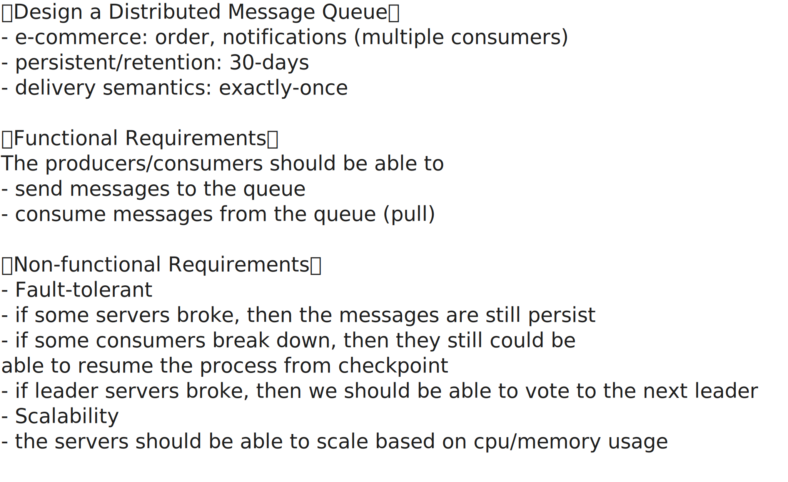

# Design a Distributed Message Queue

<iframe width="560" height="315" src="https://www.youtube.com/embed/x6eERV2WaR4?si=zyuIGHbip7pPSenX" title="YouTube video player" frameborder="0" allow="accelerometer; autoplay; clipboard-write; encrypted-media; gyroscope; picture-in-picture; web-share" referrerpolicy="strict-origin-when-cross-origin" allowfullscreen></iframe>

- [Kafka](./kafka.md)

## Clarifying Questions

To better align the design with real-world use, I'd like to first ask some clarifying questions. This will help ensure I'm solving the right problem.

- What are the business scenarios that will rely on this system?
- What are the primary use cases for this message queue?
- Who are the consumers of this system?

- What level of delivery guarantee is expected — at-most-once, at-least-once, or exactly-once?
- Do consumers need to receive messages in order (FIFO)?

- Should messages be persisted to disk for durability or just kept in memory?
- How long should messages be retained in the system?
- Do we need the ability to replay or reprocess past messages?

## Requirements

## High-Level Design & Deep Dive

## Feedback

## Questions

!!! question "What is Delivery Semantics?"

    ??? tip "Answer"

        Delivery semantics define how a messaging system guarantees the delivery of messages between producers and consumers. There are three main types:

        1. **At most once** – Messages are delivered at most one time, meaning some messages might be lost but never duplicated. It prioritizes **speed** over reliability.

        2. **At least once** – Messages are delivered one or more times. There is a risk of duplicates, but no message is lost. **The system retries until acknowledged**.

        3. **Exactly once** – Messages are delivered only once, with no duplicates or loss. It's the most complex and resource-intensive to implement, but ensures strong consistency.

!!! question "What Is 2 Phase Commit (2PC)?"

    ??? tip "Answer"

        Two-phase commit (2PC) is a protocol used to **ensure atomicity across multiple systems** in a distributed transaction. It involves two steps:

        1. **Prepare phase**: The coordinator asks all participants if they're ready to commit. Each participant replies "yes" (ready) or "no" (abort).
        2. **Commit phase**: If all say "yes," the coordinator tells everyone to commit. If any say "no," it tells all to roll back.

        This ensures all participants either commit or abort together, maintaining consistency across systems.

!!! question "Why Not Choose SQL and NoSQL as the Storage Layer?"

    ??? tip "Answer"

        I wouldn't choose NoSQL or traditional SQL databases as the storage layer for a distributed message queue because **neither is optimized for the core requirements of such systems**. **Message queues are designed around append-only, log-structured storage to support high-throughput writes, ordered reads, and offset-based consumption**. NoSQL databases prioritize flexible schemas and random access, while SQL databases focus on transactional **consistency—both introduce unnecessary overhead for sequential streaming workloads**.

        Additionally, features like **time-based retention, log compaction, and message replay would need to be manually implemented in a database setup**, leading to higher complexity and lower performance. That's why purpose-built storage engines like Kafka's log segments or Pulsar's BookKeeper are preferred—they're specifically designed to handle the scale, efficiency, and durability that message queues demand.

!!! question "What Is Leader Election in a Distributed System?"

    ??? tip "Answer"

        Leader election in a distributed system is the process of designating one node as the "leader" among a group of distributed nodes. **The leader typically coordinates actions, manages state changes, or handles critical tasks like log replication in systems like Raft or ZooKeeper**.

        It's essential for **ensuring consistency and avoiding conflicts** when multiple nodes compete to perform operations. The election must be **fault-tolerant**, meaning nodes must agree on the same leader even if there are network delays or failures. Techniques include timeouts, random backoffs, or consensus algorithms like **Paxos** or **Raft**.
