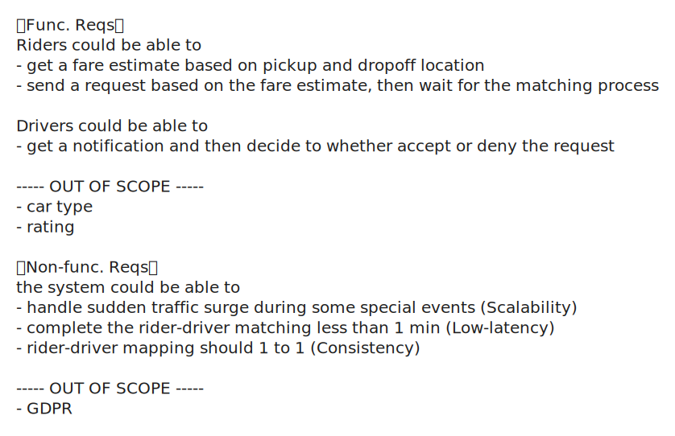
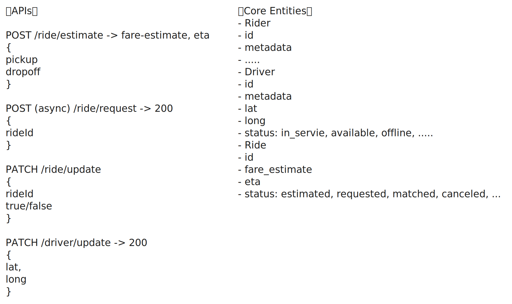
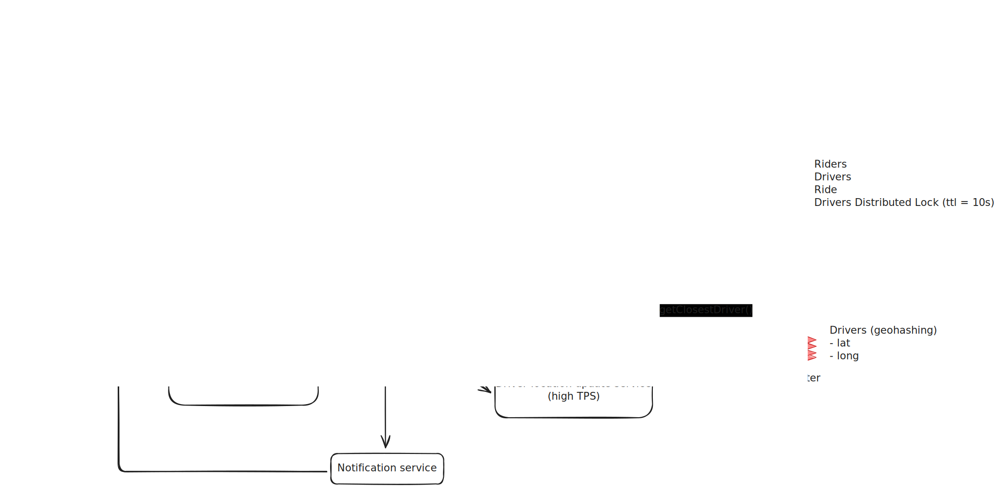

# Design a Ride-Sharing Service Like Uber

<iframe width="560" height="315" src="https://www.youtube.com/embed/lsKU38RKQSo?si=z4qnxhafRiSxdcAn" title="YouTube video player" frameborder="0" allow="accelerometer; autoplay; clipboard-write; encrypted-media; gyroscope; picture-in-picture; web-share" referrerpolicy="strict-origin-when-cross-origin" allowfullscreen></iframe>

<iframe width="560" height="315" src="https://www.youtube.com/embed/DGtalg5efCw?si=nqG81J6EBG9GwnQA" title="YouTube video player" frameborder="0" allow="accelerometer; autoplay; clipboard-write; encrypted-media; gyroscope; picture-in-picture; web-share" referrerpolicy="strict-origin-when-cross-origin" allowfullscreen></iframe>

- [Design a Ride-Sharing Service Like Uber | Hello Interview](https://www.hellointerview.com/learn/system-design/problem-breakdowns/uber)

## Requirements

## Core Entites & APIs

## System Design

