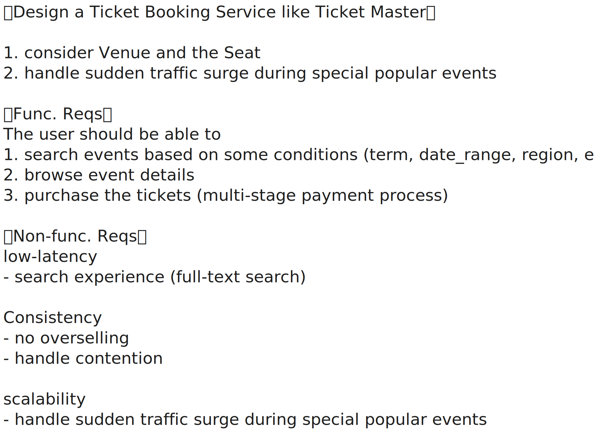
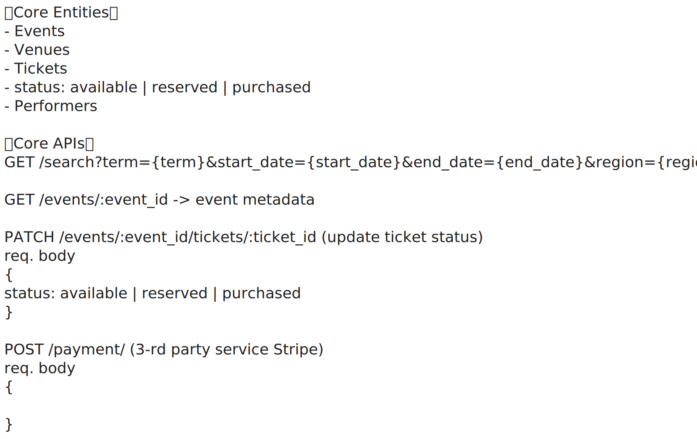
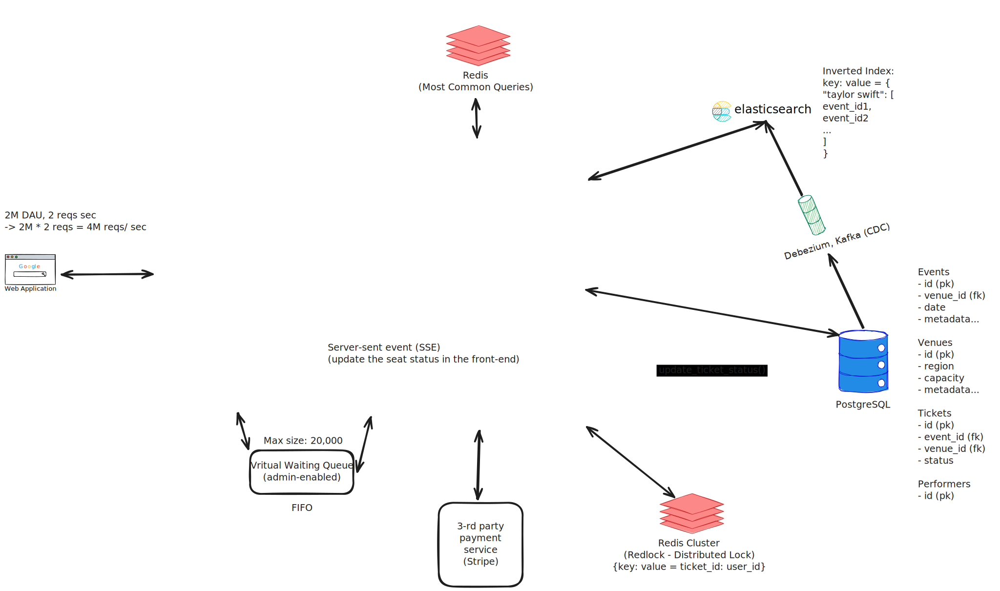

# Design a Ticket Booking Site Like Ticketmaster

<iframe width="560" height="315" src="https://www.youtube.com/embed/fhdPyoO6aXI?si=CQbojBjB_vPz0Qj8" title="YouTube video player" frameborder="0" allow="accelerometer; autoplay; clipboard-write; encrypted-media; gyroscope; picture-in-picture; web-share" referrerpolicy="strict-origin-when-cross-origin" allowfullscreen></iframe>

<iframe width="560" height="315" src="https://www.youtube.com/embed/dUSVIAGxlUw?si=I4RFnSL7WJxpuMBQ" title="YouTube video player" frameborder="0" allow="accelerometer; autoplay; clipboard-write; encrypted-media; gyroscope; picture-in-picture; web-share" referrerpolicy="strict-origin-when-cross-origin" allowfullscreen></iframe>

- [Design a Ticket Booking Site Like Ticketmaster | Hello Interview](https://www.hellointerview.com/learn/system-design/problem-breakdowns/ticketmaster)
- [System Design for Ticketmaster | System Design School](https://systemdesignschool.io/problems/ticketmaster/solution)

## Requirements

## Core Entities & APIs

## System Design

## Questions

!!! question "What is Dual-write Problem?"

    ??? tip "Answer"

        The dual-write problem occurs when a system writes to two separate systems (e.g., a database and a message queue) in a **non-atomic way**. If one write succeeds and the other fails, the two systems become inconsistent, leading to data loss or duplication.

        For example, if a service writes to a database and then publishes a Kafka message, and the Kafka write fails, consumers might never know about the database change. Solving this requires **atomicity across systems**, often via **distributed transactions** or **outbox patterns**.

!!! question "How to Handle Dual-write Problem?"

    ??? tip "Answer"

        A common way to handle the dual-write problem is using the **outbox pattern**. Instead of writing to the database and message queue separately, **the service writes both the main data and an event to the same database in a single transaction**. **A separate process (or CDC tool) then reads the outbox table and publishes the event to the message queue.**

        Another approach is using **transactional message queues** that support **atomic writes with the database**, like using Kafka with transactional producers or a distributed transaction coordinator (e.g., XA). However, these are complex and often less preferred due to performance and operational overhead.
