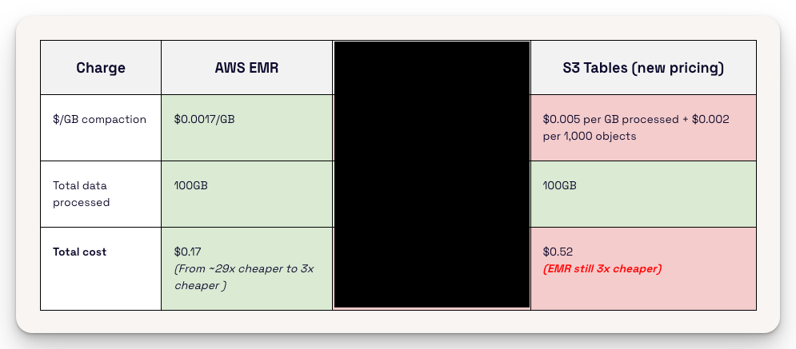

---
tags:
  - Apache Iceberg
---

# [Compaction - AWS EMR vs. AWS S3 Tables](https://www.onehouse.ai/blog/aws-s3-tables-after-the-10x-priceberg-plunge)

**Useful Information**

- It takes **EMR** **~25 seconds** of compute time to **compact 1GB** of data with an **m5.xlarge** instance. --> **$0.0017/GB** or **$0.17 for 100GB**.
- Running Iceberg compaction with **AWS EMR** comes out to be **~3x cheaper than** if you let **AWS S3 Tables** do it for you.

{width="500"}
/// caption
Cost of Compaction: AWS EMR vs. AWS S3 Tables
///

**Experiment Settings**

The **writer** produced a nominal **1 GB / minute across 100 partitions**, resulting in approximately 100 files / minute, each ranging between 7 MB and 15 MB.

{width="500"}
/// caption
Experiment Execution Details
///

{width="500"}
/// caption
the average file size over ~20h time period
///

**Cons**

- Poor observability
    - AWS only provides a CLI command (S3 Tables maintenance job status) to retrieve the last compaction status
    - Arbitrary until 3h delay cannot customize
    - No built in monitoring available
- Flawed Approach to Compaction
    - Only can choose target file size
    - It does not recognize that ideal compaction configurations are specific to different types of readers and writers.
    - Compaction not effective for low latency workloads
