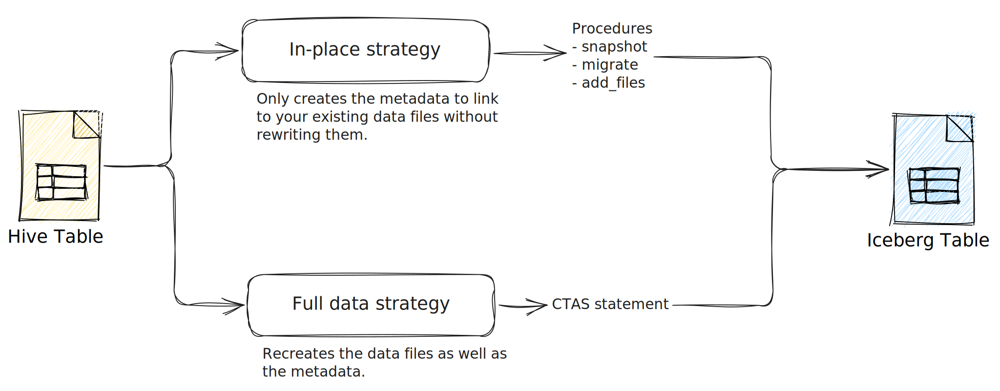

# Migrate from Hive to Iceberg



## [Migrating existing tables to Apache Iceberg | AWS ](https://docs.aws.amazon.com/prescriptive-guidance/latest/apache-iceberg-on-aws/table-migration.html)

- In-place migration
- Full data migration

- If your table file format is Parquet, ORC, or Avro, consider **in-place migration**
- For other formats such as CSV, JSON, and so on, use **full data migration**.


- If you want to evolve the table schema by using Iceberg native capabilities, consider **in-place migration**
- If you want to delete entire columns from data files, we recommend that you use **full data migration**.

- For large tables where it's prohibitively expensive to rewrite all the table partitions, consider using in-place migration and run compaction (with sorting enabled) for the most frequently accessed partitions.
- Merging small files into larger files requires rewriting the dataset. In this case, consider using full data migration.

## [How We Migrated Our Data Lake to Apache Iceberg | Insider Engineering](https://medium.com/insiderengineering/how-we-migrated-our-production-data-lake-to-apache-iceberg-4d6892eca6e6)

- The company migrated their production data lake from Apache Hive to Apache Iceberg, achieving a 90% cost saving for Amazon S3.
- Two main strategies for migrating data tables are in-place migration and full migration.
- **In-place migration keeps the data files as-is and adds Iceberg metadata, requiring stopping all write operations until completed to avoid syncing new data.**
- **Full migration allows data migration without downtime, transform the data while migrating, but is more costly due to running both systems in parallel and storing double the data during transition.**
- The company chose full migration to switch to Parquet file format with z-std compression and alter the partitioning strategy.
- They migrated tables partially and parallelized the migration job using multiple Spark jobs to accelerate the process.
- A temporary pipeline was built using a Spark job to read data from the Hive table, apply transformations, and write into the Iceberg table.
- An existing Redis instance stored migrated and non-migrated partition metadata in a Set data structure to avoid redundant operations and costs.
- The Spark job accepts the table name as a parameter and migrates data until there are no partitions left to be migrated, popping partitions from the Redis set.
- The Spark job runs as a step in an Amazon EMR cluster which shuts down after completion; EMR Serverless can be used instead.
- Grafana was used to create a dashboard to monitor migration progress, fetching migrated partitions data from Redis.
- After confirming the migration's success, the Hive tables' data, RDS instance serving the Hive Metastore, and migration job and services were deleted.

## [Apache Iceberg Reduced Our Amazon S3 Cost by 90%](https://medium.com/insiderengineering/apache-iceberg-reduced-our-amazon-s3-cost-by-90-997cde5ce931)


- The new generation data lake table formats (Apache Hudi, Apache Iceberg, and Delta Lake) enable cost-effective cloud solutions for big data analysis with ACID transactions, schema evolution, time travel, and more.
- Apache Hive was designed with HDFS in mind, which does not translate well to object storage systems like Amazon S3.
- Apache Hudi, Apache Iceberg, and Delta Lake are designed with the modern cloud infrastructure in mind to perform better and cost less on the cloud with petabyte-scale datasets.
- The main drawback of Apache Hive is the lack of grained metadata and relying on the directory listing the partitions with O(N) complexity for query planning.
- Apache Iceberg uses a snapshot approach and performs an O(1) RPC to read the snapshot file.
- Apache Iceberg tables can scale easily without worrying about the performance with increased partition count.
- At Insider, the migration of their Hive-backed data lake to Iceberg was motivated by cost-effectiveness.
- Insider ended up using Apache Parquet file format with Zstandard compression as the result of the benchmarks on their data.
- The reasons that cause Hive to have performance issues on the cloud also lead to extra costs.
- With Apache Iceberg, it is possible to configure the file size for a table with write.target-file-size-bytes parameter, which is 512MB by default.
- Querying a table reads much fewer objects, which reduces HeadObject and GetObject costs of Amazon S3 dramatically, which was around 90% in Insider's case after migrating to Iceberg.
- Insider saved around 20% of EC2 and EMR costs.
- Apache Iceberg also provides a wide set of table management features such as schema evolution, hidden partitioning, time travel, and more.

## [Hive Table migration](https://iceberg.apache.org/docs/latest/hive/#table-migration)

```sql
ALTER TABLE t SET TBLPROPERTIES ('storage_handler'='org.apache.iceberg.mr.hive.HiveIcebergStorageHandler');
```


## [I Spent 2 Hours Migrating Hive Tables to Iceberg on AWS Using a Metadata-Only Approach](https://medium.com/%40shahsoumil519/migrating-hive-tables-to-apache-iceberg-on-aws-a-metadata-only-approach-5f3b578d4884)

- `add_files` approach
- Apache Iceberg brings ACID transactions, schema evolution, and efficient querying to data lakes.
- A metadata-only migration from Hive to Iceberg offers substantial benefits without data movement.
- In metadata-only migration, the underlying data files remain in their original S3 location.
- In metadata-only migration, only the table metadata changes from Hive format to Iceberg format.
- In metadata-only migration, the process is typically much faster and more efficient.
- Prerequisites: An AWS account with appropriate permissions, Existing Hive tables in AWS Glue Data Catalog, Apache Spark with Iceberg dependencies, Basic familiarity with SQL and PySpark.
- Create an empty Iceberg table that will serve as the migration target, matching the Hive table schema.
- Use Iceberg’s add_files procedure to import the existing data files without moving them.
- The add_files procedure links existing Parquet files, creates Iceberg metadata, and allows Iceberg to take ownership of file management.
- Verify data accessibility after migration and test write operations.
- The add_files procedure can import files from specific partitions, doesn’t create a new table, creates metadata without moving files, and doesn’t verify schema compatibility.
- Once migration is complete, Iceberg takes ownership of the files, managing them through standard processes.
- Best practices: Ensure schema compatibility, match partitioning schemes, use Parquet files, test in non-production, and consider backups of Glue Data Catalog and table metadata.
- For large tables, consider a phased approach: Migrate one partition at a time, validate each partition before proceeding, and use Spark’s parallelism.
- The metadata-only approach minimizes migration time, reduces costs, and maintains data availability.

## [Migrating a Hive Table to an Iceberg Table Hands-on Tutorial](https://www.dremio.com/blog/migrating-a-hive-table-to-an-iceberg-table-hands-on-tutorial/)

- in-place migration strategy
- An in-place migration means we will **leave the existing data files as-is** and **create only the metadata for the new Iceberg table** using the data files of the existing Hive table
    - `migrate` procedure
    - `add_files` procedure


## [How to Migrate a Hive Table to an Iceberg Table](https://www.dremio.com/blog/how-to-migrate-a-hive-table-to-an-iceberg-table/)

## [Melting the ice — How Natural Intelligence simplified a data lake migration to Apache Iceberg](https://aws.amazon.com/blogs/big-data/melting-the-ice-how-natural-intelligence-simplified-a-data-lake-migration-to-apache-iceberg/)

- **Hive-to-Iceberg CDC**: Automatically synchronize Hive tables with Iceberg using a custom change data capture (CDC) process to support existing consumers. (NI chose partition-level synchronization)
- **Continuous schema synchronization**: Automated schema sync processes compared Hive and Iceberg schemas, reconciling differences while maintaining type compatibility.
- **Iceberg-to-Hive reverse CDC**: To enable the data team to transition ETL jobs to write directly to Iceberg while maintaining compatibility with existing Hive-based processes not yet migrated, a reverse CDC from Iceberg to Hive was implemented
- **Alias management in Snowflake**
- **Table replacement**