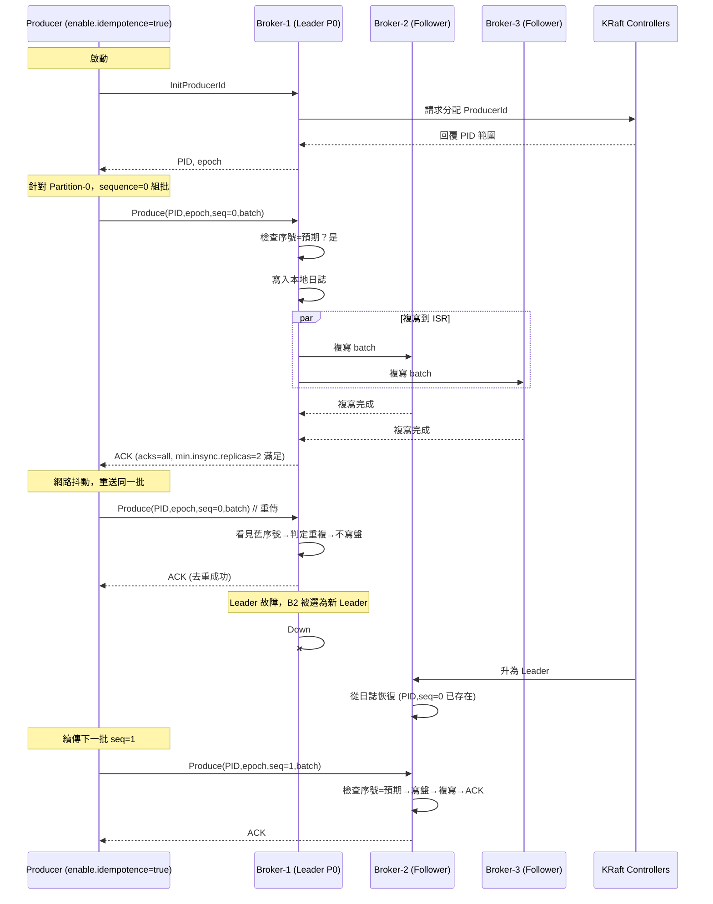
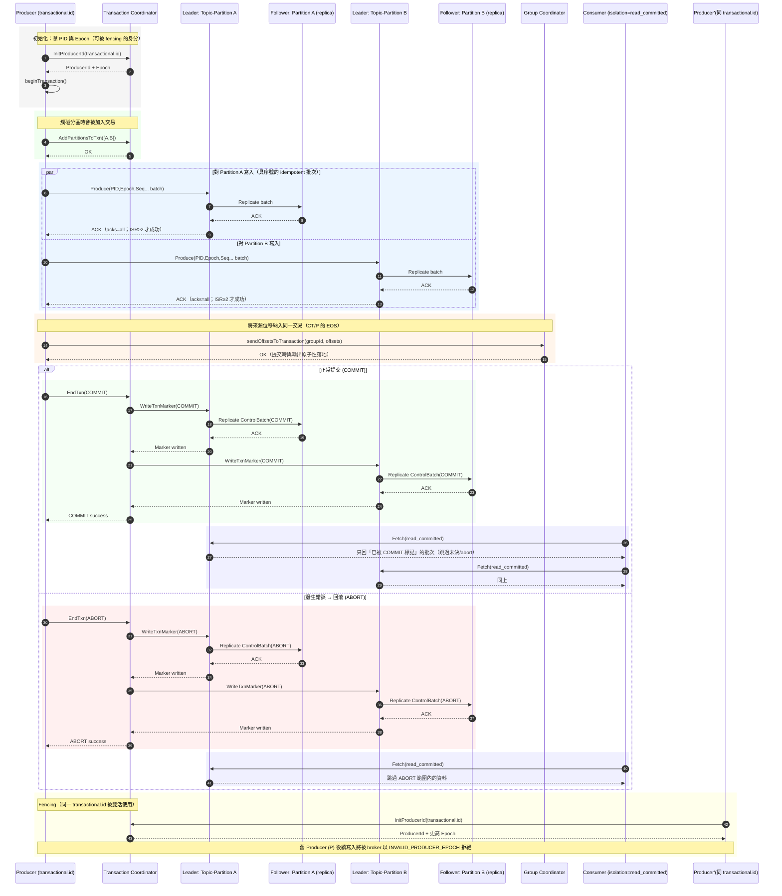

---
tags:
  - Apache Kafka
---

# Exactly Once Semantics in Kafka

- Debezium Kafka Connect Source Connectors --> [KIP-618: Exactly-Once Support for Source Connectors](https://cwiki.apache.org/confluence/display/KAFKA/KIP-618%3A+Exactly-Once+Support+for+Source+Connectors) --> [KIP-98: Exactly Once Delivery and Transactional Messaging](https://cwiki.apache.org/confluence/display/KAFKA/KIP-98+-+Exactly+Once+Delivery+and+Transactional+Messaging)
- Icerberg Kafka Connect Sink Connectors --> [KIP-447: Producer scalability for exactly once semantics](https://cwiki.apache.org/confluence/display/KAFKA/KIP-447%3A+Producer+scalability+for+exactly+once+semantics)

{width="500"}

## Idempotent Producers

## Transactional Producers

## Exactly-Once Support for Source Connectors

## References

- [Towards Debezium exactly-once delivery | Debezium Blog](https://debezium.io/blog/2023/06/22/towards-exactly-once-delivery/)
- [Exactly once delivery | Debezium Docs](https://debezium.io/documentation//reference/3.3/configuration/eos.html)