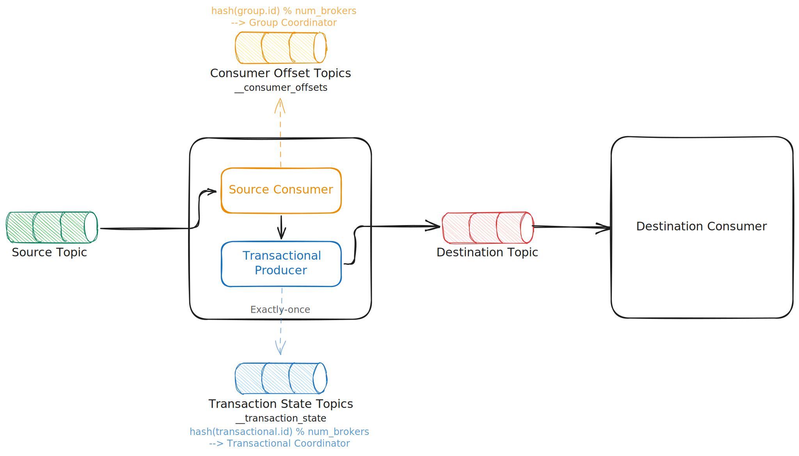
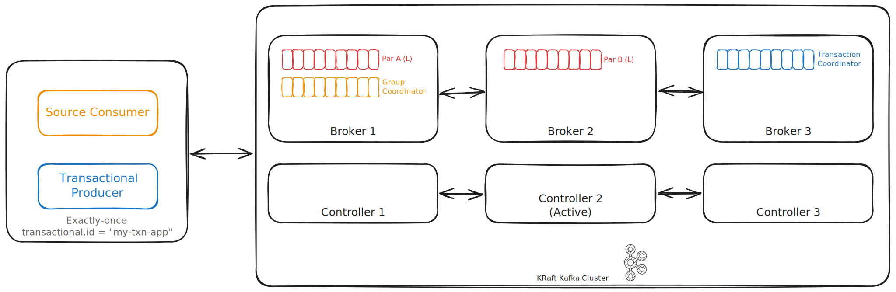

---
tags:
  - Apache Kafka
  - Apache Iceberg
---

# Exactly Once Semantics in Kafka

## Idempotent Producers

### Configuration

- **KRaft** cluster with **3** brokers and **3** controllers, eliminating ZooKeeper dependency
- Replication factor of **3**, ensuring each partition maintains three replicas for fault tolerance
- Minimum In-Sync Replicas (ISR) set to **2**, requiring at least two replicas to acknowledge writes
- Acknowledgment level of `acks=all`, guaranteeing that producers wait for all in-sync replicas
- Destination topic configured with 2 partitions (A, B) for parallel processing
    - Partition A leadership: Broker 1
    - Partition B leadership: Broker 2
- Idempotent producers enabled (`enable.idempotence=true`)

### Key Flow Steps

1. `Producer 1` initializes and gets PID
2. `Producer 1` sends first batch to `Partition A`
3. Network jitter, it causes `Producer 1` to resend the same batch to `Partition A`
4. `Broker 1` fails, triggering leader election for `Partition A`
5. `Producer 1` sends second batch to new `Partition A` leader
6. `Producer 2` initializes with different PID
7. `Producer 1` sends first batch to `Partition B` (no fencing conflict)

## Transactional Producers

Building upon the foundation of idempotent producers, Kafka's transactional producers provide the ultimate guarantee for exactly-once semantics by enabling atomic writes across multiple partitions. This advanced capability transforms Kafka from a reliable message broker into a distributed transaction system, ensuring that either all messages in a transaction are committed together, or none at all.

To understand the inner workings of Transactional producers, I recommend the following video, which provides a clear and accessible explanation of how Transactional producers operate and their underlying processes.

<iframe width="560" height="315" src="https://www.youtube.com/embed/Ki2D2o9aVl8?si=1hY1waYsw26zV4ft" title="YouTube video player" frameborder="0" allow="accelerometer; autoplay; clipboard-write; encrypted-media; gyroscope; picture-in-picture; web-share" referrerpolicy="strict-origin-when-cross-origin" allowfullscreen></iframe>
/// caption
Apache Kafka(r) Transactions: Message Delivery and Exactly-Once Semantics (2022)
///

After watching the video, you can also refer to the examples and explanations in this article. Having two different sources explaining the same concept will help deepen your understanding.

Next, we will explain this concept using the following simplified example. This example includes the following key components:

- **Source Topic**: the origin of messages to be processed
- **Data Processing Application**: the core component that consumes, processes, and produces messages atomically
    - **Source Consumer**: reads messages from the source topic
    - **Transactional Producer**: produces messages to the destination topic within a transaction
- **Destination Topic**: the target topic for processed messages
- **Destination Consumer**: reads messages from the destination topic with `read-committed` isolation level

/// caption
Transactional Producer Example
///

Before diving into how this example works in practice, let's first examine the two important roles behind Transactional Producers: the *Group Coordinator* and *Transaction Coordinator*.

Both *Transaction Coordinators* and *Group Coordinators* operate as specialized roles **within existing Kafka brokers** rather than as separate service processes, ensuring efficient resource utilization and simplified deployment. These coordinators rely on **internal topics** to maintain their state and coordinate operations across the cluster.

### Group Coordinator

The **Group Coordinator** manages all aspects of consumer group operations through **the `__consumer_offsets` internal topic**. This compacted topic serves as the persistent storage for consumer group offset information, enabling position tracking across the entire cluster. **Consumer groups periodically commit their reading position (offset) for each partition to this topic**, creating a durable record that enables consumers to **resume from the correct position after restarts or rebalancing scenarios**.

**The `__consumer_offsets` topic is partitioned using the consumer group ID as the partition key, calculated through `hash(group.id)`**. This partitioning strategy ensures that all offset information for a specific consumer group is consistently stored within the same partition, providing locality and consistency for group-related operations. For example, a consumer group with ID "analytics-group" would always map to the same partition regardless of cluster topology changes.

**The Group Coordinator responsibility is automatically assigned to the broker that serves as the leader for the corresponding `__consumer_offsets` partition**. This design eliminates the need for separate coordination infrastructure while ensuring that each group has a single authoritative coordinator. The coordinator is responsible for:

- managing consumer group membership through join and leave operations
- orchestrating partition assignment across group members
- handling offset commit and fetch operations
- coordinating the complex rebalancing process when group membership changes or partition assignments need redistribution

### Transaction Coordinator

The **Transaction Coordinator** orchestrates transactional operations through **the `__transaction_state` internal topic**, which serves as the cornerstone for Kafka's exactly-once semantics. This topic maintains comprehensive transaction metadata including transaction state, associated producers, and all involved partitions. The coordinator records critical commit and abort decisions in this topic, enabling atomic writes across multiple partitions and ensuring that transactions are either fully completed or completely rolled back.

**The `__transaction_state` topic uses the transactional ID as its partition key, implementing a `hash(transactional.id)` partitioning scheme.** This approach ensures that all transaction state for a specific transactional producer is consistently managed by the same partition and coordinator. For instance, a transactional producer with ID "order-processor" would always be managed by the same Transaction Coordinator, providing consistency and enabling proper producer fencing mechanisms.

Similar to Group Coordinators, **the Transaction Coordinator role is automatically assigned to the broker that leads the corresponding `__transaction_state` partition**. This coordinator is responsible for:

- managing transactional producer state including Producer ID (PID) and epoch tracking
- maintaining detailed records of transaction operations throughout their lifecycle
- generating control batches that mark transaction boundaries in partition logs
- orchestrating the sophisticated two-phase commit protocol across multiple partitions to ensure atomicity

### Core Transaction APIs

Now that we understand the two critical roles operating behind the scenes on brokers in the transaction mechanism, let's shift our focus to producers. Transactional Producers introduce a sophisticated API that orchestrates the entire transaction lifecycle through essential operations:

- `initTransactions()`: Registers the producer with the transaction coordinator
- `beginTransaction()`: Marks the start of a new transaction
- `send()`: Publishes messages within the transaction context
- `sendOffsetsToTransaction()`: Includes consumer offsets in the transaction
- `commitTransaction()`: Atomically commits all transaction operations
- `abortTransaction()`: Cancels the transaction and discards all changes

### Configuration

{width="600"}
/// caption
Transactional Producer Example
///

Our demonstration environment showcases a robust, production-ready setup that highlights the distributed nature of transactional processing:

- **KRaft** cluster with **3** brokers and **3** controllers, eliminating ZooKeeper dependency
- Replication factor of **3**, ensuring each partition maintains three replicas for fault tolerance
- Minimum In-Sync Replicas (ISR) set to **2**, requiring at least two replicas to acknowledge writes
- Acknowledgment level of `acks=all`, guaranteeing that producers wait for all in-sync replicas
- Destination topic configured with 2 partitions (A, B) for parallel processing
    - Partition A leadership: `Broker 1`{ .red }
    - Partition B leadership: `Broker 2`{ .red }
- Group Coordinator: `Broker 1`{ .orange }
- Transaction Coordinator: `Broker 3`{ .blue }
- Transactional identity: `transactional.id = my-txn-app`

{width="600"}
/// caption
Kafka Cluster Breakdown
///

### Key Flow Steps

The following sequence diagrams illustrate the complete transaction lifecycle, including normal operations, error scenarios, and producer fencing mechanisms.

1. **Initialization Phase**: Producer configures `transactional.id` and calls `initTransactions()` to register with Transaction Coordinator, receiving PID and epoch
2. **Transaction Boundary**: Producer calls `beginTransaction()` to mark the start of atomic operation scope
3. **Partition Registration**: First `send()` to each partition triggers `AddPartitionsToTxn()` request to register partition in transaction state
4. **Message Production**: Non-blocking `send()` operations write batches to multiple partitions with sequence numbers for idempotence
5. **Offset Integration**: `sendOffsetsToTransaction()` includes consumer group offsets in the transaction for exactly-once consumption
6. **Two-Phase Commit**: 
    - **Prepare Phase**: Producer calls `commitTransaction()` or `abortTransaction()` to initiate coordinator-driven 2PC
    - **Commit Phase**: Coordinator sends `WriteTxnMarker()` to all registered partitions in parallel to write control batches
7. **Consumer Isolation**: Read-committed consumers only see data from successfully committed transactions
8. **Producer Fencing**: New producer with same `transactional.id` gets incremented epoch, invalidating previous producer instances

### Advanced Topics

Kafka's transaction mechanism internally implements the Two-Phase Commit (2PC) protocol, a technique commonly used in distributed systems to ensure data consistency across multiple nodes. The following video provides an in-depth explanation of the two-phase commit concept and how it operates:

<iframe width="560" height="315" src="https://www.youtube.com/embed/-_rdWB9hN1c?si=8A_pZvPZ5IrogW1u" title="YouTube video player" frameborder="0" allow="accelerometer; autoplay; clipboard-write; encrypted-media; gyroscope; picture-in-picture; web-share" referrerpolicy="strict-origin-when-cross-origin" allowfullscreen></iframe>
/// caption
Distributed Systems 7.1: Two-phase commit
///

To understand the historical evolution of Kafka's transaction mechanism, you can refer to the following videos and KIPs list. These resources provide a comprehensive explanation of the journey from the initial design to subsequent improvements and optimizations.

<iframe width="560" height="315" src="https://www.youtube.com/embed/OiOdjmW3We8?si=-EkfJBj1WFPK3pRE" title="YouTube video player" frameborder="0" allow="accelerometer; autoplay; clipboard-write; encrypted-media; gyroscope; picture-in-picture; web-share" referrerpolicy="strict-origin-when-cross-origin" allowfullscreen></iframe>
/// caption
Transactions in Action: the Story of Exactly Once in Apache Kafka (2023)
///

??? info "EOS KIPs"

    - [KIP-98: Exactly Once Delivery and Transactional Messaging](https://cwiki.apache.org/confluence/display/KAFKA/KIP-98+-+Exactly+Once+Delivery+and+Transactional+Messaging)
    - [KIP-185: Make exactly once in order delivery per partition the default Producer setting](https://cwiki.apache.org/confluence/display/KAFKA/KIP-185:+Make+exactly+once+in+order+delivery+per+partition+the+default+Producer+setting)
    - [KIP-360: Improve reliability of idempotent/transactional producer](https://cwiki.apache.org/confluence/pages/viewpage.action?pageId=89068820)
    - [KIP-447: Producer scalability for exactly once semantics](https://cwiki.apache.org/confluence/pages/viewpage.action?pageId=103093950)
    - [KIP-484: Expose metrics for group and transaction metadata loading duration](https://cwiki.apache.org/confluence/display/KAFKA/KIP-484:+Expose+metrics+for+group+and+transaction+metadata+loading+duration)
    - [KIP-618: Exactly-Once Support for Source Connectors](https://cwiki.apache.org/confluence/display/KAFKA/KIP-618:+Exactly-Once+Support+for+Source+Connectors)
    - [KIP-691: Enhance Transactional Producer Exception Handling](https://cwiki.apache.org/confluence/display/KAFKA/KIP-691:+Enhance+Transactional+Producer+Exception+Handling)
    - [KIP-679: Producer will enable the strongest delivery guarantee by default](https://cwiki.apache.org/confluence/display/KAFKA/KIP-679:+Producer+will+enable+the+strongest+delivery+guarantee+by+default)
    - [KIP-854: Separate configuration for producer ID expiry](https://cwiki.apache.org/confluence/display/KAFKA/KIP-854+Separate+configuration+for+producer+ID+expiry)
    - [KIP-890: Transactions Server-Side Defense](https://cwiki.apache.org/confluence/display/KAFKA/KIP-890:+Transactions+Server-Side+Defense)
        - eliminates hanging transactions on ALL clients
        - includes new client changes to strengthen EOS
    - [KIP-936: Throttle number of active PIDs](https://cwiki.apache.org/confluence/display/KAFKA/KIP-936:+Throttle+number+of+active+PIDs)
    - [KIP-939: Support Participation in 2PC](https://cwiki.apache.org/confluence/display/KAFKA/KIP-939:+Support+Participation+in+2PC)

## Icerberg Kafka Connect Sink Connector

> [*The sink relies on KIP-447 for exactly-once semantics. This requires Kafka 2.5 or later.*](https://iceberg.apache.org/docs/latest/kafka-connect/#requirements)

In order to understand how Iceberg Kafka Connect Sink Connector achieve exactly-once semantics, we need to first look at KIP-447.

### [KIP-447: Producer scalability for exactly once semantics](https://cwiki.apache.org/confluence/display/KAFKA/KIP-447%3A+Producer+scalability+for+exactly+once+semantics)

After knowing the above, we can now look at how Iceberg Kafka Connect Sink Connectors achieve exactly-once semantics.

### Core Architectural Components

Let's see how it works

{width="500"}

## FAQs

??? info "Why PID Ranges Instead of Individual IDs?"

    The evolution from individual Producer ID allocation to range-based distribution represents a crucial scalability optimization introduced in [KIP-730: Producer ID generation in KRaft mode](https://cwiki.apache.org/confluence/display/KAFKA/KIP-730%3A+Producer+ID+generation+in+KRaft+mode).

    **The Bottleneck Problem:**

    If every new producer required a separate request to the controller for a unique ID, the controller would become a severe bottleneck, especially in high-throughput environments with frequent producer initialization.

    **The Range-Based Solution:**
    
    Kafka's modern approach distributes the allocation burden:

    - Controllers allocate **continuous ranges** rather than individual IDs
    - Example: Broker-1 receives range [1000, 1999] containing 1000 available IDs
    - Each broker's local `ProducerIdManager` can allocate IDs within its assigned range
    - New ranges are requested only when the current range is exhausted

    **Benefits of Range-Based Allocation:**

    - Dramatically reduces controller load (no per-producer coordination required)
    - Distributes allocation pressure across all brokers
    - Maintains PID uniqueness through non-overlapping ranges
    - Enables horizontal scaling of producer initialization

## References

- [PROTOCOL API KEYS](https://kafka.apache.org/protocol#protocol_api_keys)
    - FindCoordinator
    - InitProducerId
    - AddPartitionsToTxn
    - Produce
    - AddOffsetsToTxn
    - TxnOffsetCommit
    - EndTxn
    - WriteTxnMarker
- [Towards Debezium exactly-once delivery | Debezium Blog](https://debezium.io/blog/2023/06/22/towards-exactly-once-delivery/)
- [Exactly once delivery | Debezium Docs](https://debezium.io/documentation//reference/3.3/configuration/eos.html)
- [Transactions in Apache Kafka | Confluent Blog](https://www.confluent.io/blog/transactions-apache-kafka/)
- [Exactly-once semantics with Kafka transactions | Strimzi](https://strimzi.io/blog/2023/05/03/kafka-transactions/)