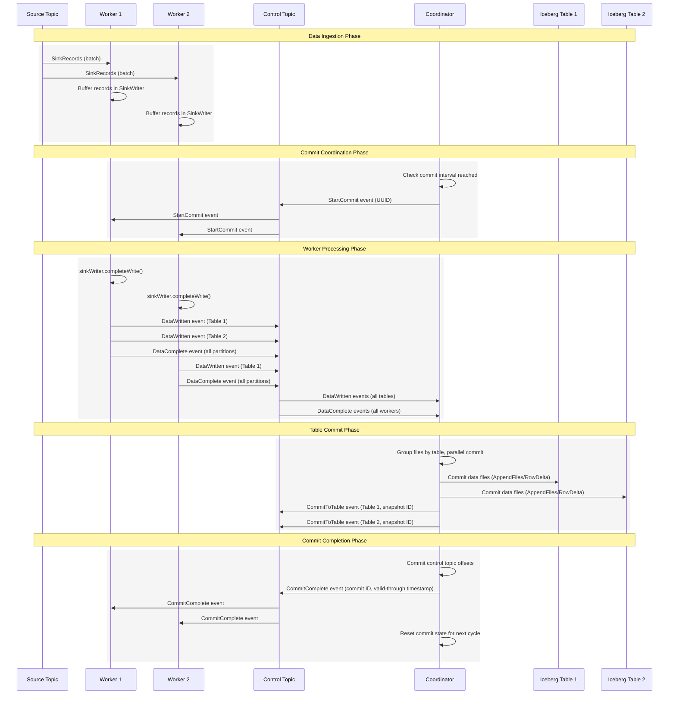

---
tags:
  - Apache Kafka
  - Apache Iceberg
---
# Deep Dive into Kafka Connect Icerberg Sink Connector

Apache Iceberg provides a [Kafka Connect Sink Connector](https://iceberg.apache.org/docs/latest/kafka-connect/) that writes data from Kafka topics into Iceberg tables. This connector supports **Exactly-Once Semantics (EOS)**, ensuring that each message is written to the target Iceberg table exactly once, preventing data duplication.

> [*The sink relies on KIP-447 for exactly-once semantics. This requires Kafka 2.5 or later.*](https://iceberg.apache.org/docs/latest/kafka-connect/#requirements)

The Iceberg Kafka Connect Sink Connector documentation explicitly states that this connector relies on KIP-447. In order to understand how it achieves exactly-once semantics, we need to first examine KIP-447.

## [KIP-447: Producer scalability for exactly once semantics](https://cwiki.apache.org/confluence/display/KAFKA/KIP-447%3A+Producer+scalability+for+exactly+once+semantics)

Prior to KIP-447, the Transaction Coordinator was unaware that consumer group partition assignments could change dynamically through rebalancing. This resulted in an expectation that each transactional producer would be bound to a single source topic partition. Consequently, each source topic partition required its own dedicated producer instance with separate threads, caches, and network connections. This approach not only consumed excessive resources but also negatively impacted output batching efficiency, leading to poor overall scalability.

KIP-447 aims to enable **a single Transactional Producer to handle multiple source topic partitions simultaneously**. The solution involves **allowing the Transaction Coordinator to track consumer metadata**, enabling it to determine whether zombie producers should be fenced, whether a producer can take over certain source partitions, and make reasonable decisions when partition assignments change. This eliminates the need for a static assignment architecture. A single producer instance can now handle offset commits for multiple source partitions and writes to multiple destination partitions, **significantly reducing resource consumption while improving output throughput, scalability, efficiency, and resource utilization**.

After knowing the above, we can now look at how Iceberg Kafka Connect Sink Connector achieve exactly-once semantics.

## Architecture Overview

<iframe width="560" height="315" src="https://www.youtube.com/embed/5ywgsh2Wzm4?si=Vdm-g44ME-uSASvI" title="YouTube video player" frameborder="0" allow="accelerometer; autoplay; clipboard-write; encrypted-media; gyroscope; picture-in-picture; web-share" referrerpolicy="strict-origin-when-cross-origin" allowfullscreen></iframe>
/// caption
Kafka Connect Iceberg Sink | Iceberg Summit 2024
///

{width="500"}
/// caption
[Intro to the Iceberg Kafka Connect sink](https://www.tabular.io/blog/intro-kafka-connect/) (2023)
///

Let's see how it works

### Coordinator

The [Coordinator](https://github.com/apache/iceberg/blob/main/kafka-connect/kafka-connect/src/main/java/org/apache/iceberg/connect/channel/Coordinator.java) is the central command center that orchestrates commit operations across all distributed worker tasks in the Iceberg Kafka Connect Sink system. It acts like a conductor directing when and how data should be committed to Iceberg tables.

The Coordinator's primary responsibilities include:

- initiating commit cycles by broadcasting `StartCommit` events
- collecting `DataWritten` and `DataComplete` responses from all Workers
- executing the actual Iceberg table commits
- managing offset tracking to ensure exactly-once semantics

It maintains [global commit state](https://github.com/apache/iceberg/blob/main/kafka-connect/kafka-connect/src/main/java/org/apache/iceberg/connect/channel/CommitState.java) and coordinates the timing of all distributed operations.

The Coordinator runs **co-located with one of the Worker nodes** and **contains no data processing logic**. It performs only three coordination tasks: checking commit intervals, listening for coordination events, and monitoring timeouts.

### Workers

[Workers](https://github.com/apache/iceberg/blob/main/kafka-connect/kafka-connect/src/main/java/org/apache/iceberg/connect/channel/Worker.java) are the distributed data processing engines that handle the actual ingestion of Kafka records and transform them into Iceberg-compatible data files. Each Worker operates independently on its assigned topic partitions while coordinating with the central Coordinator.

Workers' main responsibilities include

- consuming and buffering Kafka records through their [`SinkWriter`](https://github.com/apache/iceberg/blob/main/kafka-connect/kafka-connect/src/main/java/org/apache/iceberg/connect/data/SinkWriter.java) component
- listening for `StartCommit` signals from the Coordinator
- completing write operations when instructed
- reporting back with `DataWritten` and `DataComplete` events.

They bridge Kafka's streaming model with Iceberg's batch-oriented storage format.

Workers use a composition pattern with [`SinkWriter`](https://github.com/apache/iceberg/blob/main/kafka-connect/kafka-connect/src/main/java/org/apache/iceberg/connect/data/SinkWriter.java) components, where the [`SinkWriter`](https://github.com/apache/iceberg/blob/main/kafka-connect/kafka-connect/src/main/java/org/apache/iceberg/connect/data/SinkWriter.java) handles pure data processing (record routing, file writing, offset tracking) while the Worker manages coordination aspects (control topic communication, event handling). Each Worker can handle multiple topic partitions simultaneously, enabling horizontal scalability.

### Control Topic

The Control Topic is the communication backbone that enables coordination between the Coordinator and all Workers in the distributed system. It functions as a **dedicated Kafka topic** that carries all coordination events and ensures reliable message delivery between components.

The Control Topic's responsibilities include

- carrying five types of coordination events (`StartCommit`, `DataWritten`, `DataComplete`, `CommitToTable`, `CommitComplete`)
- maintaining event ordering through Producer ID-based partitioning
- providing persistent audit trails for system recovery.

It implements a **broadcast pattern** where all participants listen to the same topic but process only relevant events. It also employs a Producer ID-based partitioning strategy. This partitioning strategy ensures that **events from the same component** (Coordinator or Worker) **are assigned to the same partition, maintaining event ordering**. For the coordination process, this ordering guarantee is crucial as it ensures that events sent by each component won't become out of order due to network delays or partition reassignments.

The topic uses different consumer group strategies - **persistent groups for the Coordinator** and **transient UUID-based groups for Workers**. All interactions use Kafka's **transactional operations** to maintain exactly-once semantics, with Avro serialization ensuring cross-version compatibility and efficient transmission.

## How Commit Coordination Works

### Launching

System initialization begins by performing **leadership election**, checking if the current worker has the first topic partition (lexicographically ordered). If elected leader, it creates a Coordinator instance that runs in a **dedicated thread** with no direct interaction with the co-located Worker on the same node. Worker initialization happens lazily during the first `save()` call, creating a [`SinkWriter`](https://github.com/apache/iceberg/blob/main/kafka-connect/kafka-connect/src/main/java/org/apache/iceberg/connect/data/SinkWriter.java) for data writing and instantiating a Worker instance.

The Coordinator and Worker establish their communication infrastructure by connecting to the control topic for coordination messages, setting up transactional producers with specific transaction IDs for exactly-once semantics, subscribing to the control topic with appropriate consumer groups, and performing an initial poll to initialize consumer group coordination.

### Before Commit

The Coordinator maintains commit state by tracking elapsed time since the last commit and monitoring whether the configured commit interval has been reached. It buffers incoming responses, storing data file information from workers and completion signals indicating workers have finished processing their assigned partitions.

The Coordinator runs continuously in its dedicated thread, checking if the commit interval is reached and generating a new UUID to send `StartCommit` events when ready. It **polls the control topic every second** to receive worker responses and monitors for commit timeouts that would trigger partial commits.

Workers accumulate records in their [`SinkWriter`](https://github.com/apache/iceberg/blob/main/kafka-connect/kafka-connect/src/main/java/org/apache/iceberg/connect/data/SinkWriter.java) during this phase without immediate processing.

### Committing

**The commit phase begins when the Coordinator broadcasts a `StartCommit` event to the control topic with a new commit UUID**. Each Worker handles this by calling their [`SinkWriter`](https://github.com/apache/iceberg/blob/main/kafka-connect/kafka-connect/src/main/java/org/apache/iceberg/connect/data/SinkWriter.java) to finalize accumulated data, creating partition offset assignments for all assigned partitions (including empty ones), and sending `DataWritten` events (one per table) containing data/delete files plus a single `DataComplete` event with all partition assignments.

The Coordinator processes incoming worker responses by collecting data file information and completion signals. **When all expected partitions have responded, it triggers the actual commit process which groups data files by table and executes parallel table commits across multiple threads**.

For each table, the Coordinator loads the table from the catalog, filters files based on previously committed offsets to avoid duplicates, deduplicates files by location, and chooses between **append-only operations** (for data-only scenarios) or **row delta operations** (when both data and delete files are present). It sets crucial snapshot properties including commit ID, control topic offsets in JSON format, and valid-through timestamp. All operations use **transactional guarantees, sending records and committing offsets atomically**.

After each table commit succeeds, the Coordinator sends a `CommitToTable` event containing the commit ID, table reference, snapshot ID of the newly created snapshot, and valid-through timestamp. This event serves as a notification that the specific table has been successfully committed with its new snapshot.

### After Commit

Upon successful table commits, the Coordinator commits its control topic offsets, clears the accumulated commit state, and sends a `CommitComplete` event with the commit ID and valid-through timestamp. This notification informs all participants that the commit cycle completed successfully.

The Coordinator performs state reset by clearing completion signals, resetting the current commit ID, and preparing for the next commit cycle. The system includes robust error handling where the Coordinator catches all exceptions during commits, logs warnings, and continues to the next cycle while always ensuring state cleanup. **For timeout scenarios, partial commits are executed** with a null valid-through timestamp to indicate degraded consistency guarantees while maintaining system operation.

## Writing Data Behind the Scenes

The data writing journey begins when Workers receive batches of Kafka Connect `SinkRecords` from their assigned topic partitions. Each Worker immediately forwards these records to its [`SinkWriter`](https://github.com/apache/iceberg/blob/main/kafka-connect/kafka-connect/src/main/java/org/apache/iceberg/connect/data/SinkWriter.java) component, which serves as the main orchestrator for transforming streaming Kafka data into Iceberg table files. **The [`SinkWriter`](https://github.com/apache/iceberg/blob/main/kafka-connect/kafka-connect/src/main/java/org/apache/iceberg/connect/data/SinkWriter.java) maintains a map of table names to [`RecordWriter`](https://github.com/apache/iceberg/blob/main/kafka-connect/kafka-connect/src/main/java/org/apache/iceberg/connect/data/RecordWriter.java) instances and tracks source offsets for position management**, setting up the foundation for the sophisticated data processing pipeline that follows.

### Multi-Table Routing

Upon receiving records, the [`SinkWriter`](https://github.com/apache/iceberg/blob/main/kafka-connect/kafka-connect/src/main/java/org/apache/iceberg/connect/data/SinkWriter.java) first determines which Iceberg tables should receive each record through its routing mechanism. The system supports both static and dynamic routing strategies to handle diverse data flow requirements.

**Static routing** operates through the `routeRecordStatically()` method, which has two modes: when no route field is configured, it distributes each record to all configured tables in the connector settings. When a route field is specified, the system extracts the field value from each record and applies regex pattern matching against each configured table's regex pattern. Only tables whose patterns successfully match the route field value receive the record, enabling content-based selective routing.

**Dynamic routing** uses the `routeRecordDynamically()` method, which extracts the route field value from each record and converts it to lowercase to use directly as the table name. This approach enables the system to create and write to tables dynamically based on actual data content, supporting use cases like multi-tenant applications where table names are determined by tenant identifiers embedded in the data.

### Auto-Table Creation

When dynamic routing identifies a table that doesn't exist, or when static routing encounters missing tables with auto-creation enabled, the `IcebergWriterFactory` automatically creates the necessary Iceberg infrastructure through its `createWriter()` method. The factory first attempts to load the table from the catalog, and if it fails with a `NoSuchTableException`, it proceeds with auto-creation.

The auto-creation process involves **inferring the appropriate schema from sample records** using type inference algorithms, **creating partition specifications** based on connector configuration, and **establishing namespaces** if they don't already exist.

The factory handles race conditions gracefully through **retry logic with exponential backoff**, ensuring that multiple workers can operate concurrently without conflicts when attempting to create the same tables simultaneously. When a table cannot be found and auto-creation is disabled, the factory returns a `NoOpWriter` that silently discards records, allowing the system to continue operating without interruption.

### Type Conversion and Schema Evolution

As records flow to their designated tables, the `RecordConverter` performs comprehensive type mapping from Kafka Connect types to Iceberg types, handling primitives, complex nested structures like structs and maps, temporal data types, and specialized types such as UUIDs and decimals.

**Schema evolution** is implemented in the `IcebergWriter.convertToRow()` method through a sophisticated monitoring system. When schema evolution is enabled, the system uses a `SchemaUpdate.Consumer` to track changes during record conversion. If the consumer detects changes (when `updates.empty()` returns false), the writer immediately flushes the current file via the `flush()` method, applies schema updates using `SchemaUtils.applySchemaUpdates()`, reinitializes the writer with the new schema through `initNewWriter()`, and reconverts the record using the updated schema. This ensures that schema changes are applied atomically without corrupting existing files, while maintaining backward compatibility and data integrity throughout the evolution process.

### Multi-Table Writing

The system achieves multi-table writing through **the [`SinkWriter`](https://github.com/apache/iceberg/blob/main/kafka-connect/kafka-connect/src/main/java/org/apache/iceberg/connect/data/SinkWriter.java)'s coordination of multiple [`RecordWriter`](https://github.com/apache/iceberg/blob/main/kafka-connect/kafka-connect/src/main/java/org/apache/iceberg/connect/data/RecordWriter.java) instances**. Each table receives its own dedicated writer instance, either an [`IcebergWriter`](https://github.com/apache/iceberg/blob/main/kafka-connect/kafka-connect/src/main/java/org/apache/iceberg/connect/data/IcebergWriter.java) for valid tables or a `NoOpWriter` for missing tables when auto-creation is disabled. The [`SinkWriter`](https://github.com/apache/iceberg/blob/main/kafka-connect/kafka-connect/src/main/java/org/apache/iceberg/connect/data/SinkWriter.java) maintains a map of table names to [`RecordWriter`](https://github.com/apache/iceberg/blob/main/kafka-connect/kafka-connect/src/main/java/org/apache/iceberg/connect/data/RecordWriter.java) instances, allowing it to route each record to the appropriate writers based on the routing logic.

When processing records, the system **creates separate `IcebergWriterResult` objects for each table**, containing metadata about the data files, delete files, and partition information specific to that table. This design enables true multi-table parallelism, where different tables can have different schemas, partition strategies, and file formats while sharing the same data stream.

### Partitioned Writing

The writing process adapts to both partitioned and unpartitioned table configurations. For partitioned tables, the `PartitionedAppendWriter` determines the appropriate partition key for each record and routes it to the correct partition-specific writer, supporting various partition transforms including temporal partitioning by year, month, day, or hour, as well as bucket and truncate transforms for hash-based and range-based partitioning. Each partition maintains its own writer instance, allowing for efficient parallel writing while ensuring that records land in their correct partition locations within the table structure.

### File Completion and Result Collection

When the commit cycle begins and `completeWrite()` is called, the [`SinkWriter`](https://github.com/apache/iceberg/blob/main/kafka-connect/kafka-connect/src/main/java/org/apache/iceberg/connect/data/SinkWriter.java) coordinates the finalization of all accumulated data. It calls `complete()` on all active writers to flush remaining data to storage, collects metadata from all generated data files and delete files, captures the final Kafka offset positions for each processed partition, and returns a comprehensive `SinkWriterResult` containing both the file metadata and offset tracking information. This completes the transformation from streaming Kafka records to batch-oriented Iceberg files, with all the necessary metadata prepared for the distributed commit coordination process that follows.

**The `SinkWriterResult` serves as the bridge between data writing and coordination, containing a list of `IcebergWriterResult` objects (one per table) and a map of source offsets for each processed topic partition.** Each `IcebergWriterResult` includes the table identifier, lists of data files and delete files generated during writing, and the partition type specification from the target table.

**`DataWritten` and `DataComplete` Event Generation**: When the Worker receives a `StartCommit` event, it triggers `sinkWriter.completeWrite()` and then generates coordination events from the results. For each `IcebergWriterResult` in the `SinkWriterResult`, the Worker sends a separate `DataWritten` event containing the commit ID, table reference, and file metadata (data files and delete files). After sending all table-specific `DataWritten` events, the Worker sends a single `DataComplete` event that includes the commit ID and `TopicPartitionOffset` assignments for all assigned partitions, signaling to the Coordinator that this Worker has finished processing all its data for the current commit cycle.