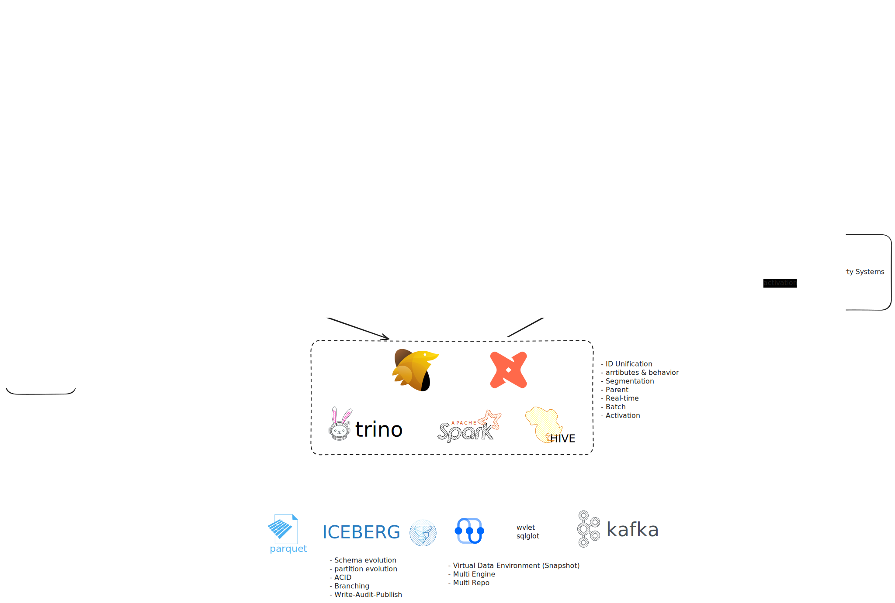

# Treasure Data

[Treasure Data | NotebookLM](https://notebooklm.google.com/notebook/2bdc1ccd-6c59-4675-ac74-6a8ecda93643)

## Metrics

In 2023, Treasure Data currently serves over **700 accounts** and **more than 6,000 users**. Since 2022, platform usage has doubled. Each day, the system handles **2.5 million+ Trino queries** and over **100,000 Hive queries**. It processes more than **200 trillion rows daily** and **performs over 10 billion S3 GET requests per day to read partition data from AWS S3**.

## Overview

<figure markdown="span">
  {width="600"}
  [*How Treasure Data reduced ad spend and increased marketing ROI by 20%*](https://www.treasuredata.com/customers/treasure-data/)
</figure>

<figure markdown="span">
  
  [*Treasure Data Enterprise Customer Data Platform | Demo*](https://www.youtube.com/watch?v=B_UPLEtM2SE)
</figure>

## Tech Stack

- [Wvlet](https://github.com/wvlet/wvlet), similar to BigQuery's [pipe query syntax](https://cloud.google.com/bigquery/docs/pipe-syntax-guide)
- Trino
- Hive 4 ([Hive 4.0.x comes with Iceberg 1.4.3 included.](https://iceberg.apache.org/docs/latest/hive/#feature-support))
- Plazma (Closed Source)
    - PostgreSQL (metadata)
    - S3
        - Real-time Storage
        - Archive Storage
- [fluentd](https://github.com/fluent/fluentd)
- [embulk](https://github.com/embulk/embulk): [Data Connector and Result Export](https://api-docs.treasuredata.com/blog/embulk-in-td/)

<figure markdown="span">
  
  [LinkedIn Post](https://www.linkedin.com/posts/toby-mao_sqlglot-python-oss-activity-7340421595162734594-ox1J)
</figure>

## Data Architecture

<figure markdown="span">
  
  Data Architecture 2021 (Source: [*Secure exchange SQL - Treasure Data at Trino Summit 2023*](https://www.youtube.com/watch?v=FaytoXxKXOQ))
</figure>

<figure markdown="span">
  
  Data Architecture 2023 (Source: [*Secure exchange SQL - Treasure Data at Trino Summit 2023*](https://www.youtube.com/watch?v=FaytoXxKXOQ))
</figure>

<figure markdown="span">
  
  Pros and Cons (Source: [*What is Treasure Data CDP?*](https://hightouch.com/blog/what-is-treasure-data-cdp))
</figure>

<figure markdown="span">
  {width="600"}
  [*Zero-Copy Integrations Between Your CDP and Data Warehouse*](https://www.treasuredata.com/product/zero-copy/)
</figure>

## Data Ingestion

- [Google Analytics Data API Import Integration](https://docs.treasuredata.com/articles/#!int/Google-Analytics-Data-API-Import-Integration)

## Questions

- Data Lakehouse Architecture? proprietary ([MPC1](https://api-docs.treasuredata.com/blog/hive-table-scan-optimization/))
- How to deal with dbt Core? ([dbt Fusion](https://www.getdbt.com/blog/new-code-new-license-understanding-the-new-license-for-the-dbt-fusion-engine))
- SQLMesh

https://www.linkedin.com/in/pramodmanjappa/