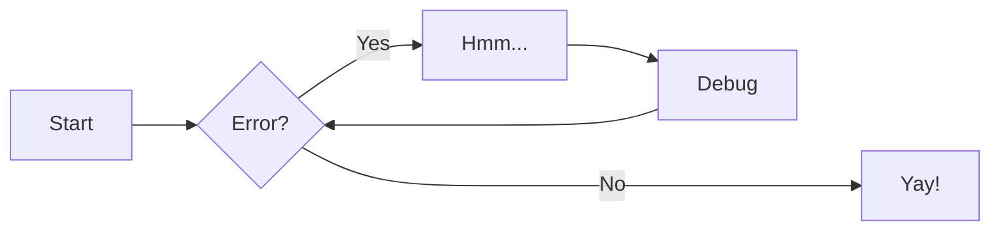
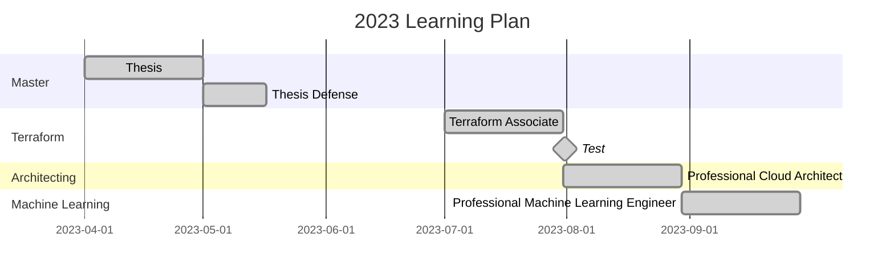

# 2023

[=85% "85%"]{: .candystripe }

!!! success "Goals"
    - [x] Google Cloud - Professional Cloud Architect
    - [x] Google Cloud - Professional Machine Learning Engineer
    - [x] Google Cloud - Professional Data Engineer
    - [x] dbt Certified Analytics Engineer
    - [x] Hashicorp - Terraform Associate
    - [x] Professional Scrum Master I
    - [ ] IELTS: overall band of 7.0 with at least 6.5 for each component.   

## [Preparing for Google Cloud Certification: Cloud Data Engineer Professional Certificate](https://www.coursera.org/professional-certificates/gcp-data-engineering)
- [ ] [Google Cloud Big Data and Machine Learning Fundamentals](https://www.coursera.org/learn/gcp-big-data-ml-fundamentals)
    - Course Certificate
    - Labs
- [x] [Modernizing Data Lakes and Data Warehouses with Google Cloud](https://www.coursera.org/learn/data-lakes-data-warehouses-gcp)
    - [Course Certificate](https://www.coursera.org/account/accomplishments/verify/EZ44YULTP3F3), 2022/03/21
    - Labs
- [ ] [Building Batch Data Pipelines on Google Cloud](https://www.coursera.org/learn/batch-data-pipelines-gcp)
    - Course Certificate
    - Labs
- [ ] [Building Resilient Streaming Analytics Systems on Google Cloud](https://www.coursera.org/learn/streaming-analytics-systems-gcp)
    - Course Certificate
    - Labs
- [ ] [Smart Analytics, Machine Learning, and AI on Google Cloud](https://www.coursera.org/learn/smart-analytics-machine-learning-ai-gcp)
    - Course Certificate
    - Labs
- [ ] [Preparing for the Google Cloud Professional Data Engineer Exam](https://www.coursera.org/learn/preparing-cloud-professional-data-engineer-exam)
    - Course Certificate
    - Labs

## [Preparing for Google Cloud Certification: Machine Learning Engineer Professional Certificate](https://www.coursera.org/professional-certificates/preparing-for-google-cloud-machine-learning-engineer-professional-certificate)
- [x] [Google Cloud Big Data and Machine Learning Fundamentals](https://www.coursera.org/learn/gcp-big-data-ml-fundamentals)
  - [Course Certificate](https://www.coursera.org/account/accomplishments/verify/WS89TZGJJ43A), 2023/08/28
  - Labs
    - Exploring a BigQuery Public Dataset
    - Creating a streaming data pipeline for a Real-Time dashboard with Dataflow
    - Predicting Visitor Purchases Using BigQuery ML
    - Predicting loan risk with AutoML
- [x] [How Google does Machine Learning](https://www.coursera.org/learn/google-machine-learning)
  - [Course Certificate](https://www.coursera.org/account/accomplishments/verify/5XX9B8KVQHWT), 2023/08/28
  - Labs
    - Using an image dataset to train an AutoML model
    - Training an AutoML video classification model
- [x] [Launching into Machine Learning](https://www.coursera.org/learn/launching-machine-learning)
  - [Course Certificate](https://www.coursera.org/account/accomplishments/verify/E4LHP3S882BQ), 2023/09/05
  - Labs
    - Improving data quality
    - Exploratory Data Analysis using Python and BigQuery
    - Introduction to linear regression
    - Training an AutoML classification model (Structured data)
    - Using BigQuery ML to predict penguin weight
    - Using the BigQuery ML hyperparameter tuning to improve model performance
- [ ] [TensorFlow on Google Cloud](https://www.coursera.org/learn/intro-tensorflow)
  - Course Certificate
  - Labs
- [ ] [Feature Engineering](https://www.coursera.org/learn/feature-engineering)
  - Course Certificate
  - Labs
- [x] [Machine Learning in the Enterprise](https://www.coursera.org/learn/art-science-ml)
  - [Course Certificate](https://www.coursera.org/account/accomplishments/verify/TSK9T8E4R47T), 2023/09/16
  - Labs
    - Exploring and Creating an Ecommerce Analytics Pipeline with Cloud Dataprep
    - Vertex AI: Custom Training Job and Prediction Using Managed Datasets
    - Vertex AI: Hyperparameter Tuning
    - Vertex AI Model Monitoring
    - Introduction to Vertex AI Pipelines
    - Running Pipelines on Vertex AI 2.5
- [ ] [Production Machine Learning Systems](https://www.coursera.org/learn/gcp-production-ml-systems)
  - Course Certificate
  - Labs
- [ ] [Machine Learning Operations (MLOps): Getting Started](https://www.coursera.org/learn/mlops-fundamentals)
  - Course Certificate
  - Labs
- [ ] [ML Pipelines on Google Cloud](https://www.coursera.org/learn/ml-pipelines-google-cloud)
  - Course Certificate
  - Labs

## [Preparing for Google Cloud Certification: Cloud Architect Professional Certificate](https://www.coursera.org/account/accomplishments/professional-cert/9DULMYQ7HYVA)
- [x] [Google Cloud Fundamentals: Core Infrastructure](https://www.coursera.org/learn/gcp-fundamentals)
  - [Course Certificate](https://www.coursera.org/account/accomplishments/verify/D6XBEB5JSF26), 2022/03/11
  - Labs
      - Getting Started with Cloud Marketplace
      - Getting Started with Compute Engine
      - Getting Started with Cloud Storage and Cloud SQL
      - Getting Started with Kubenetes Engine
      - Getting Started with App Engine
      - Getting Started with Deployment Manager and Stackdriver
      - Getting Started with BigQuery
- [x] [Essential Google Cloud Infrastructure: Foundation](https://www.coursera.org/learn/gcp-infrastructure-foundation)
  - [Course Certificate](https://www.coursera.org/account/accomplishments/verify/2JAZRLT3FA9S), 2022/03/18
  - Labs
    - Working with the Google Cloud Console and Cloud Shell
    - Infrastructure Preview
    - VPC Networking
    - Implement Private Google Access and Cloud NAT
    - Creating Virtual Machines
    - Working with Virtual Machines
- [x] [Essential Google Cloud Infrastructure: Core Services](https://www.coursera.org/learn/gcp-infrastructure-core-services)
  - [Course Certificate](https://www.coursera.org/account/accomplishments/verify/8XAM9QBRBP39), 2022/03/27
  - Labs
    - Exploring IAM
    - Cloud Storage
    - Implementing Cloud SQL
    - Examining Billing Data with BigQuery
    - Resource Monitoring
    - Error Reporting and Debugging
- [x] [Elastic Google Cloud Infrastructure: Scaling and Automation](https://www.coursera.org/learn/gcp-infrastructure-scaling-automation)
  - [Course Certificate](https://www.coursera.org/account/accomplishments/verify/ZQV5VC8BQG5A), 2022/04/09
  - Labs
    - Configuring Google Cloud HA VPN
    - Configuring an HTTP Load Balancer with Autoscaling
    - Configuring an Internal Load Balancer
    - Automating the Infrastructure of networks using Terraform
- [x] [Reliable Google Cloud Infrastructure: Design and Process](https://www.coursera.org/learn/cloud-infrastructure-design-process)
  - [Course Certificate](https://www.coursera.org/account/accomplishments/verify/P6SG4GV9743S), 2023/08/01
  - Labs
    - Building a DevOps Pipeline (Cloud Source Repositories, Cloud Build, Cloud Container Registry, Compute Engine)
    - Deploying Apps to Google Cloud (App Engine, GKE, Cloud Run)
    - Monitoring Applications in Google Cloud (Cloud Logging, Cloud Trace, Cloud Profiler, Cloud Monitoring, Uptime Check)
- [x] [Architecting with Google Kubernetes Engine: Foundations](https://www.coursera.org/learn/foundations-google-kubernetes-engine-gke)
  - [Course Certificate](https://www.coursera.org/account/accomplishments/verify/NRBWPYVLKBTK), 2023/08/05
  - Labs
    - Accessing the Google Cloud Console and Cloud Shell
    - Working with Cloud Build
    - Deploying Google Kubernetes Engine
- [x] [Preparing for your Professional Cloud Architect Journey](https://www.coursera.org/learn/preparing-cloud-professional-cloud-architect-exam)
  - [Course Certificate](https://www.coursera.org/account/accomplishments/verify/USQYS2ECV377), 2023/08/23
