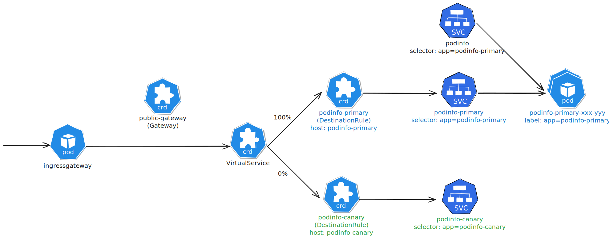

---
tags:
  - Flagger
  - Progressive Delivery
  - Istio
  - Service Mesh
---
# Flagger Istio Integration

This article documents notes and additional explanations made while following the Flagger-provided [Istio Canary Deployments](https://docs.flagger.app/main/tutorials/istio-progressive-delivery) tutorial.




When you are trying to specify a `Canary` resource for flagger, there are several fields that are so confusing that it is hard to understand what they do and how to set them up properly. Below is a list of such fields with explanations.

## Public Gateway

```yaml title="public-gateway.yaml"
apiVersion: networking.istio.io/v1alpha3
kind: Gateway
metadata:
  name: public-gateway
  namespace: istio-system
spec:
  selector:
    istio: ingressgateway
  servers:
    - port:
        number: 80
        name: http
        protocol: HTTP
      hosts:
        - "*"
```

!!! info

    This `public-gateway` Istio Gateway defines an HTTP ingress entry on port 80, allowing requests with any Host header to enter, with traffic being received by the `istio-ingressgateway` into the Kubernetes Cluster.

Now that you know how to route traffic from outside the cluster to the Istio ingress gateway, you can configure Flagger to create an Istio `VirtualService` that routes traffic from this gateway to your application and handles canary deployments.

## Canary Spec Fields

This is an example Flagger `Canary` custom resource (CR) configuration for Istio:

```yaml
apiVersion: flagger.app/v1beta1
kind: Canary
metadata:
  name: podinfo
  namespace: test
spec:
  # deployment reference
  targetRef:
    apiVersion: apps/v1
    kind: Deployment
    name: podinfo
  # HPA reference (optional)
  autoscalerRef:
    apiVersion: autoscaling/v2
    kind: HorizontalPodAutoscaler
    name: podinfo
  # the maximum time in seconds for the canary deployment
  # to make progress before it is rollback (default 600s)
  progressDeadlineSeconds: 600
  service:
    # Istio gateways (optional)
    gateways:
      - istio-system/public-gateway
    # Istio virtual service host names (optional)
    hosts:
      - app.example.com
    # service port number
    port: 9898
    # container port number or name (optional)
    targetPort: 9898
    # Istio traffic policy (optional)
    trafficPolicy:
      tls:
        # use ISTIO_MUTUAL when mTLS is enabled
        mode: DISABLE
    # Istio retry policy (optional)
    retries:
      attempts: 3
      perTryTimeout: 1s
      retryOn: "gateway-error,connect-failure,refused-stream"
  analysis:
    # schedule interval (default 60s)
    interval: 1m
    # max number of failed metric checks before rollback
    threshold: 3
    # max traffic percentage routed to canary
    # percentage (0-100)
    maxWeight: 50
    # canary increment step
    # percentage (0-100)
    stepWeight: 10
    metrics:
      - name: request-success-rate
        interval: 1m
        # minimum req success rate (non 5xx responses)
        # percentage (0-100)
        thresholdRange:
          min: 99
      - name: request-duration
        interval: 30s
        # maximum req duration P99
        # milliseconds
        thresholdRange:
          max: 500
    # testing (optional)
    webhooks:
      - name: acceptance-test
        type: pre-rollout
        url: http://flagger-loadtester.test/
        timeout: 30s
        metadata:
          type: bash
          cmd: "curl -sd 'test' http://podinfo-canary:9898/token | grep token"
      - name: load-test
        type: rollout
        url: http://flagger-loadtester.test/
        timeout: 5s
        metadata:
          cmd: "hey -z 1m -q 10 -c 2 http://podinfo-canary.test:9898/"
```

It's hard to understand the whole configuration at once, so let's break down and explain some of the important fields one by one.

### Istio Gateway and `VirtualService` Hosts

First, that focus on how to route traffic from the Istio ingress gateway to your application through Flagger's `Canary` CR.

```yaml hl_lines="8 9 11 12 14 16"
...
kind: Canary
...
spec:
  ...
  service:
    # Istio gateways (optional)
    gateways:
      - istio-system/public-gateway
    # Istio virtual service host names (optional)
    hosts:
      - app.example.com
    # service port number
    port: 9898
    # container port number or name (optional)
    targetPort: 9898
    ...
  ...
...
```

In a Flagger `Canary` resource, `spec.service.gateways` tells Flagger **which Istio Gateways should use the traffic-splitting rules**. Flagger copies this setting into the generated Istio `VirtualService` under `spec.gateways`. As a result, **only requests that enter the cluster through these Gateways will follow the canary routing rules** (for example, splitting traffic between the primary and canary versions). Traffic that does not go through these `Gateways` is not affected by this `VirtualService`.

In a Flagger `Canary` resource, `spec.service.hosts` specifies **which Host headers the generated Istio `VirtualService` should match**. Flagger writes this configuration into the `VirtualService`'s `spec.hosts`. As a result, **only requests whose Host header matches one of these values will be handled by this `VirtualService` and follow its routing rules**. Requests with other Host headers are not affected by this VirtualService.

Flagger will automatically create or take over Kubernetes `Services` for traffic routing. Specifically, Flagger will create three `Services` for you:

- `<service-name>`
- `<service-name>-primary`
- `<service-name>-canary`

The `spec.service.port` in the Flagger `Canary` CR will become the `spec.ports[].port` of these `Services`, while `spec.service.targetPort` will become the `spec.ports[].targetPort` of these `Services`.

### Progress Deadline Seconds and Analysis Interval

Now that you understand how traffic routing works, let's look at how to control the timing of the canary deployment process.

```yaml
...
kind: Canary
...
spec:
  progressDeadlineSeconds: 600
  ...
  analysis:
    interval: 1m
```

`spec.progressDeadlineSeconds` defines **the maximum time allowed for the canary deployment to make progress** before it is considered failed and rolled back, defaulting to **600 seconds (10 minutes)**. This setting ensures that if the canary deployment does not meet the defined success criteria within this timeframe, Flagger will automatically revert to the stable version to maintain application stability.

Another confusing field is `spec.analysis.interval`. It defines **how often Flagger performs analysis during the canary deployment process**, defaulting to **1 minute**. This interval determines **how frequently Flagger checks the metrics and logs** to evaluate the health and performance of the canary version compared to the stable version.

### Metrics Analysis

When performing a canary deployment, Flagger gradually shifts traffic from the stable version to the canary version in increments. During this process, Flagger continuously monitors the defined metrics to ensure that the canary version is performing as expected. How this process is controlled by several fields under `spec.analysis`. We will explain these fields into three parts.

First, the overall traffic shifting strategy is defined by the following fields:

```yaml
...
spec:
  ...
  analysis:
    interval: 1m
    stepWeight: 10
    maxWeight: 50
    threshold: 3
```

Metrics are checked once per minute (`interval: 1m`), with each check increasing canary traffic by 10% (`stepWeight: 10`), up to a maximum of 50% traffic to canary (`maxWeight: 50`). If 3 checks fail (`threshold: 3`), a rollback occurs.


Second, the specific metrics to be monitored during the canary deployment are defined under `spec.analysis.metrics`:

```yaml
spec:
  ...
  analysis:
    ...
    metrics:
      - name: request-success-rate
        interval: 1m
        # minimum req success rate (non 5xx responses)
        # percentage (0-100)
        thresholdRange:
          min: 99
      - name: request-duration
        interval: 30s
        # maximum req duration P99
        # milliseconds
        thresholdRange:
          max: 500
```

Each metric check evaluates two metrics:

1. `request-success-rate`: **Checked once per minute, requiring a success rate of at least 99% (non-5xx responses)**.
2. `request-duration`: **Checked every 30 seconds, requiring P99 request duration not to exceed 500 milliseconds**.

It's worth noting that `request-success-rate` and `request-duration` are **predefined** metric names in Flagger, and Flagger automatically calculates the corresponding metric values based on these names. Specifically, Flagger uses Prometheus queries to calculate these metrics.

The Prometheus query for `request-success-rate` is as follows:

??? note "Prometheus Query for Request Success Rate"

    ```promql
    sum(
        rate(
            istio_requests_total{
            reporter="destination",
            destination_workload_namespace=~"{{ namespace }}",
            destination_workload=~"{{ target }}",
            response_code!~"5.*"
            }[{{ interval }}]
        )
    )
    /
    sum(
        rate(
            istio_requests_total{
            reporter="destination",
            destination_workload_namespace=~"{{ namespace }}",
            destination_workload=~"{{ target }}"
            }[{{ interval }}]
        )
    )
    ```

The Prometheus query for `request-duration` is as follows:

??? note "Prometheus Query for Request Duration"

    ```promql
    histogram_quantile(0.99,
    sum(
        irate(
        istio_request_duration_milliseconds_bucket{
            reporter="destination",
            destination_workload=~"{{ target }}",
            destination_workload_namespace=~"{{ namespace }}"
        }[{{ interval }}]
        )
    ) by (le)
    )
    ```

Third, Flagger allows you to define custom webhooks to perform additional tests during the canary deployment process. This is done under `spec.analysis.webhooks`:

!!! note "Progressive Stages and Webhooks"

    During a progressive deployment, Flagger breaks the overall rollout process into multiple stages. Between each stage, corresponding webhooks can be configured, for example:

    - `confirm-rollout` hooks are executed before scaling up the canary deployment and can be used for manual approval.
    - `pre-rollout` hooks are executed before routing traffic to canary.
    - `rollout` hooks are executed during the analysis on each iteration before the metric checks.
    - `confirm-traffic-increase` hooks are executed right before the weight on the canary is increased.
    - `confirm-promotion` hooks are executed before the promotion step.
    - `post-rollout` hooks are executed after the canary has been promoted or rolled back.

```yaml
spec:
  ...
  analysis:
    ...
    # testing (optional)
    webhooks:
      - name: acceptance-test
        type: pre-rollout
        url: http://flagger-loadtester.test/
        timeout: 30s
        metadata:
          type: bash
          cmd: "curl -sd 'test' http://podinfo-canary:9898/token | grep token"
      - name: load-test
        type: rollout
        url: http://flagger-loadtester.test/
        timeout: 5s
        metadata:
          cmd: "hey -z 1m -q 10 -c 2 http://podinfo-canary.test:9898/"
```

Before the entire rollout begins, Flagger executes the `acceptance-test` webhook, calling the URL `http://flagger-loadtester.test/` and requesting the `flagger-loadtester` application to execute `curl` to call the `podinfo-canary:9898/token` endpoint, checking whether the response contains the string `token`. If it does, the test passes and traffic routing can proceed to the next step, which is scaling up the canary deployment.

During the rollout loop, Flagger executes the `load-test` webhook, calling the URL `http://flagger-loadtester.test/` and requesting the `flagger-loadtester` application to run the `hey` tool to perform load testing against the `podinfo-canary.test:9898/` endpoint, simulating a rate of 10 requests per second for 1 minute with 2 concurrent requests. Through this load testing, the canary version's performance under actual traffic can be observed.

### Traffic Mirroring

You can enable mirroring by replacing `stepWeight`/`maxWeight` with `iterations` and by setting `analysis.mirror` to true:


```yaml hl_lines="9-11"
apiVersion: flagger.app/v1beta1
kind: Canary
metadata:
    ...
spec:
  ...
  analysis:
    ...
    iterations: 10
    mirror: true
    mirrorWeight: 100
    ...
  ...
```

### Session Affinity

While Flagger can perform weighted routing and A/B testing individually, with Istio it can **combine the two leading to a Canary release with session affinity**. See [Canary Release with Session Affinity](https://docs.flagger.app/main/usage/deployment-strategies#canary-release-with-session-affinity) for more details.

```yaml hl_lines="9-13"
apiVersion: flagger.app/v1beta1
kind: Canary
metadata:
  ...
spec:
  ...
  analysis:
    ...
    sessionAffinity:
      cookieName: flagger-cookie
      # max age of the cookie (in seconds)
      # optional; defaults to 86400
      maxAge: 21600
    ...
  ...
```


### A/B Testing

```yaml
apiVersion: flagger.app/v1beta1
kind: Canary
metadata:
  name: podinfo
  namespace: test
spec:
    ...
